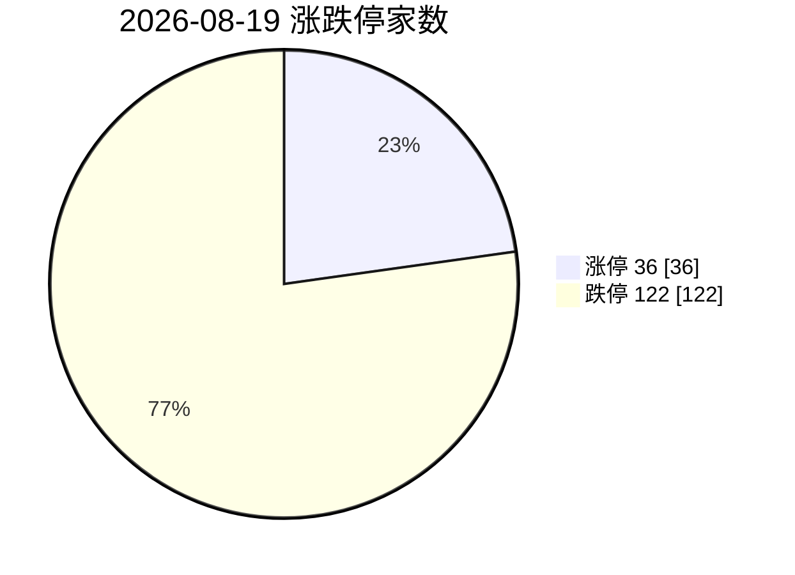

# 盘后简报 · 2026-08-19（星期三）

> 本文为盘后研究摘要，仅供研究参考，不构成任何投资建议。数据采集时点见文末。

## 1. 今日市场异动（8 条）

今日 A 股全线重挫：上证指数收 3890.19（-2.51%），深证成指 13890.71（-5.00%），创业板指 3474.59（-6.23%），沪深 300 -3.02%；两市成交约 2.49 万亿元。午盘时全市场超 4900 只个股下跌。

| # | 标的 / 板块 | 幅度 | 为何算异动 |
|---|---|---|---|
| 1 | 创业板指、科创 50 | -6.23% / 盘中跌超 6% | 指数级单日重挫，成长风格系统性杀跌，远超大盘平均跌幅 |
| 2 | 全市场涨跌停对比 | 涨停 36 家 vs 跌停 122 家 | 跌停家数为涨停 3 倍以上，情绪极端冰点，普跌格局 |
| 3 | 寒武纪（688256） | -9.6%，收 1050.49 元 | StockSight 超额收益异动「警告」级；AI 芯片龙头跟随隔夜美股芯片抛售大跌 |
| 4 | 中芯国际（688981） | -5.2%，收 128.01 元 | StockSight 超额收益异动「关注」级；半导体权重股放量下行 |
| 5 | 山东黄金（600547） | +6.5%，收 32.60 元 | StockSight 超额收益异动、判定「偏强-动能偏多」；大跌日逆势大涨，避险资金集中流入 |
| 6 | 光伏电池概念（HIT/TOPCon/BC） | -9.65% / -9.07% / -9.00% | 概念板块单日跌幅近跌停级别，高位题材集体退潮 |
| 7 | 煤炭板块 | 宝泰隆、陕西黑猫、大有能源、美锦能源涨停 | 大跌日逆势封板；行业资金净流入排名第 2，防御属性凸显 |
| 8 | 农业高标股 | 金健米业、红四方 3 连板；万向德农 2 连板 | 弱市中少数连板梯队，资金抱团防御性题材 |

其他值得记录：华为概念 -8.69%、宽带提速 -8.72%；人形机器人概念多股跌停（中大力德、巨轮智能、五洲新春等）；地产/航运局部活跃（南都物业、南京港涨停）。资金面上，净流入前十行业为厨卫电器、煤炭、银行、港口航运、保险、公路铁路、机场航运、贵金属、石油加工、油气开采——全部是防御与资源方向。

## 数据可视化

数值与上文一致。GitHub / Cursor 可直接渲染下列 Mermaid 图。

### 主要指数涨跌幅（%）

```mermaid
xychart-beta
    title 2026-08-19 A股主要指数涨跌幅
    x-axis ["上证", "沪深300", "深成指", "创业板"]
    y-axis "涨跌幅(%)" -7 --> 1
    bar [-2.51, -3.02, -5.00, -6.23]
```

### 涨跌停家数



### 观察对象与关键标的（%）

```mermaid
xychart-beta
    title 黄金/半导体/纳指/医药相关涨跌
    x-axis ["山东黄金", "恒瑞", "纳指隔夜", "生物制药", "中芯", "电子器件", "寒武纪"]
    y-axis "涨跌幅(%)" -11 --> 8
    bar [6.5, 0.6, -1.3, -1.97, -5.2, -7.15, -9.6]
```

说明：纳指为 8 月 18 日收盘；电子器件、生物制药为 akshare 板块涨跌。

## 2. 四个观察对象的行情要点

### 黄金
- **价格/涨跌**：现货黄金站上 4400 美元/盎司上方（8 月中旬以来两周涨约 10%，8 月 13 日盘中曾逼近 4450 美元）。A 股黄金股大涨：山东黄金 +6.5%；但黄金概念指数整体 -0.31%（被大盘普跌拖累）。**akshare「黄金期货」接口返回无效行（V0/P0 等），沪金期货当日数据不可用**，金价以 firecrawl 检索的公开报价为准。
- **资金/情绪**：贵金属行业进入当日资金净流入前十；月内国内黄金 ETF 吸金超 80 亿元；中国央行已连续 21 个月增持黄金。
- **关键新闻**：美国 7 月 CPI 同比降至 3.4%、PPI 降至 4.7%、零售环比 -0.6%，市场对美联储 9 月加息押注从 75% 骤降至约 33%，美元指数跌破 100，是本轮金价走强核心驱动；机构分歧明显（城堡证券看多 vs 花旗认为只是反弹）。

### 半导体
- **价格/涨跌**：A 股电子器件板块 -7.15%、电子信息 -6.03%，为当日跌幅最深方向之一；中芯国际 -5.2%、寒武纪 -9.6%。隔夜（8/18）费城半导体指数（SOX）暴跌 5%，英伟达、美光、博通领跌。
- **资金/情绪**：科创 50 盘中跌超 6%，半导体是本轮杀跌重灾区；未见承接资金。
- **关键新闻**：华尔街对 AI 股「价格涨过头」的批评发酵，叠加全球债券收益率攀升压制成长股估值，科技抛售由美股传导至 A 股。

### 纳斯达克（纳指）
- **价格/涨跌**：8 月 18 日（周二）收 26,289.71，-1.3%（-355.20 点），自上周四历史高点后连续第三日下跌；同日标普 500 -0.7%（7,691.76）、道指 -0.2%。年内纳指仍 +13.1%。**北京时间 15:30 前美股尚未开盘，本节为最近一晚收盘数据。**
- **资金/情绪**：科技股领跌，能源与医疗保健是当日标普中少数上涨板块；罗素 2000 同跌 1.3%。
- **关键新闻**：债券收益率攀升、油价因中东（伊朗）局势升温上行，加重对高估值 AI 板块的压力（路透、AP）。

### 医药
- **价格/涨跌**：生物制药板块 -1.97%，显著跑赢大盘（沪指 -2.51%、深成指 -5.00%），是当日最抗跌的成长方向；恒瑞医药 +0.6% 逆势收红（StockSight 判定无异动、量价平稳）。
- **资金/情绪**：板块结构性分化延续——高股息中药/流通 vs 科创板创新药械两种风格轮动；隔夜美股医疗保健板块亦属领涨方向。
- **关键新闻**：2026 上半年中国创新药对外授权（BD）交易金额已突破 1100 亿美元（界面新闻引述），产业进入以临床数据和商业化兑现定价的阶段。

## 3. 投资建议（三选一，附风险）

| 对象 | 建议 | 理由与主要风险 |
|---|---|---|
| 黄金 | **逢低关注** | 加息预期骤降 + 美元走弱 + 央行持续购金，中期驱动完整，且大跌日避险属性得到验证（山东黄金 +6.5%）。**风险**：金价两周已涨约 10% 处历史高位，追高易受剧烈回吐冲击；若美国数据反弹令加息预期回摆，回调可能剧烈。 |
| 半导体 | **谨慎减仓** | 美股 AI/芯片估值去化叠加 A 股高位成长杀跌，电子器件单日 -7.15%、龙头齐跌且未见承接资金，短期趋势已破坏。**风险**：国产替代长期逻辑未变，若超跌反弹则减仓面临踏空；建议仅针对高位重仓部分控制风险，勿恐慌性清仓。 |
| 纳指 | **观望** | 历史高点附近连续三日回落、AI 估值批评与收益率上行共振，方向未明；年内涨幅仍厚，多空拉锯概率大。**风险**：中东局势推升油价与通胀预期，若加息预期重新升温，回调或加深；反之科技财报超预期可能快速修复。 |
| 医药 | **逢低关注** | 大跌日板块仅 -1.97%、恒瑞逆势收红，防御属性与创新药 BD 出海逻辑（上半年超 1100 亿美元）共同支撑，是弱市中相对占优方向。**风险**：若大盘继续系统性下跌，抗跌板块往往补跌；创新药临床/商业化兑现不及预期、集采政策扰动。 |

**总体风险提示**：今日 A 股为极端普跌日（跌停 122 家），情绪冰点后波动率通常维持高位，任何方向的操作都应控制仓位；以上为研究观点而非操作指令。

## 4. 数据来源与时间戳

| 来源 | 内容 | 时点（北京时间） |
|---|---|---|
| akshare-stock skill | A 股大盘收盘、涨跌停统计、行业/概念板块涨跌、行业资金净流入、生物制药/电子器件板块数值 | 2026-08-19 15:05–15:07 拉取（收盘数据） |
| akshare-stock skill | 市场资金流向（主力净流入 -669.33 亿为 **8/18 T-1 数据**，当日数据接口未更新） | 2026-08-19 15:05 拉取 |
| stocksight skill | 山东黄金、中芯国际、寒武纪、恒瑞医药详细异动报告（腾讯行情源，见 `stocksight/` 子目录） | 2026-08-19 15:01–15:02 拉取 |
| firecrawl-cli skill | 黄金/半导体/纳指/医药/A股大跌 资讯检索（AP、路透、Yahoo、新浪、证券时报、界面、观点网等，原始 JSON 见 `sources/`） | 2026-08-19 14:33–14:35 检索 |
| 纳指行情 | AP（via king5）8 月 18 日美股收盘统计 | 美东 8/18 收盘 |

**Skill 执行情况说明（按要求如实记录）**：
- `akshare-stock`：✅ 成功。例外：「黄金期货」查询返回 V0/P0 等无效合约行（数据不可用）；「市场资金流向」仅返回 T-1（8/18）数据。
- `stocksight`：⚠️ 部分成功。主线雷达 `mainline_radar.py` 失败（东方财富板块接口在本云端环境被拒：`Expecting value: line 1 column 1`，重试无效），改用 akshare 板块数据替代板块扫描；四份个股详细报告经腾讯源正常生成。
- `firecrawl-cli`：✅ 成功（`FIRECRAWL_API_KEY` 未注入本环境，走免费无密钥档，5 次检索均返回有效结果）。
