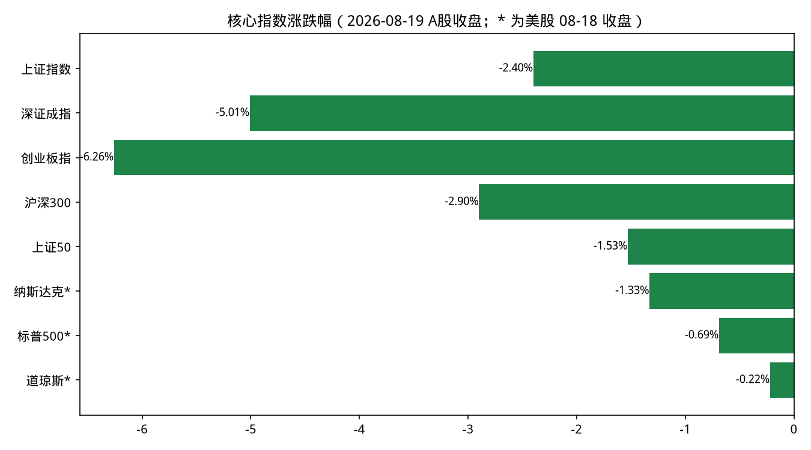
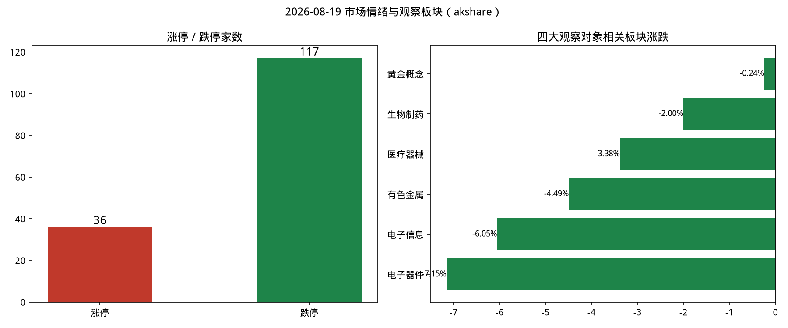
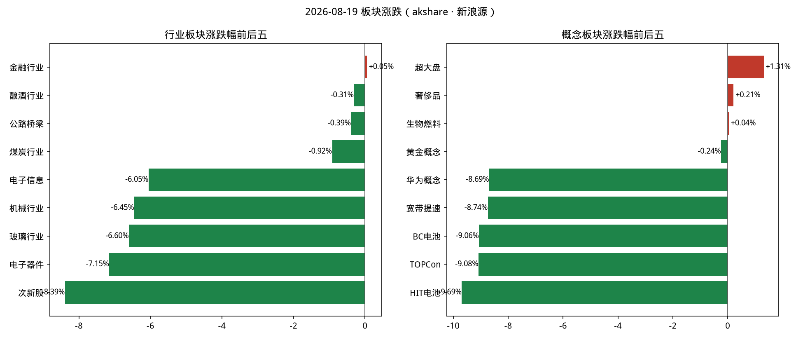
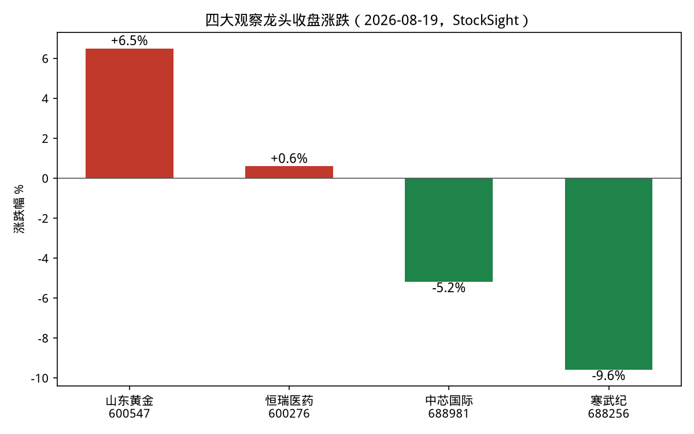

# 2026-08-19 盘后复盘

> 数据时点：A 股为 2026-08-19 收盘（北京时间 15:30 采集）；美股/黄金为 2026-08-18（美东）收盘及 8 月中旬最新可得数据。本文仅供研究，不构成投资建议。

## 1. 今日结论

1. **A 股放量大跌**：上证 -2.40%、深成指 -5.01%、创业板指 -6.26%，两市成交约 2.51 万亿元，跌停 117 家 vs 涨停 36 家，全市场超 4900 只个股下跌（午间口径），科技成长股是重灾区。
2. **外围传导明确**：隔夜（8/18）中东局势恶化推升油价与美债收益率至多年高位，费城半导体指数（SOX）暴跌 5%，纳指 -1.33%，直接压制今日 A 股算力硬件、半导体、机器人等前期热门方向。
3. **防御与资源逆势**：金融行业唯一收红（+0.05%），资金净流入前十为煤炭、银行、保险、港口航运、贵金属、油气等防御+资源方向；煤炭、农业、地产、航运个股逆势涨停。
4. **黄金一枝独秀**：现货金站稳 4400 美元/盎司上方（两周涨约 10%），A 股黄金概念仅 -0.24% 显著抗跌，山东黄金逆市 +6.5%（量比 4.89）。
5. **医药相对抗跌但内部分化**：生物制药板块 -2.00% 明显好于大盘，恒瑞医药微涨 +0.6%；但创新药高位标的随成长股普跌，板块处于高股息与科创成长的风格轮动中。

## 2. A 股异动

### 指数与情绪（akshare，收盘）

| 指数 | 收盘 | 涨跌幅 | 成交额 |
|:---|---:|---:|---:|
| 上证指数 | 3894.42 | -2.40% | 12181 亿 |
| 深证成指 | 13890.15 | -5.01% | 12929 亿 |
| 创业板指 | 3473.49 | -6.26% | 6336 亿 |
| 沪深300 | 4588.70 | -2.90% | 7053 亿 |
| 上证50 | 2895.57 | -1.53% | 1936 亿 |

- 涨停 36 家 / 跌停 117 家，最高连板 3（金健米业、红四方）。跌停家数远超涨停，情绪冰点。
- 涨停结构：煤炭（宝泰隆）、农业（金健米业）、地产物业（南都物业）、次新+并购（鲁信创投）等防御与题材孤岛。

### 板块（akshare · 新浪源）

- 行业跌幅前五：次新股 -8.39%、电子器件 -7.15%、玻璃 -6.60%、机械 -6.45%、电子信息 -6.05%；唯一收红：金融 +0.05%。
- 概念跌幅前五：HIT 电池 -9.69%、TOPCon -9.08%、BC 电池 -9.06%、宽带提速 -8.74%、华为概念 -8.69%；抗跌：超大盘 +1.31%、黄金概念 -0.24%。
- 板块明细：生物制药 -2.00%、医疗器械 -3.38%、有色金属 -4.49%。
- 行业资金净流入前十：厨卫电器、煤炭、银行、港口航运、保险、公路铁路、机场航运、**贵金属**、油气、石油加工（防御+红利+资源特征明显）。

### 个股异动扫描（StockSight · 腾讯源，neutral 视角）

| 标的 | 收盘 | 涨跌幅 | 量比 | 异动判定 |
|:---|---:|---:|---:|:---|
| 山东黄金 600547 | 32.60 | +6.5% | 4.89 | 超额收益异动+RSI 偏热（66.8）+BOLL 破上轨，短线过热 |
| 恒瑞医药 600276 | 52.66 | +0.6% | 1.00 | 无显著异动，MACD 空头排列、KDJ 信号，缩量抗跌 |
| 中芯国际 688981 | 128.01 | -5.2% | 3.33 | 超额收益异动（关注级），RSI 走低至 44.7 |
| 寒武纪 688256 | 1050.49 | -9.6% | 2.51 | 超额收益异动（警告级），转弱需关注回撤 |

## 3. 黄金 / 半导体 / 纳指 / 医药

### 黄金

- **行情**：现货黄金 8 月中旬重新站上 4400 美元/盎司（8/13 盘中逼近 4450 后震荡，8/17 再度收复 4400），两周涨约 10%。A 股：山东黄金 +6.5%，黄金概念 -0.24% 全场最抗跌之一，贵金属进入行业资金净流入前十，月内国内黄金 ETF 吸金超 80 亿元。
- **驱动**：美国 7 月 CPI/PPI/零售数据集体走弱，9 月加息押注从约 75% 骤降至 33%，美元指数跌破 100；叠加中东地缘风险与央行持续购金（中国央行连增 21 个月）。
- **建议：逢低关注**。避险+降息预期双驱动完好，但短线技术过热（山东黄金 RSI 66.8、BOLL 破上轨），追高风险大，宜等回调。**主要风险**：金价历史高位波动剧烈，若美联储释放鹰派信号或中东缓和，回撤可能快且深。

### 半导体

- **行情**：美股 8/18 SOX 暴跌 5%（英伟达 -2.3%、美光 -7%、闪迪 -9%、西数 -7.4%）；今日 A 股电子器件 -7.15%、电子信息 -6.05%，中芯国际 -5.2%（量比 3.33 放量下跌）、寒武纪 -9.6%（警告级异动）。
- **驱动**：美债收益率升至多年高位压估值，前期 AI 涨幅过大后的集中获利了结；市场等待英伟达财报作为 AI 行情下一个检验点。
- **建议：谨慎减仓**。中美两地半导体同步放量下跌、龙头技术形态转弱，调整可能未走完。**主要风险**：若英伟达财报超预期或收益率回落，可能 V 型反弹踏空；仓位操作宜分步而非清仓。

### 纳斯达克

- **行情**：8/18（美东）收 26289.71，跌 355.20 点（-1.33%），为科技股领跌格局；标普 -0.69%、道指 -0.22%，能源板块逆势领涨。纳指跌幅数据为上一交易日收盘，今晚美股尚未开盘。
- **驱动**：中东不确定性推升油价与美债收益率至多年高位；纳斯达克跌多涨少（跌:涨约 1.67:1），新低 121 家多于新高 75 家。
- **建议：观望**。收益率与地缘两大压制未解除，英伟达财报临近方向未定，不宜追空也不宜抄底。**主要风险**：高收益率环境下科技估值继续压缩；反向风险是地缘缓和引发快速修复。

### 医药

- **行情**：生物制药 -2.00%、医疗器械 -3.38%，均明显跑赢大盘；恒瑞医药 +0.6%（量比 1.00 缩量抗跌，无显著异动）。创新药高位股随成长风格普跌（午评口径）。
- **资讯面**：2026 上半年中国创新药对外授权（BD）金额已突破 1100 亿美元、全球 TOP10 交易占八席；8 月机构对创新药关注度抬升，板块处于高股息中药与科创创新药的风格轮动中。
- **建议：观望**（偏积极）。BD 出海产业逻辑扎实、相对抗跌显示资金认可，但恒瑞 MACD 空头排列、市场系统性风险未释放完，暂不急于加仓。**主要风险**：市场继续普跌时医药难独善其身；创新药对政策（医保谈判、集采）与临床数据敏感。

## 4. 次日观察点

1. 今晚美股：纳指能否止跌，英伟达财报预期发酵方向；美债收益率与油价走势。
2. A 股情绪修复信号：跌停家数能否收敛至两位数以内、成交能否维持 2 万亿以上而不缩量阴跌。
3. 黄金：现货金 4400 美元关口得失；山东黄金放量后是否出现高位分歧。
4. 半导体：中芯国际 125 附近（本轮放量下跌起点下沿）能否企稳；寒武纪千元关口。
5. 防御方向持续性：银行、保险、煤炭、贵金属资金净流入是否延续。

## 5. 风险提示

本报告为自动化研究摘要，数据来自公开接口，可能存在延迟或字段缺失；不构成任何投资建议，据此操作风险自负。

## 6. 数据时点与来源

| 来源 | 状态 | 说明 |
|:---|:---|:---|
| akshare-stock | 成功（部分查询降级） | A 股大盘/涨跌停/行业概念板块/新浪行业明细/行业资金净流入，采集于 2026-08-19 15:31-15:33（北京时间）。「市场资金流向」返回空、「纳指行情」被路由回 A 股、「黄金期货」返回无效行——三项数据不可用，纳指与金价改由 firecrawl 补充 |
| stocksight | 部分成功 | 主线雷达失败（东方财富接口拒绝本机出口 IP，返回非 JSON）；改用个股详细报告（腾讯源，neutral 视角）成功产出 4 份：688981/688256/600276/600547，见 `stocksight/` |
| firecrawl-cli | 成功（免密钥档） | FIRECRAWL_API_KEY 未注入，走免费无密钥档；5 组检索全部成功，原始结果见 `sources/`。来源含新华社、路透、雅虎财经、WSJ、央广财经、金融界、证券时报等 |

美股与黄金数据时点为美东 2026-08-18 收盘及 8 月中旬最新报道，非 A 股同日实时数据。
