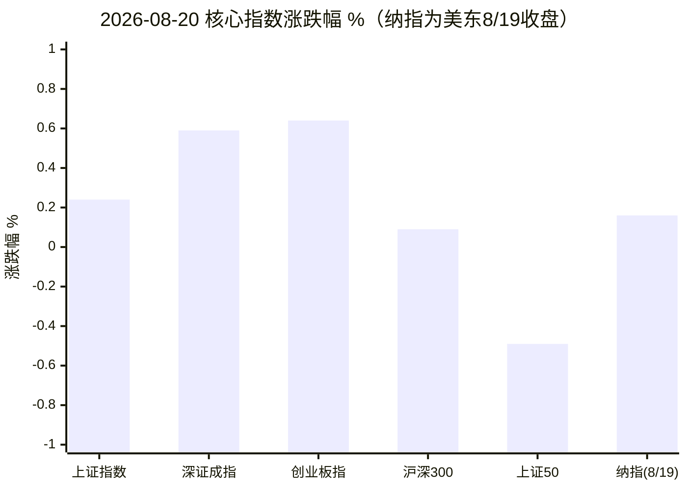
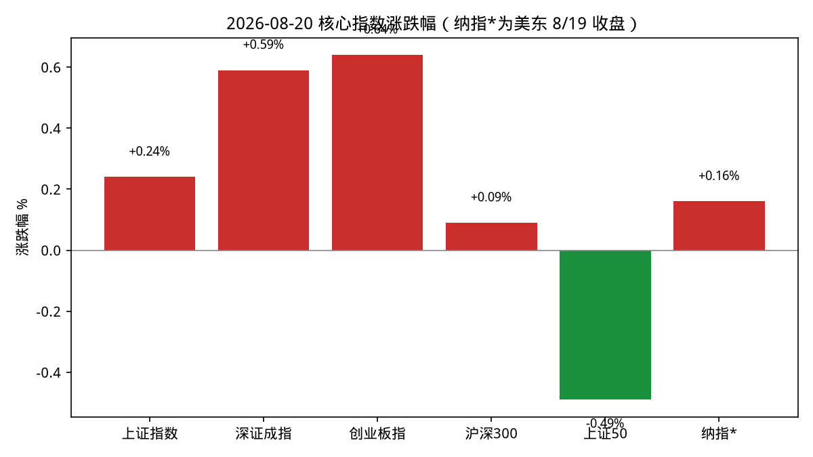
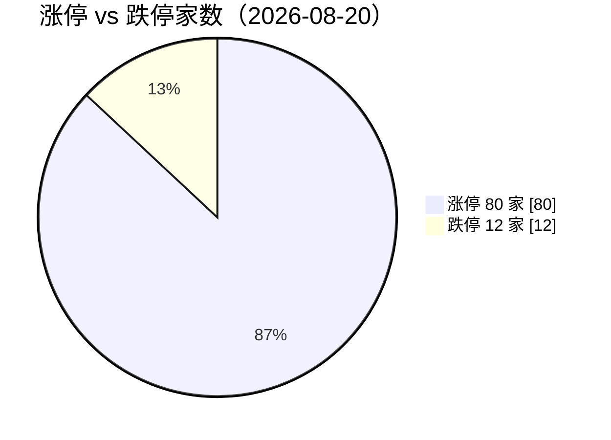
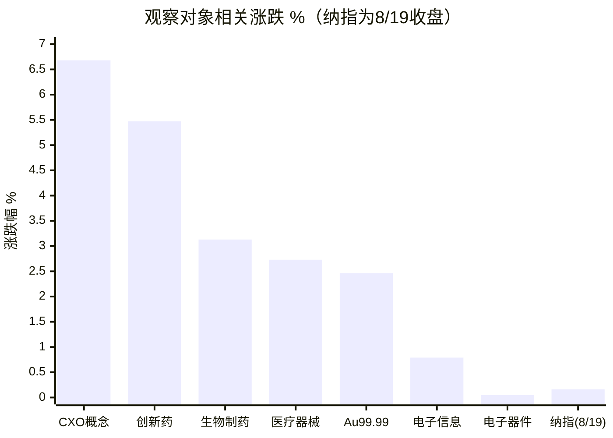
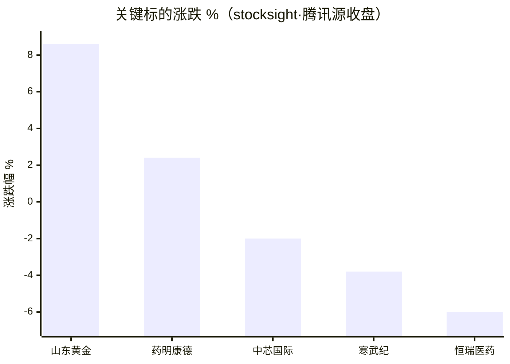
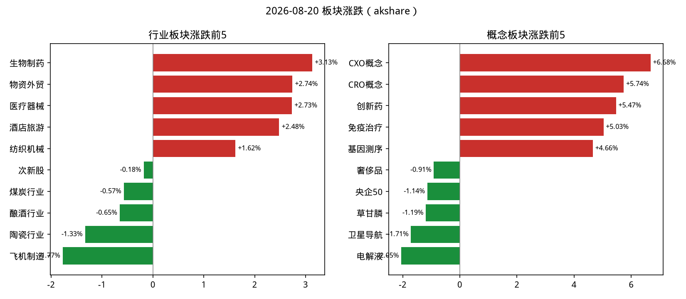
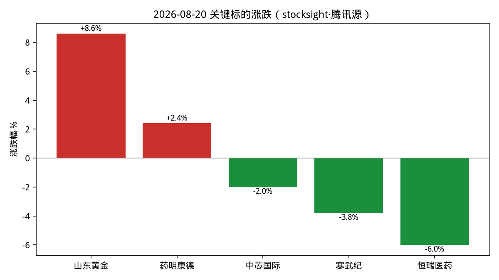
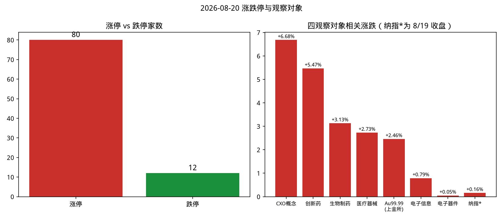

# A 股盘后复盘 · 2026-08-20（周四）

> 数据时点：北京时间 2026-08-20 15:30 收盘后（akshare 采集于 15:31，stocksight 于 15:32，firecrawl 于 15:34–15:39）。纳指与美股数据为美东 8 月 19 日收盘。本文仅供研究，不构成投资建议。

## 1. 今日结论

1. **医药是绝对主线**：Moderna 黑色素瘤疫苗三期成功（隔夜暴涨 176%）海外映射 + CXO 龙头上调业绩指引，点燃疫苗/创新药/CXO 全线，涨停 80 家中医药占据涨停榜前列（多只 20cm）。
2. **指数温和、结构剧烈**：上证 +0.24% 报 3903.72，创业板 +0.64%，但上证 50 -0.49%，权重让路、题材唱戏；两市成交约 2.08 万亿元，量能充沛。
3. **黄金强势**：上金所 Au99.99 收 968.5 元/克（较昨收 945.22 约 +2.5%），国际金价 8 月持续反弹；山东黄金 +8.6% 触发超额收益异动 + RSI 超买。
4. **半导体失血**：电子器件 +0.05% 基本平盘，中芯国际 -2.0%、寒武纪 -3.8% 且量比放大（2.0/2.4），资金明显切换至医药。
5. **龙头分化警示**：恒瑞医药逆板块 -6.0%（量比 3.74）——8/19 晚披露半年报净利同比仅 +0.34%，高估值遇上近零增长被兑现；医药行情内部并非普涨。

## 2. A 股异动

- **涨跌停**：涨停 80 家 vs 跌停 12 家，情绪偏强。涨停榜前列几乎被医药包揽：莱美药业、沃森生物 20%，康希诺、百克生物、键凯科技、悦康药业、近岸蛋白 20cm 涨停，双鹭药业、汉森制药（2 连板）10cm；中关村 +9.98%。
- **板块**：行业涨幅榜——生物制药 +3.13%、物资外贸 +2.74%、医疗器械 +2.73%；概念涨幅榜——CXO +6.68%、CRO +5.74%、创新药 +5.47%、免疫治疗 +5.03%、基因测序 +4.66%。跌幅居前：飞机制造 -1.77%、电解液 -2.05%、卫星导航 -1.71%。
- **资金流**：akshare「市场资金流向」接口当日返回空数据（最新=未知、近 5 日无记录），**资金流数值不可用**，仅以量比侧写：恒瑞（3.74）、寒武纪（2.36）、中芯国际（2.01）放量。
- **主线雷达**：stocksight 主线雷达因东方财富接口在云端 IP 被拒而失败（详见 `主线雷达.md`），已用 akshare 板块数据 + stocksight 个股详细报告（腾讯源）替代。
- **值得跟踪**：山东黄金（+8.6%，金价驱动但 RSI 超买）、药明康德（+2.4%，CXO 主线但 RSI 超买）、恒瑞医药（-6.0%，中报兑现后的估值重定价）。

## 3. 数据可视化

### 3.1 主要指数涨跌幅

### 3.2 涨停 vs 跌停

### 3.3 四观察对象及关键标的涨跌

### 3.4 行业资金净流入前 5

**本图省略**：akshare「市场资金流向」当日返回空数据，行业资金净流入无可靠金额数值，按约定不编造。

## 4. 四个观察对象

### 4.1 黄金 —— 逢低关注

- **行情**：上金所 Au99.99 今收 968.5 元/克，较昨收 945.22 约 **+2.5%**（日线：8/18 收 955.16 → 8/19 收 945.22 → 今日拉升）。国际金价 8 月强势反弹：8/11 盘中一度突破 4400 美元/盎司（触及 4434.95），距 1 月峰值 5596.33 仍有距离，6/30 曾最低 3943.65（年内最大回撤约 29.5%）。
- **驱动**（凤凰财经/华尔街见闻/CBS）：美国 7 月非农爆冷 + 美联储加息窗口消失、美债收益率自高位回落（8/19 美财政部宣布对 10–30 年长债回购加倍，10Y 降至 4.65%）、全球央行持续购金（中国央行连增 21 个月，Q2 全球净买 288.9 吨环比 +411%）、7 月黄金 ETF 全球净流入 30 亿美元。CBS 提示 2026 全年视角金价仍低于 4400 美元、较 1 月峰值跌超 1000 美元，属高波动修复段。
- **A 股映射**：山东黄金 +8.6%（超额收益异动 + RSI 超买）。
- **建议：逢低关注**。央行购金 + 降息预期回归的中期逻辑仍在，但日内 +2.5%、龙头股 RSI 超买，短线追高风险大；等回踩再看。**主要风险**：美伊局势缓和、油价回落带动避险溢价快速退坡；美债收益率再度冲高。

### 4.2 半导体 —— 观望

- **行情**：A 股电子器件 +0.05%、电子信息 +0.79%，基本平盘跑输大市；中芯国际 -2.0%（125.50，量比 2.01）、寒武纪 -3.8%（1010.88，量比 2.36），放量调整、资金切向医药。
- **海外**：8/18 美股芯片抛售（SK 海力士单日 -9%，金十），8/19 美股反弹但更多由债市与疫苗股驱动，芯片修复力度一般。
- **建议：观望**。板块处于主线让位后的缩量整理，量比放大而价格走弱说明分歧仍在；等待放量企稳或海外芯片景气信号再评估。**主要风险**：继续被医药虹吸走资金；高位股（寒武纪）估值波动大。

### 4.3 纳斯达克 —— 观望

- **行情**（美东 8/19 收盘，非当日实时）：纳指收 **26331.09，+0.16%**，与道指（53463.05，+0.22%）、标普（+0.21%）一起结束三连跌；此前 8/18 纳指曾跌至 26289.71。
- **驱动**：美财政部宣布将 10–30 年长债回购规模"至少加倍"，10Y 收益率 -5bp 至 4.65%、30Y -9bp 至 5.19%（此前创 2007 年以来新高）；Moderna 黑色素瘤疫苗三期成功暴涨 176%；特朗普宣布对加拿大 50% 关税暂停三天（称"已达成协议"）。
- **建议：观望**。反弹主要靠债市技术性因素与个别事件驱动，油价上行与利率高位的压制未解除；等待 CPI/利率路径进一步明朗。**主要风险**：长端利率再度冲高、油价继续上涨挤压估值。

### 4.4 医药 —— 逢低关注

- **行情**：今日最强主线。生物制药 +3.13%、医疗器械 +2.73%；CXO +6.68%、CRO +5.74%、创新药 +5.47%；疫苗股集体 20cm 涨停（沃森、康希诺、百克、近岸蛋白等）。
- **催化**：① Moderna/默沙东黑色素瘤疫苗三期成功、隔夜 +176% 的海外映射；② CXO 龙头上调业绩指引、创新药 BD 订单高景气（财联社）；③ 证券时报报道 CXO 半年报订单饱满、结构升级。
- **警示**：恒瑞医药 -6.0%（半年报净利同比仅 +0.34%、营收 154.56 亿，拟 10–20 亿回购未能对冲失望情绪）；药明康德 +2.4% 但 RSI 已超买。板块"情绪普涨 + 业绩分化"并存。
- **建议：逢低关注**。产业催化真实（疫苗数据 + 订单景气），但单日过热、龙头技术指标超买，追高胜率低；回调时优先关注有业绩订单支撑的 CXO/疫苗方向，规避纯情绪跟风股。**主要风险**：情绪退潮后 20cm 涨停股大幅回吐；业绩不及预期的个股补跌（恒瑞已示范）。

## 5. 次日观察点

1. 医药涨停梯队能否晋级（汉森制药 2 连板是否延续、20cm 首板的溢价率）；炸板率与获利盘兑现节奏。
2. 恒瑞医药能否在 49 元附近止跌——作为板块业绩分化的风向标。
3. 金价能否站稳 968 元/克（国际金价 4400 美元关口）；山东黄金 RSI 超买后的量价关系。
4. 半导体是否出现缩量止跌信号；寒武纪千元关口的争夺。
5. 美股今晚（美东 8/20）能否延续反弹，长端美债收益率与油价走向。

## 6. 风险提示

本文全部内容基于公开数据整理，仅供研究复盘使用，不构成任何投资建议。市场情绪高热阶段波动剧烈，涨停股、超买股追高风险显著；数据接口存在延迟与缺失（详见下节），引用前请自行核实。

## 7. 数据时点与来源

| 来源 | 状态 | 说明 |
|:---|:---|:---|
| akshare-stock | 部分成功 | 大盘/涨跌停/行业/概念/新浪行业板块正常（15:31）；「市场资金流向」返回空、「纳指行情」路由回 A 股、「黄金期货」返回无效行，均已标注不可用并用其他来源替代 |
| stocksight | 部分成功 | 主线雷达失败（东财接口拒绝云端 IP，见 `主线雷达.md`）；5 只个股详细报告成功（腾讯源，15:32，neutral 视角，见 `stocksight/`） |
| firecrawl-cli | 成功 | 无 API Key（免费档），9 次检索全部成功（15:34–15:39），原始结果见 `sources/`；关键引用：雅虎财经（美股 8/19 收盘）、凤凰财经（8 月金价反弹）、CBS（2026 金价回调归因）、财联社/证券时报（CXO 指引与恒瑞中报）、金十（8/18 芯片抛售） |
| akshare 直连补充 | 成功 | 新浪美股日线（纳指 8/19 收 26331.09）、上金所 Au99.99 分时与日线 |

- A 股行情时点：2026-08-20 15:30 收盘。
- 美股/纳指时点：美东 2026-08-19 收盘（北京时间 8/20 凌晨）。
- 金价时点：上金所 Au99.99 2026-08-20 15:30；国际金价叙述引自 8 月中旬报道，非实时。
