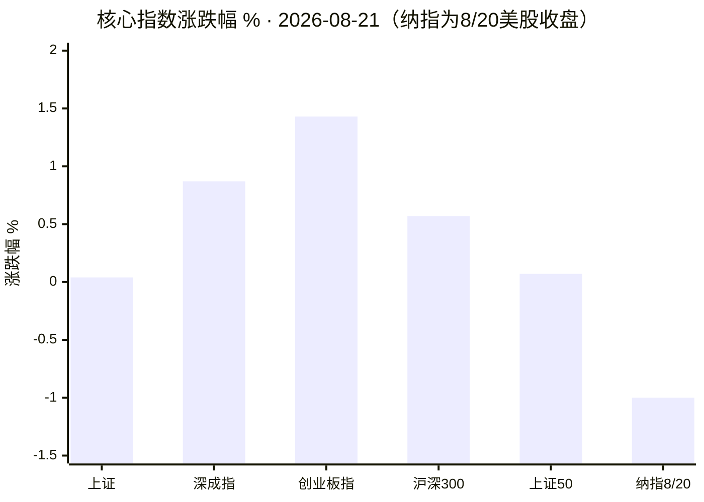
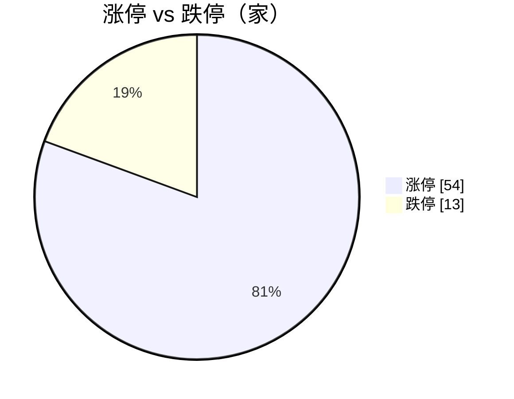
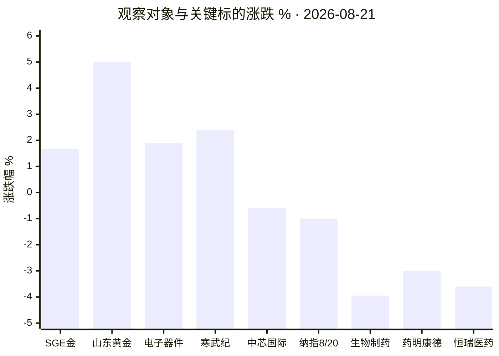

# A 股盘后复盘 · 2026-08-21（周五）

> 数据时点：A 股 2026-08-21 15:30 收盘（北京时间）；纳指/美股为 2026-08-20（美东周四）收盘；国际金价为 08-21 抓取时点实时值。内容仅供研究，不构成投资建议。

## 1. 今日结论

1. 指数分化明显：上证微涨 0.04% 收 3905.20，创业板指 +1.43% 领涨，两市成交约 1.88 万亿，成长风格占优。
2. **黄金是当日最强主线**：SGE Au99.99 现货 984.3 元/克（约 +1.67%）连续第二日大涨，黄金概念 +3.52% 居概念涨幅第一，山东黄金放量涨 5%（量比 4.13）。
3. **医药链重挫**：CXO 概念 -5.50%、CRO -5.11%、生物制药行业 -3.95%，昨日“生物医药引领沪指重上 3900 点”后一日急回撤；但医药内部分化，键凯科技 20% 两连板、汉森制药三连板。
4. 半导体维持强势中继：电子器件 +1.90%，寒武纪 +2.4%（成交 124.5 亿）；但中芯国际 -0.6% 出现 KDJ 死叉，内部亦有分化。
5. 隔夜纳指 -1.00% 收 26067.17，本周受芯片股抛售与债券收益率上行压制，8/26 英伟达财报是下周最大外部变量。

## 2. A 股异动

- 涨停 54 家 / 跌停 13 家，情绪中性偏暖；最高连板：汉森制药 3 连板。
- 涨停梯队里医药股占比高（双鹭药业 2 连板、汉森制药 3 连板、贝瑞基因 2 连板、键凯科技 20% 2 连板），与 CXO/仿制药的大跌形成罕见的板块内部撕裂。
- 市场资金流向接口当日不可用（akshare 返回空，连续第三日），资金面用个股量比侧写：山东黄金量比 4.13、药明康德量比 2.31，放量方向一涨一跌，资金由医药向黄金/有色切换的迹象明显。
- 主线雷达（stocksight）因东方财富接口拒绝访问而失败，详见 `主线雷达.md`，已用 akshare 板块数据替代。

### 关键标的（stocksight `--provider auto`，neutral 视角）

| 标的 | 收盘 | 涨跌幅 | 量比 | 成交额 | stocksight 信号 |
|:---|---:|---:|---:|---:|:---|
| 山东黄金 600547（XD） | 37.05 | +5.0% | 4.13 | 54.4 亿 | RSI 信号，放量上攻 |
| 寒武纪 688256 | 1035.00 | +2.4% | 1.91 | 124.5 亿 | MACD 信号 |
| 中芯国际 688981 | 124.80 | -0.6% | — | 38.3 亿 | KDJ 死叉，短线动能转弱 |
| 药明康德 603259 | 162.86 | -3.0% | 2.31 | 93.9 亿 | RSI 信号，放量下跌 |
| 恒瑞医药 600276 | 47.74 | -3.6% | — | — | 无显著异动信号，趋势性回调 |

## 3. 数据可视化

### 主要指数涨跌幅（纳指为 8/20 美股收盘）

### 涨停 vs 跌停

### 四观察对象与关键标的涨跌

- 行业资金净流入前 5：**当日无数据**（akshare 市场资金流向接口返回空），该图省略，不做推测。

PNG 版本（数据与上文一致）：`charts/01_核心指数.png`、`charts/02_板块涨跌.png`、`charts/03_关键标的.png`、`charts/04_涨跌停与观察对象.png`。

## 4. 四观察对象

### 黄金 —— 逢低关注

- **行情**：SGE Au99.99 现货 15:29 报 984.3 元/克，较昨收 968.14 约 +1.67%（昨日 +2.42%，连续放量上行）。国际现货金 4561.54 美元/盎司（TradingEconomics 08-21 抓取时点，日 +1.01%、月 +10.42%、年 +35.22%）。A 股黄金概念 +3.52% 居概念涨幅第一，山东黄金 +5.0%（量比 4.13）。
- **驱动**：中国央行 7 月增持黄金 64 万盎司，创近三年单月新高、连续 21 个月增持；美国 7 月非农意外转负（-2.3 万人），美联储降息预期显著升温、美元承压（财闻 08-11）。财联社报道黄金 ETF 近期获约 200 亿资金流入（正文未能完整抓取，仅标题级引用）。
- **背景与风险**：金价 1 月创历史峰值后曾深度回撤逾 1000 美元（2 月一度较高点 -21%，CBS/BullionVault），8 月为强反弹段；短线连涨后追高性价比下降，若降息预期反复或美元走强，回撤会很快。
- **建议：逢低关注**。央行购金 + 降息交易的中期逻辑清晰，但连涨之后不追高，等回踩再看。主要风险：降息预期证伪、金价高波动（年内已示范过 20% 级回撤）。

### 半导体 —— 观望

- **行情**：电子器件行业 +1.90%（行业涨幅第四）、电子信息 +0.76%；寒武纪 +2.4% 收 1035 元、成交 124.5 亿（MACD 信号）；中芯国际 -0.6%（KDJ 死叉，短线动能转弱）。
- **海外**：本周美股芯片股遭抛售（8/18 芯片抛售 + 债券收益率上行拖累三大指数，Yahoo Finance）；英伟达 8/20 收约 217 美元附近，5 日 -3.75%，**8/26（美东）公布财报**。
- **建议：观望**。A 股 AI 算力链仍是强势中继，但龙头内部分化（寒武纪强、中芯弱），且英伟达财报事件风险在前，方向未定前不做增减。主要风险：英伟达财报不及预期引发全球半导体估值联动回撤；国产链高位标的波动放大。

### 纳斯达克 —— 观望

- **行情**：8/20（美东周四）收 26067.17，-1.00%（前一日 26331.09）；本周三个交易日两跌一平，受芯片股抛售与政府债收益率上行双重压制（新浪美股日线 + Yahoo Finance）。北京时间 15:30 美股未开盘，以上为最近收盘。
- **建议：观望**。指数处于高位缩量震荡，8/26 英伟达财报公布前多空都缺乏催化。主要风险：财报或利率路径超预期引发的高波动；AI 权重股拥挤交易的回撤风险。

### 医药 —— 观望

- **行情**：生物制药行业 -3.95%（行业跌幅第一）、医疗器械 -2.12%；概念端 CXO -5.50%、CRO -5.11%、仿制药 -4.58% 包揽跌幅前列。恒瑞医药 -3.6%、药明康德 -3.0%（量比 2.31 放量下跌）。
- **消息面**：昨日（8/20）生物医药刚引领沪指重上 3900 点（新浪 ETF 综述），今日为获利盘急回撤；恒瑞半年报显示创新药收入 88.09 亿 +16.38%（占药品收入 63.16%）、仿制药受集采拖累 -16.07%，公司已启动新一轮回购（网易财经）。
- **分化**：跌的是前期涨幅大的 CXO/创新药权重，涨停的是低位补涨与个股逻辑（键凯科技 20% 2 连板、汉森制药 3 连板、双鹭药业/贝瑞基因 2 连板）。
- **建议：观望**。单日 -5% 级别的板块急跌未见企稳信号，不接飞刀；恒瑞回购与创新药基本面是中期托底，但短线波动过大。主要风险：集采与药价政策压制持续；高位 CXO 筹码松动引发第二波下杀。

## 5. 次日观察点

1. 黄金概念能否缩量回踩不破、山东黄金放量后的承接力度；国际金价能否站稳 4550 美元上方。
2. CXO/创新药是否出现止跌信号（缩量十字星或龙头翻红），恒瑞回购落地节奏。
3. 寒武纪千元上方的量能持续性；中芯国际 KDJ 死叉后是否确认回调。
4. 今晚（美东周五）纳指对下周英伟达财报（8/26）的抢跑方向。
5. 两市成交能否维持 1.8 万亿上方——缩量则指数轮动难度加大。

## 6. 风险提示

本报告为盘后研究摘要，全部数据来自公开接口与公开报道，可能存在延迟或错误；不构成任何投资建议，据此操作风险自负。

## 7. 数据时点与来源

| 来源 | 状态 | 明细 |
|:---|:---|:---|
| akshare-stock（skill） | 成功（部分接口不可用） | A 股大盘/涨跌停/行业/概念板块（15:31-15:32 采集）；SGE Au99.99 现货与日线；新浪美股纳指日线。**市场资金流向接口返回空，标注不可用** |
| stocksight（skill） | 部分成功 | `report.py --provider auto`（腾讯源）5 只标的详细报告成功，见 `stocksight/`；**mainline_radar 失败**（东财接口拒绝本 VM 出口 IP），见 `主线雷达.md` |
| firecrawl-cli（skill） | 成功（免费无密钥档） | `FIRECRAWL_API_KEY` 未注入，走免费档限速检索 6 次；原始结果见 `sources/*.json`。检索混入部分 2024-2025 旧文，已按正文日期甄别剔除 |

引用报道：财闻（2026-08-11，央行购金/非农）、Yahoo Finance（2026-08-18 美股芯片抛售；NVDA 行情页 08-21 抓取）、TradingEconomics（08-21 抓取时点金价）、CBS News（8 月上旬金价回撤分析）、新浪财经 ETF 综述（2026-08-20）、网易财经（恒瑞半年报与回购）、财联社（黄金 ETF 资金流入，仅标题级）。
