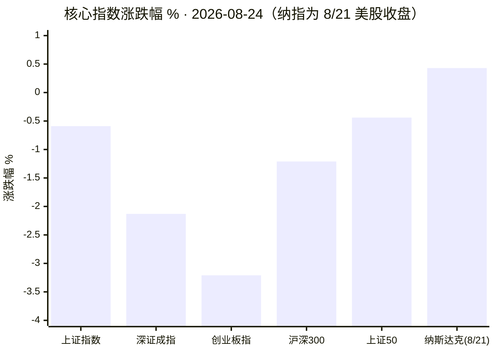
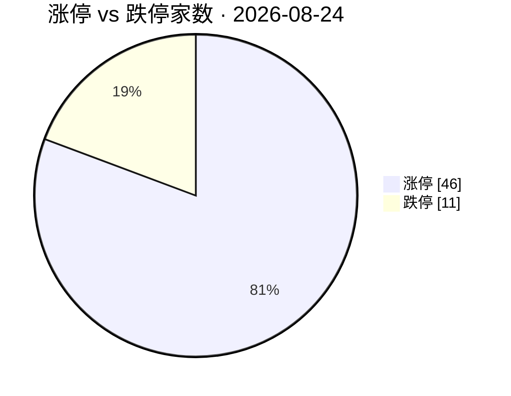
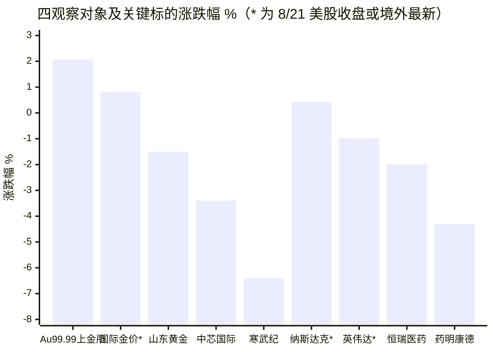

# 2026-08-24 A 股收盘复盘

- 生成时间：2026-08-24 15:30–15:40（北京时间），定时任务准点触发
- 数据来源：akshare-stock（收盘行情）、stocksight（异动扫描/主线雷达/个股报告）、firecrawl-cli（资讯检索）
- 本内容仅供研究，不构成投资建议

---

## 1. 今日结论

1. **指数普跌、结构分化剧烈**：上证 -0.59% 相对抗跌，创业板指 -3.21%、深成指 -2.13% 放量下挫；两市成交约 2.0 万亿（沪 9520 亿 + 深 10554 亿），属放量调整而非缩量阴跌。
2. **黄金是当日最强主线**：上金所 Au99.99 现货收于约 1003.9 元/克（+2.07%），首次站上 1000 元/克整数关口；国际现货金 4644.69 美元/盎司（+0.81%，5 月中旬以来新高）。A 股贵金属板块 +4.41% 居行业涨幅榜首，白银细分 +7.44%。
3. **医药/CXO 遭遇获利兑现式大跌**：CXO 概念 -5.48%、CRO -5.32%、创新药 -4.08%，泰格医药跌超 9%，创新药 ETF 跌约 5%；卖方观点认为主因是前期涨幅较大后的获利了结。
4. **科技成长杀跌**：寒武纪 -6.4%（量比 2.75，MACD 死叉）、中芯国际 -3.4%（MACD 死叉），电子器件行业 -2.68%。
5. **防御与红利方向接力**：煤炭 +2.07%（多股涨停）、酿酒 +1.65%、金融 +1.08%，资金向低位防御资产轮动。

## 2. A 股异动

### 涨跌停与情绪

- 涨停 46 家 / 跌停 11 家，最高连板 3（深中华A、中关村）。
- 涨停结构集中在黄金珠宝（深中华A 3 连板）、国际工程（北方国际）、煤炭（美锦能源、上海能源、大有能源）、种业（登海种业）、家居（海鸥住工）等，题材偏防御+涨价逻辑。
- 情绪面：普跌日仍有 46 家涨停，局部赚钱效应集中在贵金属/煤炭/种业三条线。

### 资金流

- akshare「市场资金流向」接口本日返回空数据（连续多日不可用），**全市场主力资金流数据不可用**，以量比侧写替代：山东黄金量比 5.06、药明康德 2.77、寒武纪 2.75、中芯国际 2.38，放量集中在黄金兑现盘与科技/医药抛压。

### stocksight 主线雷达（东财接口本日恢复可用）

| 排名 | 板块 | 涨跌幅 | 领涨股 | 自动雷达分 | 状态 |
|---:|---|---:|---|---:|---|
| 1 | 贵金属 | +4.41% | 湖南白银 +9.98% | 9.5/10 | 强势雷达 |
| 2 | 国际工程 | +3.66% | 北方国际 +10.03% | 9.5/10 | 强势雷达 |
| 3 | 焦炭 | +3.64% | 美锦能源 +9.89% | 9.5/10 | 强势雷达 |
| 6 | 种子 | +4.04% | 登海种业 +10.04% | 8.5/10 | 强势雷达 |
| 7 | 黄金 | +3.40% | 四川黄金 +9.97% | 8.5/10 | 强势雷达 |
| 9 | 煤炭 | +2.80% | 美锦能源 +9.89% | 8.5/10 | 强势雷达 |

（完整 30 条见 `主线雷达.md`；自动雷达分仅为发现方向，10 项人工主线评分未确认。）

### 值得跟踪的标的（stocksight 详细报告，见 `stocksight/`）

| 标的 | 收盘 | 涨跌幅 | 量比 | 关键信号 | stocksight 结论 |
|---|---:|---:|---:|---|---|
| 山东黄金 600547 | 36.50 | -1.50% | 5.06 | 换手 5.1% 偏高，RSI 超买，MACD 仍偏多 | 过热 — RSI 超买 |
| 中芯国际 688981 | 120.58 | -3.40% | 2.38 | MACD 死叉 | 转弱 — 需关注回撤 |
| 寒武纪 688256 | 969.05 | -6.40% | 2.75 | MACD 死叉 + 超额收益异动 | 转弱 — 需关注回撤 |
| 恒瑞医药 600276 | 46.76 | -2.00% | 1.35 | RSI14 = 29.3 进入超卖区 | 观察 — 结构平稳 |
| 药明康德 603259 | 155.84 | -4.30% | 2.77 | MACD 死叉，顶背离警告 | 过热 — 背离警告 |

注意板块与个股的分歧：黄金板块大涨但龙头山东黄金放量收跌，显示高位兑现盘涌出，板块内部在向低位补涨股（四川黄金、湖南白银等）扩散。

## 3. 数据可视化

### 3.1 主要指数涨跌幅

### 3.2 涨停 vs 跌停

### 3.3 四观察对象及关键标的涨跌

### 3.4 行业资金净流入前 5

**本图省略**：akshare「市场资金流向」接口当日返回空数据，行业资金净流入数据不可用，不编造。

（PNG 版图表见 `charts/`：核心指数、行业/概念板块前后五、观察对象、情绪与强弱板块。）

## 4. 四个观察对象

### 4.1 黄金 —— 逢低关注

- **行情**：上金所 Au99.99 现货 15:29 报 1003.9 元/克，较上周五收盘 983.56 元/克 **+2.07%**，历史性突破 1000 元/克；国际现货金 4644.69 美元/盎司（+0.81%），5 月中旬以来新高，近一月 +13.9%（Trading Economics，8/24）。
- **A 股映射**：贵金属行业 +4.41% 居首、黄金板块 +3.40%、白银 +7.44%，四川黄金/湖南白银涨停；但龙头山东黄金放量收跌 -1.5%，短线兑现压力已现。
- **驱动**（Trading Economics 8/24）：美国财政部意外加码长久期国债回购引发债务管理与财政可持续性担忧，美债收益率与美元走低，"贬值交易"重启；伊朗制裁风险推升避险需求；市场等待 7 月 PCE 数据与美联储主席沃什（Warsh）杰克逊霍尔讲话。
- **建议：逢低关注**。宏观驱动（财政担忧+降息预期+央行购金）完整，趋势未破坏；但短线情绪过热（山东黄金 RSI 超买、板块单日 +4.4%），不宜追高。**风险**：PCE 超预期或沃什讲话偏鹰导致金价急回撤；A 股黄金股相对金价的溢价收敛。

### 4.2 半导体 —— 观望

- **行情**：电子器件行业 -2.68%、电子信息 -2.51%；中芯国际 -3.40%（MACD 死叉）、寒武纪 -6.40%（量比 2.75，超额收益异动）。
- **海外**：费城半导体指数上周累计下跌约 5%（Daily Sabah 周前瞻）；英伟达 8/21 收 214.72 美元（-0.98%），**本周发布财报**，市场情绪进入观望期。
- **建议：观望**。板块处于英伟达财报事件窗口 + 国内高位股技术性走弱（双 MACD 死叉）叠加期，方向未明前不宜介入。**风险**：英伟达财报超预期引发向上跳空踏空，或不及预期带来二次杀跌。

### 4.3 纳斯达克 —— 观望

- **行情**（8/21 周五收盘，北京时间 15:30 美股未开盘）：纳指收 26180.46，**+0.43%**；但全周自 8/17 的 26644.91 回落约 **-1.74%**，周线连续走弱。
- **要点**：本周三大事件密集——英伟达财报、7 月 PCE 通胀、美联储主席沃什杰克逊霍尔讲话（Trading Economics 8/24）；黄金走强反映的美元/财政担忧同样对成长股估值构成扰动。
- **建议：观望**。事件密集周波动率大概率放大，等财报与讲话落地再定方向。**风险**：通胀数据推迟降息预期，高估值科技股回调；空仓者的踏空风险相对可控。

### 4.4 医药 —— 谨慎减仓（短线）

- **行情**：CXO 概念 -5.48%、CRO -5.32%、创新药 -4.08%、生物制药行业 -2.89%、医疗器械 -3.40%；泰格医药跌超 9%，科伦药业、凯莱英、康龙化成跌超 7%，创新药 ETF 跌约 5%（每日经济新闻 8/24）。
- **个股**：药明康德 -4.3% 放量 MACD 死叉、顶背离警告；恒瑞医药 -2.0% 但 RSI 已达 29（超卖）。
- **定性**：卖方研报（新浪财经载）认为医药普跌"主要是前期医药表现较强下的获利了结"，产业逻辑（创新药出海、AI 制药）未被证伪。
- **建议：谨慎减仓**。前期获利丰厚 + 单日放量长阴 + 龙头技术破位，短线趋势已折损，高仓位者宜借反弹降低仓位；恒瑞等已超卖标的不宜恐慌杀跌。**风险**：若属情绪性一日游，减仓后板块快速修复会损失弹性；后续 BD 大单或政策利好可能随时逆转情绪。

## 5. 次日观察点

1. 黄金：Au99.99 能否站稳 1000 元/克；山东黄金放量滞涨是兑现尾声还是趋势顶部；板块低位补涨能否延续。
2. 医药：CXO 是否止跌企稳（泰格医药、药明康德止跌信号），恒瑞超卖后是否出现修复。
3. 科技：寒武纪/中芯国际 MACD 死叉后是否确认走弱，注意创业板 3400 点附近支撑。
4. 煤炭/种业等防御接力方向的持续性（主线雷达 10 项评分待人工确认第 2 日强度）。
5. 海外：周内英伟达财报、7 月 PCE、沃什杰克逊霍尔讲话，直接影响纳指与 A 股科技情绪。

## 6. 风险提示

本报告为盘后研究摘要，全部数据来自公开接口与公开报道，可能存在延迟或口径差异；不构成任何投资建议，据此操作风险自负。

## 7. 数据时点与来源

| 来源 | 状态 | 说明 |
|---|---|---|
| akshare-stock | 部分成功 | 大盘/涨跌停/行业/概念板块、上金所金价、纳指日线正常；「市场资金流向」返回空（连续多日）；「黄金期货」「纳指行情」路由缺陷改用直连接口 |
| stocksight | 成功 | 主线雷达本日东财接口恢复可用；5 只个股详细报告（腾讯源）+ NVDA（Yahoo 源）全部生成 |
| firecrawl-cli | 成功 | 免费无密钥档（`FIRECRAWL_API_KEY` 未注入）；抓取 Trading Economics 金价、纳指/半导体/医药新闻各 4 条；检索中混入 2025 年 8 月旧文已甄别剔除 |

- A 股数据时点：2026-08-24 15:30 收盘后
- 上金所 Au99.99：2026-08-24 15:29 分时现价
- 纳指/英伟达：2026-08-21（上周五）美股收盘
- 国际金价：Trading Economics 2026-08-24 实时页
