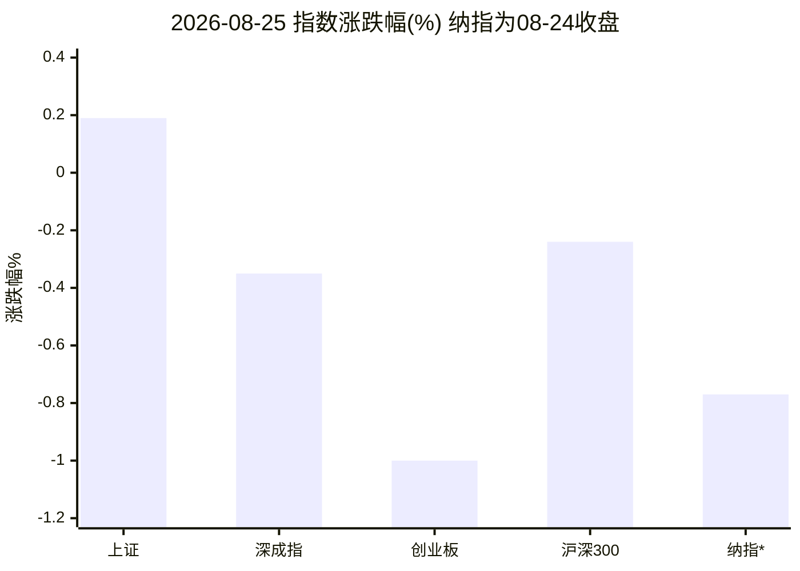
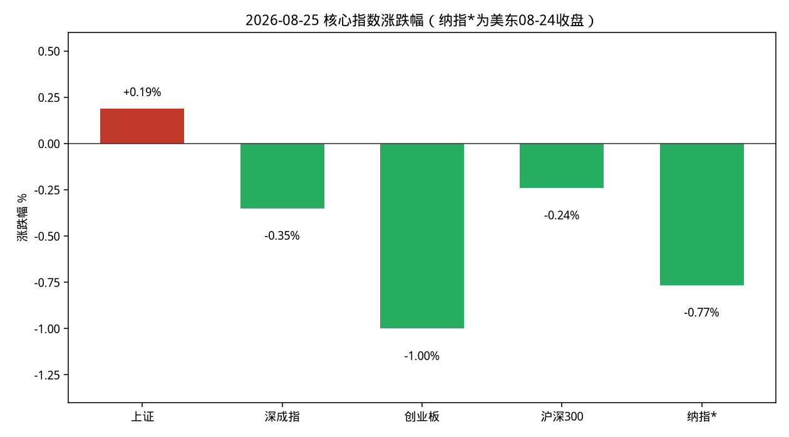
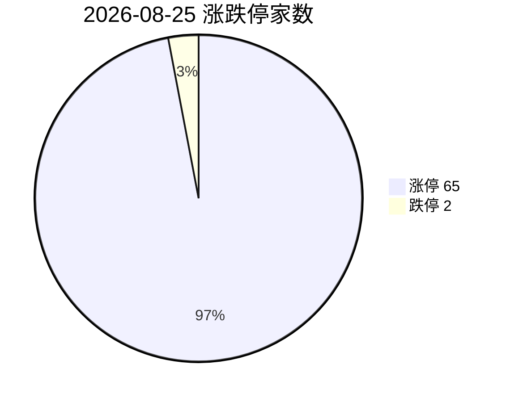
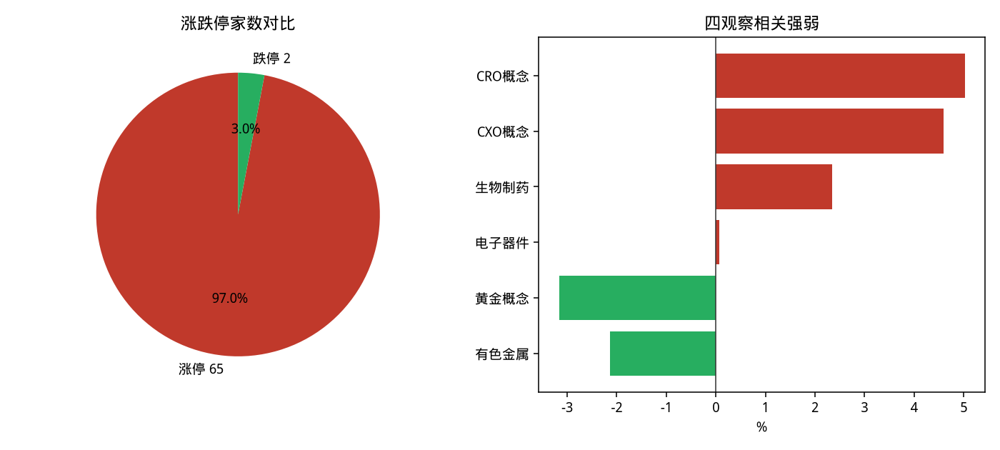
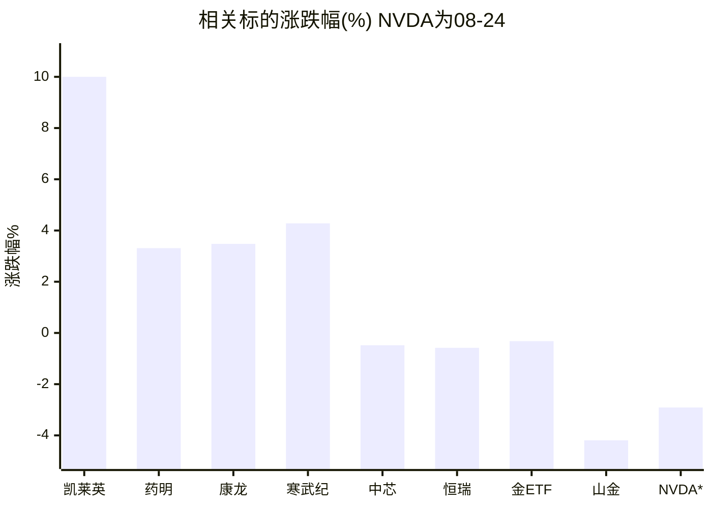
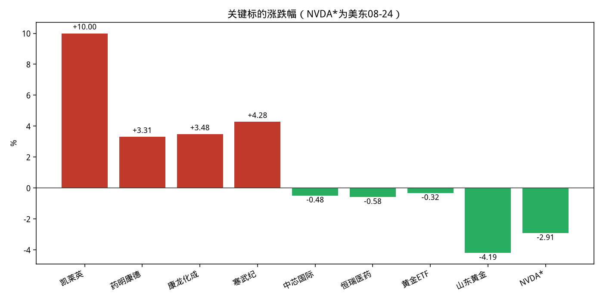
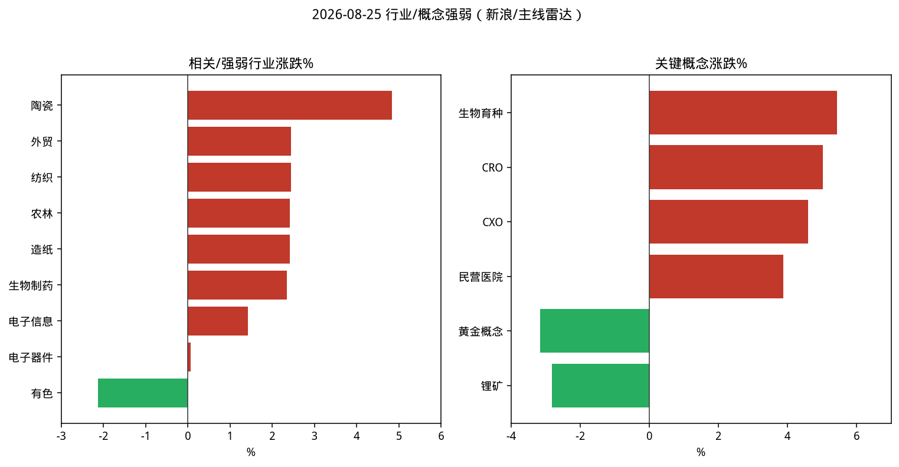

# A股盘后简报 · 2026-08-25

> 研究摘要，不构成投资建议。Cron 于 07:30 UTC（北京 15:30）准点触发，以下为收盘后采集。

## 今日结论

1. **结构分化**：上证微涨 +0.19%，创业板 -1.00%，两市涨停 65 / 跌停 2，情绪尚可但指数偏弱。
2. **医药（CRO/CXO）是当日主线**：概念涨约 +4.6%~+5.0%，凯莱英涨停；催化剂为多家 CXO 半年报扭亏/上修指引。
3. **黄金股高位兑现**：黄金概念 -3.16%，山东黄金 -4.19%；国际金价仍在高位附近震荡（约 4638 美元/盎司，日跌约 0.3%）。
4. **半导体内外背离**：A 股电子器件接近平盘，寒武纪 +4.28%；隔夜美股芯片抛售，NVDA -2.91%，纳指 -0.77%。
5. **市场资金流向接口今日仍返回空结果**，不作编造；行业资金净流入图省略。

---

## 1. 今日市场异动（最多 8 条）

| # | 标的 | 幅度 | 为何算异动 |
|---|---|---|---|
| 1 | 凯莱英 002821 | +10.00% 涨停 | StockSight：超额收益异动（危险），量比 5.37、换手约 5.4%、振幅 11.5%；MACD 死叉提示短线过热风险 |
| 2 | CRO / CXO 概念 | +5.02% / +4.60% | 主线雷达自动分 5.5/10，列「跟踪观察」；领涨凯莱英，半报催化扩散 |
| 3 | 生物制药行业 | +2.35% | 行业榜前列；成交额约 478 亿，领涨福瑞医科 +15.78% |
| 4 | 黄金概念 | -3.16% | 概念跌幅榜第 1；与国际金高位震荡、A 股黄金股兑现一致 |
| 5 | 山东黄金 600547 | -4.19% | 量比 3.80、振幅 8.9%；StockSight RSI 偏热后回落观察 |
| 6 | 有色金属行业 | -2.13% | 行业跌幅榜第 1，与黄金/资源股回调共振 |
| 7 | 寒武纪 688256 | +4.28% | 半导体方向内部分化中的算力芯片强势个股（腾讯行情） |
| 8 | NVDA（美东 08-24） | -2.91% | 隔夜芯片抛售拖累纳指；Business Times/CNBC：存储与芯片股领跌 |

其他：涨停池 65 家（如深中华A 4 连板）；跌停相关池 2 家（菲林格尔、养元饮品）。生物育种概念 +5.43%（万向德农涨停）属农业主题，不在四观察对象内，仅作市场情绪参考。

---

## 2. 四个观察对象的行情要点

### 黄金

| 项目 | 数据 | 时点/来源 |
|---|---|---|
| 上金所 Au99.99 | 现价 **1000.0 元/克**，较 08-24 收盘 1004.21 **-0.42%** | akshare 分时 15:30 / 日线 |
| 国际金（TE） | 约 **4637.3~4637.9 美元/盎司**，日约 **-0.30%~-0.32%**；近月 +13.7% | Trading Economics 08-25 |
| A 股黄金股 | 黄金概念 **-3.16%**；山东黄金 **-4.19%**；黄金 ETF 518880 **-0.32%** | 新浪概念 / 腾讯 |
| 黄金期货（akshare 主力列表） | **数据不可用**（返回无效合约行） | akshare-stock 失败 |
| 情绪/驱动 | 美债回购/「贬值交易」支撑金价近 3 个月高位，但盘中冲高回落；A 股黄金股高位兑现 | firecrawl：TE / 南方财经 / 东财财富号 |
| 关键新闻 | 现货曾冲击约 4700 美元后回落；贝森特称将继续国债回购；关注本周 PCE 与 Jackson Hole（现任联储主席 Warsh） | TE / 新浪证券日报转载 |

### 半导体

| 项目 | 数据 | 时点/来源 |
|---|---|---|
| A 股电子器件 / 电子信息 | **+0.07% / +1.42%** | 新浪行业 |
| 龙头 | 中芯国际 **-0.48%**（MACD/KDJ 警告）；寒武纪 **+4.28%**；紫光国微 **+0.77%** | StockSight / 腾讯 |
| 海外芯片 | NVDA **-2.91%**（08-24）；新闻称费城半导体承压，美光等存储股跌幅更大 | Yahoo + firecrawl |
| 资金 | 市场资金流向 **数据不可用** | akshare 空返回 |
| 关键新闻 | 隔夜美股芯片抛售→A 股存储/算力承压预期；韩股半导体股波动大 | X/财闻/CNBC |

### 纳斯达克（纳指）

| 项目 | 数据 | 时点/来源 |
|---|---|---|
| 收盘 | **25980.19**，较前一交易日 **-0.765%**（约 -200 点） | akshare `.ixic`，**美东 2026-08-24 收盘** |
| 新闻交叉验证 | CNBC/AP：纳指收于 25980.19，跌约 0.76%~0.8%；芯片股拖累 | firecrawl |
| 宏观日历 | 本周关注 PCE、NVDA 财报、Jackson Hole（Warsh）；伊核相关制裁叙事扰动风险偏好 | Reuters / TE |
| 今日美股盘中（北京 15:30） | **尚未开盘**，无当日收盘 | — |

### 医药

| 项目 | 数据 | 时点/来源 |
|---|---|---|
| 行业/概念 | 生物制药 **+2.35%**；CRO **+5.02%**；CXO **+4.60%**；民营医院 **+3.88%** | 新浪 + 主线雷达 |
| 龙头 | 凯莱英 **+10%**；药明康德 **+3.31%**；康龙化成 **+3.48%**；恒瑞 **-0.58%**（相对板块跑输） | StockSight / 腾讯 |
| 资金/情绪 | 板块成交活跃（生物制药约 478 亿）；雷达将 CRO/CXO 列为跟踪观察（5.5/10，完整主线分待确认） | stocksight |
| 关键新闻 | 美迪西、益诺思半年报扭亏；药明康德上修全年指引；港股 CRO 跟涨；机构称全球需求复苏确认但仍有地缘政治风险 | 财闻 / 新浪港股 / eet-china |

---

## 3. 数据可视化

### 主要指数涨跌幅

### 涨停 vs 跌停

### 四观察对象及相关标的

### 行业资金净流入前 5

**省略**：akshare「市场资金流向」返回空（无近 5 日主力资金数值），禁止编造。

---

## 4. 投资建议（三选一）

> 以下为研究视角仓位态度，**不是买卖指令**。任选操作都需自担风险；注意流动性、停牌、涨跌停与汇率/隔夜外盘跳空。

| 对象 | 建议 | 理由（1–2 句） | 主要风险 |
|---|---|---|---|
| **黄金** | **观望** | 现货仍处近三个月高位附近震荡，A 股黄金股已明显兑现；方向未坏但赔率变差，不宜追涨股也不必急于左侧重仓。 | 美元/美债回购预期反复；若风险偏好回升，金价与黄金股可能继续回吐。 |
| **半导体** | **观望** | A 股电子板块接近平盘、龙头分化；外盘芯片抛售且临近 NVDA 财报，等待外盘情绪与业绩落地后再评估。 | 财报不及预期、出口管制/地缘、存储价格叙事反转。 |
| **纳指** | **观望** | 上一交易日收跌且芯片拖累明确，本周宏观与科技财报密集，短线波动放大，不适合在信息真空期加仓。 | PCE/联储讲话引发利率预期重定价；科技集中度过高导致指数弹性大。 |
| **医药** | **逢低关注** | CRO/CXO 有半报扭亏与订单回暖的基本面线索，主线雷达已进入跟踪观察；但涨停与高量比后短线拥挤，更适合回撤确认而非追板。 | 一日游行情、海外政策/清单类地缘扰动、恒瑞等传统药企与 CXO 分化。 |

---

## 5. 次日观察点

1. 美东 08-25 开盘后纳指/费城半导体能否止跌，NVDA 财报前定价。
2. CRO/CXO 能否延续（关注凯莱英开板后量能、药明康德跟风强度）。
3. 黄金股是否止跌，Au99.99 能否站稳 1000 元/克整数关。
4. 本周 PCE 与 Jackson Hole（Warsh）对利率预期的冲击。

---

## 6. 风险提示

- 内容仅供研究学习，**不构成投资建议或代客理财**。
- 行情与新闻存在延迟、口径差异；部分接口失败处已标明「数据不可用」。
- 涨停板、科创板与美股隔夜波动可能导致大幅跳空，注意仓位与流动性风险。

---

## 7. 数据来源与时间戳

| Skill | 状态 | 说明 |
|---|---|---|
| **akshare-stock** | 部分成功 | 成功：A股大盘、涨停统计（65/2）、行业/概念板块、Au99.99、纳指日线、涨停池。失败/不可用：市场资金流向（空）、黄金期货主力列表（无效行）、「纳指行情/半导体板块/医药板块」自然语言路由未返回专用板块（回退到行业总榜）。补救：直接 `stock_sector_spot` / `spot_*_sge` / `index_us_stock_sina`。 |
| **stocksight** | 成功 | `mainline_radar.py`（akshare 源，约 3s）；详细报告：002821 / 600276 / 688981 / 600547；标准报告：NVDA（yahoo）。策略：neutral。 |
| **firecrawl-cli** | 成功（无密钥免费档） | `FIRECRAWL_API_KEY` 未注入；`search --scrape` + TE/雅虎 scrape 完成。雅虎 IXIC 页抓取失败（页面错误页），纳指数值改用 akshare + CNBC/AP 交叉验证。原始文件见 `sources/`。 |

- **采集时间**：2026-08-25 约 07:31–07:50 UTC（北京约 15:31–15:50）
- **报告目录**：`reports/2026-08-25/`（`复盘.md`、`主线雷达.md`、`stocksight/`、`charts/`、`sources/`）
)
