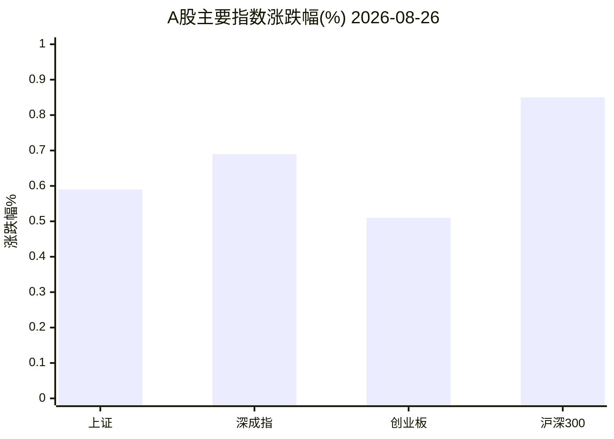
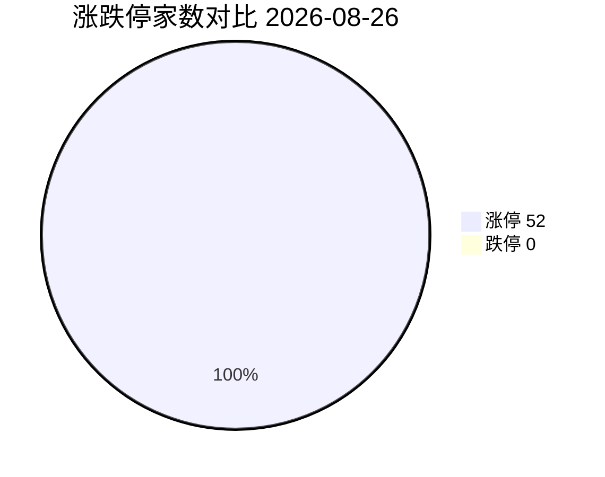
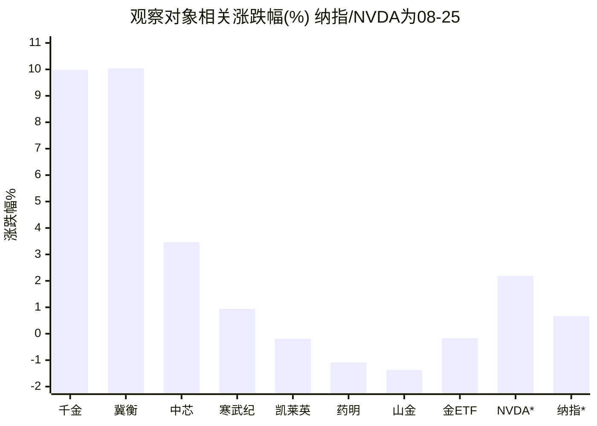
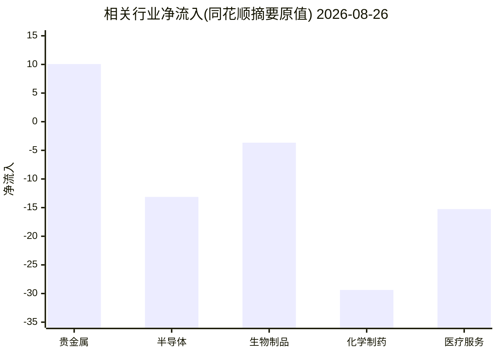

# A股盘后简报 · 2026-08-26

> 研究摘要，不构成投资建议。Cron 于 07:30 UTC（北京 15:30）准点触发，以下为收盘后采集。

## 今日结论

1. **指数偏强、情绪修复**：上证 +0.59%、沪深300 +0.85%、上证50 +1.03%；涨停 52 / 跌停 0，金融与光伏细分领涨。
2. **医药内部分化**：生物制药行业小涨，但 CXO/CRO 概念回调约 1%~1.4%，昨日涨停的凯莱英高量比收平；个股涨停集中在千金药业、冀衡医药等。
3. **半导体内外温差**：同花顺半导体约 -0.12%（净流出），中芯国际却 +3.46%；隔夜纳指/NVDA 反弹，夜盘关注 NVDA 财报。
4. **黄金高位震荡**：上金所 Au99.99 约 1001 元/克微涨；国际金约 4631~4633 美元/盎司日跌约 0.5%~0.6%；A 股黄金股分化。
5. **市场资金流向接口仍返回空**；行业级净流入改用同花顺行业摘要（见下）。黄金期货「主力列表」自然语言查询无效，AU0 日线最新为 08-25。

---

## 1. 今日市场异动（最多 8 条）

| # | 标的 | 幅度 | 为何算异动 |
|---|---|---|---|
| 1 | 千金药业 600479 | +9.98% 涨停 | StockSight：超额收益异动 L3（危险），量比 5.33、换手约 5.3%、RSI 75；生物制药领涨股 |
| 2 | 冀衡医药 002742 | +10.04% 涨停 | 连板 2；StockSight 过热（RSI 超买），量比 2.46 |
| 3 | 中芯国际 688981 | +3.46% | 半导体方向内部分化中的强势龙头；量比约 2.0，但 MACD 死叉提示短线转弱风险 |
| 4 | CXO / CRO 概念 | -1.36% / -0.99% | 昨日主线今日兑现；医疗服务同花顺板块 -1.23%、净流出 |
| 5 | 凯莱英 002821 | -0.19% | 价平量巨：量比 4.79、换手约 4.8%；StockSight MACD 死叉、风险规避 |
| 6 | 金辰股份 603396 / HIT电池 | +10.02% / +3.62% | 主线雷达第 1（自动分 5.5/10，跟踪观察）；光伏细分扩散 |
| 7 | 山东黄金 600547 | -1.37% | 量比 2.66；StockSight KDJ 死叉，黄金股高位回撤观察 |
| 8 | 纳指 / NVDA（美东 08-25） | +0.66% / +2.19% | 科技反弹、芯片修复；NVDA 财报前定价（路透：纳指 +0.66%，NVDA +2.2%，AMD +4.9%） |

其他：涨停 52 家（如海鸥住工 3 连板、融发核电等）；跌停 0 家。金融行业 +2.21% 为行业涨幅第 1，不在四观察对象内，仅作市场情绪参考。

---

## 2. 四个观察对象的行情要点

### 黄金

| 项目 | 数据 | 时点/来源 |
|---|---|---|
| 上金所 Au99.99 | 分时末价 **1001.0 元/克**，较 08-25 日线收盘 1000.0 **+0.10%**；延时行情 iAu99.99 约 **1001.6** | akshare 分时/日线；上金所延时（firecrawl） |
| 国际金（TE） | 约 **4631.3~4632.7 美元/盎司**，日约 **-0.55%~-0.57%**；近月约 +13.6% | Trading Economics 08-26 |
| A 股黄金相关 | 同花顺贵金属 **-0.25%**（净流入约 +10.1）；山东黄金 **-1.37%**；中金黄金 **+0.72%**；黄金 ETF 518880 **-0.17%** | THS / 新浪个股 |
| 黄金期货 | akshare-stock「黄金期货」**数据不可用**（无效合约行）；AU0 日线最新 **08-25 收 1004.22**（08-26 日线尚未入库） | akshare |
| 情绪/驱动 | 金价自近三个月高位小幅回落，等待美国 PCE 与 Jackson Hole（联储主席 **Warsh**）讲话；美元此前走弱、油价回落构成复杂博弈 | firecrawl：TE / WSJ |
| 关键新闻 | 现货一度接近 4650 后回落；中国经香港净进口金 7 月环比约 +11%（TE 叙述） | TE |

### 半导体

| 项目 | 数据 | 时点/来源 |
|---|---|---|
| A 股板块 | 同花顺**半导体 -0.12%**（上涨 64 / 下跌 121，净流入约 **-13.1**）；新浪电子器件 **+0.13%**、电子信息 **+0.32%** | THS / 新浪行业 |
| 龙头 | 中芯国际 **+3.46%**（MACD 警告）；寒武纪 **+0.94%**（MACD 死叉、空头排列） | StockSight / 新浪 |
| 海外芯片 | NVDA **+2.19%**（Yahoo/新浪，美东 08-25）；路透称 AMD +4.9%、芯片自周初大跌反弹 | stocksight + firecrawl |
| 资金 | 全市场「市场资金流向」**数据不可用**；半导体行业级净流出见上 | akshare 空返回；THS 行业摘要 |
| 关键新闻 | 投资者等待 **NVDA 财报**（美东周三盘后）与通胀数据；A 股半导体未跟涨外盘反弹 | Reuters / Investopedia |

### 纳斯达克（纳指）

| 项目 | 数据 | 时点/来源 |
|---|---|---|
| 收盘 | **26151.30**，较前一交易日 **+0.66%**（约 +171 点） | akshare `.IXIC`，**美东 2026-08-25 收盘** |
| 新闻交叉验证 | 路透：Dow +0.3%、S&P +0.32%、Nasdaq **+0.66%**；科技反弹、NVDA 财报前定价 | firecrawl Reuters |
| 宏观日历 | 本周 PCE、NVDA 财报、Jackson Hole（**Warsh**）；北京 15:30 时美股当日盘尚未开盘 | Reuters / TE |
| 今日美股盘中（北京 15:30） | **尚未开盘**，无 08-26 美股收盘 | — |

### 医药

| 项目 | 数据 | 时点/来源 |
|---|---|---|
| 行业/概念 | 新浪生物制药 **+0.53%**；概念 **CXO -1.36%、CRO -0.99%**；同花顺：生物制品 **+0.94%**、中药 **+0.81%**、化学制药约平、医疗服务 **-1.23%** | 新浪概念 + THS |
| 龙头 | 千金药业 **+9.98%**；冀衡医药 **+10.04%**；凯莱英 **-0.19%**（高量比）；药明康德 **-1.09%**；恒瑞 **+0.54%** | StockSight / 新浪 |
| 资金/情绪 | 化学制药净流入约 **-29.4**、医疗服务约 **-15.3**（THS）；昨日半报催化后的兑现日特征明显 | THS |
| 关键新闻 | 昨日 CXO 半报催化余温仍在媒体复盘中，但今日 A 股 CXO/CRO 已回调；机构仍谈估值修复与地缘风险并存 | firecrawl：东财/财联社/新浪（多偏 08-25 复盘） |

---

## 3. 数据可视化

### 主要指数涨跌幅

| 指数 | 收盘 | 涨跌幅 |
|---|---:|---:|
| 上证指数 | 3912.52 | +0.59% |
| 深证成指 | 13841.33 | +0.69% |
| 创业板指 | 3414.88 | +0.51% |
| 沪深300 | 4590.79 | +0.85% |

### 涨停 vs 跌停

| 类别 | 家数 |
|---|---:|
| 涨停 | 52 |
| 跌停 | 0 |

> 注：跌停为 0，饼图仅作结构占位；实际情绪以涨停家数与连板梯队为准。

### 四个观察对象及相关标的涨跌

> NVDA / 纳指为美东 **08-25** 收盘；国际金为 TE 08-26 盘中参考。

### 行业资金净流入（有数据才画）

全市场「市场资金流向」接口**数据不可用**。改用同花顺行业摘要中与观察对象相关的净流入（单位与接口口径一致，作相对强弱参考）：

| 板块 | 涨跌幅 | 净流入（接口原值） | 涨/跌家数 |
|---|---:|---:|---|
| 贵金属 | -0.25% | +10.07 | 6 / 7 |
| 半导体 | -0.12% | -13.13 | 64 / 121 |
| 生物制品 | +0.94% | -3.66 | 35 / 19 |
| 化学制药 | +0.02% | -29.38 | 79 / 75 |
| 医疗服务 | -1.23% | -15.26 | 16 / 39 |

---

## 4. 投资建议（三选一）

> 以下为研究视角仓位态度，**不是买卖指令**。选项仅限：观望 / 逢低关注 / 谨慎减仓。任选操作都需自担风险。

| 对象 | 建议 | 理由（1–2 句） | 主要风险 |
|---|---|---|---|
| **黄金** | **观望** | 内外金价仍处高位震荡、等待 PCE/Warsh；A 股黄金股分化且山东黄金出现 KDJ 转弱，方向未坏但赔率一般，不宜追涨。 | 利率预期反复、美元反弹；若风险偏好回升，金价与黄金股可能继续回吐。 |
| **半导体** | **观望** | A 股半导体整体偏弱、资金净流出，中芯单日反弹与 MACD 死叉并存；外盘反弹但临近 NVDA 财报，信息真空期不适合加仓。 | 财报不及预期、出口管制/地缘、板块内涨跌家数背离延续。 |
| **纳指** | **观望** | 08-25 科技反弹修复部分跌幅，但今晚（美东）NVDA 财报与后续 PCE 可能剧烈改写定价，短线以等待落地为主。 | 财报/宏观引发利率与成长股重定价；科技集中度高导致指数弹性大。 |
| **医药** | **谨慎减仓** | 昨日 CXO/CRO 高潮后今日概念回调、龙头高量比滞涨，短线拥挤兑现特征明确；非 CXO 个股涨停属局部异动，不代表板块共振延续。 | 半报行情一日游、地缘/清单类政策扰动、高位股回撤放大。 |

---

## 5. 次日观察点

1. 美东 08-26：NVDA 盘后财报及盘前/盘后纳指、费城半导体反应。
2. CXO/CRO 回调是否止跌（凯莱英量能能否收敛、药明康德是否续弱）。
3. 中芯国际能否在放量后站稳，半导体板块涨跌家数是否改善。
4. Au99.99 能否站稳 1000 元/克；国际金对 PCE/Warsh 的敏感度。

---

## 6. 风险提示

- 内容仅供研究学习，**不构成投资建议或代客理财**。
- 行情与新闻存在延迟、口径差异；部分接口失败处已标明「数据不可用」。
- 涨停板、科创板与美股隔夜波动可能导致大幅跳空，注意仓位与流动性风险。

---

## 7. 数据来源与时间戳

| Skill | 状态 | 说明 |
|---|---|---|
| **akshare-stock** | 部分成功 | 成功：A股大盘、涨停统计（52/0）、行业/概念板块、Au99.99、纳指日线、AU0 历史。失败/不可用：市场资金流向（空）、黄金期货主力列表（无效行）、「纳指行情/半导体板块/医药板块」自然语言路由回退到总榜。补救：`stock_sector_spot`、`spot_*_sge`、`index_us_stock_sina`、`stock_board_industry_summary_ths`、新浪个股行情。 |
| **stocksight** | 成功 | `mainline_radar.py`（akshare 源）；详细报告：688981 / 688256 / 002821 / 603259 / 600547 / 600479 / 002742 / 603396；标准报告：NVDA（yahoo）。策略：neutral。 |
| **firecrawl-cli** | 成功（无密钥免费档） | `FIRECRAWL_API_KEY` 未注入；`search --scrape`（黄金中英、纳指半导体、医药）+ scrape Trading Economics 金价页。原始文件见 `sources/`。 |

- **采集时间**：2026-08-26 约 07:30–07:36 UTC（北京约 15:30–15:36）
- **报告目录**：`reports/2026-08-26/`（`复盘.md`、`主线雷达.md`、`stocksight/`、`sources/`）
