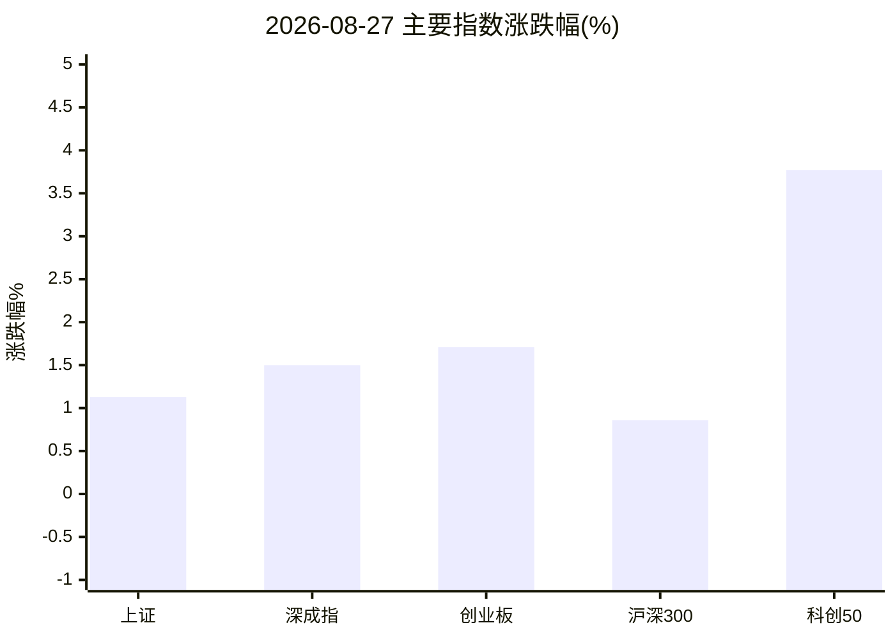
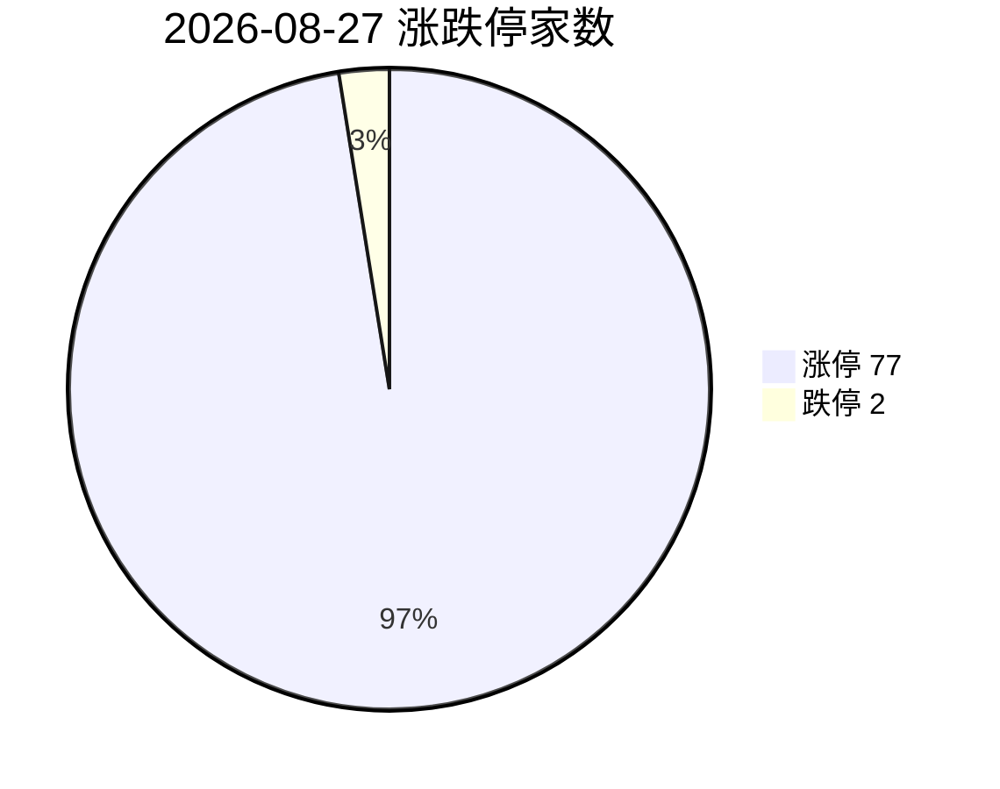
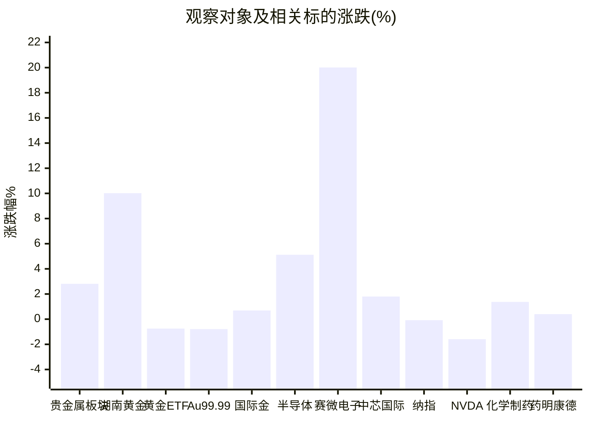
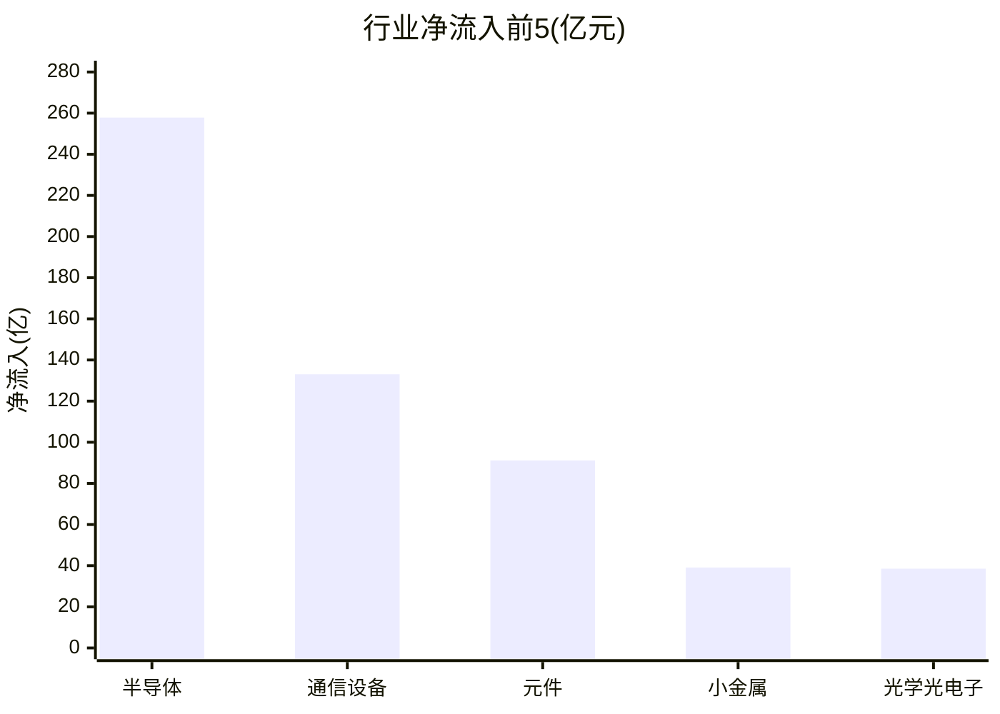

# 2026-08-27 A股盘后观察简报

> 研究摘要，不构成投资建议。数据时点：北京时间约 15:30–15:35（美股为上一交易日 08-26 收盘）。

## 今日结论

1. **A 股偏强修复**：上证 +1.13%、深成指 +1.50%、创业板 +1.71%，科创50 大涨约 +3.77%；涨停 77 / 跌停 2，情绪显著回暖。
2. **半导体成为当日主线**：同花顺半导体板块约 +5.12%，行业净流入约 +252～258 亿元，领涨赛微电子 +20%；资金高度集中电子链。
3. **黄金内部分化**：国内 Au99.99 现货相对昨收约 -0.79%，黄金 ETF -0.75%；但贵金属板块 +2.81%（湖南黄金涨停），国际金价（Trading Economics）约 4625 美元/盎司、日内约 +0.7%。
4. **纳指上一交易日近乎平盘**：纳指收 26130.20（-0.08%）；NVDA 常规交易时段约 -1.6%，盘后财报超预期（资讯面），今夜/明日美股反应待验证。
5. **医药结构性偏暖、资金并不拥挤**：化学制药 +1.37% 小幅净流入，生物制品/医疗服务净流出；龙头药明康德仅 +0.4% 且出现 MACD 死叉警示。

---

## 1. 今日市场异动（最多 8 条）

| # | 标的 | 幅度 | 为何算异动 |
|---|---|---|---|
| 1 | 赛微电子(300456) | +20.01% | 半导体领涨股；量比约 13.7、换手约 13.7%，StockSight 判为超额收益+换手过热（危险级） |
| 2 | 湖南黄金(002155) | +10.02%（涨停） | 贵金属领涨；涨停且板块全线上涨，StockSight 超额收益异动 |
| 3 | 半导体（同花顺行业） | +5.12% / 净流入约 +252 亿 | 全市场净流入第一，上涨 184 / 下跌仅 3，主线级资金共振 |
| 4 | 科创50 | +3.77% | 显著强于主板，与半导体/硬科技情绪一致 |
| 5 | 中芯国际(688981) | +1.8% | 板块中军跟涨但弱于板块；StockSight 提示 MACD 死叉（警告） |
| 6 | 黄金ETF(518880) | -0.75% | 与贵金属个股背离：股强 ETF/现货偏弱，映射金价回调 |
| 7 | NVDA | -1.59%（08-26 常规时段） | 美股半导体权重；盘后业绩超预期（资讯），常规时段仍回撤 |
| 8 | 涨停/跌停结构 | 涨停 77 / 跌停 2 | 情绪极端偏多；需警惕次日高位分歧 |

其他涨停观察样本（非逐一深度扫描）：冀衡医药、神奇制药、海鸥住工（4 连板）等。

---

## 2. 四个观察对象的行情要点

### 黄金

| 项目 | 数据 | 说明 |
|---|---|---|
| 上海金 Au99.99 | 约 992.8 元/克（15:29） | 相对 08-26 日线收盘 1000.68 约 **-0.79%** |
| AU0 黄金期货主力 | 最近日线 08-26 收 1003.00 | **当日日线尚未入表**（数据滞后） |
| 国际现货金 | 约 4624.85～4625.52 美元/盎司 | Trading Economics：较前一日约 **+0.68%～+0.69%**（08-27 盘中参考） |
| A 股贵金属板块 | +2.81%，净流入约 +12 亿 | 14 涨 0 跌；领涨湖南黄金 +10.02% |
| 山东黄金(600547) | 34.89，+1.16% | StockSight：KDJ 死叉警告 |
| 黄金ETF(518880) | 9.446，-0.75% | 量比偏高但价格跟现货回调 |

**相关新闻/宏观**：金价在联储路径博弈中反弹；7 月美国 PCE 略超预期，市场关注 Jackson Hole（联储主席 **Kevin Warsh** 周五演讲，预期难给出明确 9 月指引）。“贬值交易/债务担忧”与美元波动仍是中期叙事。国内现货走弱、国际金价回升，形成**内外价阶段背离**。

### 半导体

| 项目 | 数据 | 说明 |
|---|---|---|
| 同花顺半导体 | +5.12%，净流入约 +252 亿 | 成交额约 2881 亿；184 涨 / 3 跌 |
| 元件 / 电子化学品 | +5.33% / +5.22% | 电子链共振 |
| 赛微电子 | 37.06，+20.01% | 危险级异动（涨幅+换手过热） |
| 中芯国际 | 126.33，+1.8% | 跟涨但弱于板块；MACD 死叉 |
| 圣邦股份 | 116.90，+3.0% | 偏强、暂无极端异动信号 |
| 主线雷达 | 华为概念/科创50/卫星导航等靠前 | 自动雷达分约 5.5/10，完整 10 项仍多「待确认」 |

**相关新闻**：东财盘后标题指向「沪指涨逾 1%、科创50 大涨近 4%、半导体爆发」。海外半导体检索结果偏目录/ETF 页，**缺少高质量当日收盘综述**（已用 NVDA 报价与东财早报交叉验证）。

### 纳斯达克（纳指）

| 项目 | 数据 | 说明 |
|---|---|---|
| 纳指 .IXIC | 26130.20 | **08-26 收盘**，较 08-25 **-0.08%**（北京 15:30 仍为上一美股日） |
| 道指 / 标普 | 53463.88（-0.21%）/ 7675.70（-0.02%） | 东财早报引用 |
| NVDA | 209.66，-1.59% | Yahoo 常规时段；StockSight 无技术异动 |
| 资讯 | 英伟达 Q2 营收/利润超预期 | 08-26 **盘后**披露；对 08-27 美股开盘影响待兑现 |

**时点声明**：本简报生成于北京时间 08-27 15:30 后，**纳指与美股半导体仍引用 08-26 收盘**；今夜美股未开盘。

### 医药

| 项目 | 数据 | 说明 |
|---|---|---|
| 化学制药 | +1.37%，净流入约 +3.1 亿 | 114 涨 / 38 跌；领涨上海谊众等 |
| 生物制品 | +0.32%，净流入约 **-6.4 亿** | 涨幅有限、资金偏流出 |
| 医疗服务 / 医疗器械 | +0.58% / +0.39% | 净流入均为负 |
| 药明康德 | 159.94，+0.4% | StockSight：MACD 死叉警告 |
| 涨停样本 | 冀衡医药、神奇制药、百花医药 等 | 题材扩散，非全面爆发 |

**相关新闻**：创新药/CXO 结构性行情仍在演绎；基金解读提到美股 XBI 等近期较强、仓位再均衡；亦提示英伟达超预期或阶段性分流部分风险偏好。资讯偏观点类，**政策硬催化当日证据不足**。

---

## 3. 数据可视化（Mermaid）

### 主要指数涨跌幅（%）

### 涨停 vs 跌停家数

### 四观察对象及相关标的涨跌对比（%）

> 纳指、NVDA 为 08-26 收盘；国际金价为 TE 盘中参考涨跌；AU0 当日日线不可用故未列入。

### 行业资金净流入前 5（亿元，同花顺）

---

## 4. 投资建议（研究口径，非代客理财）

| 对象 | 建议（三选一） | 理由 | 主要风险 |
|---|---|---|---|
| **黄金** | **观望** | 国内现货/ETF 回调，国际金价反弹，股强金弱；Jackson Hole 前方向空间收窄 | 实际利率/美元急升；内外价差收敛时个股高位回撤 |
| **半导体** | **观望** | 单日资金与涨幅过热，龙头已出现危险级异动；中军跟涨但技术面现死叉警示，不宜追高 | 次日分歧回撤；外部出口管制/美股科技波动传导 |
| **纳斯达克** | **观望** | 上一交易日近乎平盘；NVDA 财报超预期尚未在常规时段定价，等待美股开盘验证 | 财报后高开低走；宏观数据扰动风险偏好 |
| **医药** | **逢低关注** | 板块温和上涨、资金未全面拥挤，创新药/CXO 仍有结构性叙事；但龙头技术信号转弱，宜等回调再观察 | 业绩证伪、主题退潮、医疗服务资金持续流出 |

**统一风险提示**：以上仅为基于公开行情与资讯的研究摘要，不构成任何买卖建议；仓位、止损与合规要求须自行独立判断。市场有风险，决策需审慎。

---

## 5. 次日观察点

1. 半导体能否在分歧中守住板块均线/中军（中芯等）量价，而非只有题材股脉冲。
2. Jackson Hole / Warsh 讲话前后国际金价与国内黄金股、黄金 ETF 是否重新同向。
3. 美股开盘后 NVDA 与 SOX/半导体 ETF 对 A 股电子链的隔夜映射。
4. 医药涨停扩散能否延续，CXO/创新药是否出现放量中军而非仅题材涨停。
5. 北向资金完整成交净买数据（当日接口显示沪/深股通北向净买为 0，**完整度存疑，标为待核实**）。

---

## 6. Skill 调用与数据来源 / 时间戳

**生成时间**：2026-08-27 约 15:30–15:40（北京时间） / 07:30–07:40 UTC  

| Skill | 状态 | 说明 |
|---|---|---|
| **akshare-stock** | 部分成功 | 「A股大盘」「纳指行情」入口因 formatter `_fmt_amount` 报错失败，已用 `stock_zh_index_spot_sina` / `index_us_stock_sina` 直连补全；「半导体/医药板块」路由回总榜，已用同花顺行业摘要补全；「黄金期货」主力列表无效，已用 `spot_quotations_sge`/`futures_main_sina(AU0)` 补全；涨停统计、资金流、行业/概念涨跌成功 |
| **stocksight** | 成功 | 主线雷达（akshare，30 条）；详细/标准报告：赛微电子、湖南黄金、中芯国际、圣邦股份、药明康德、山东黄金、黄金ETF、NVDA（策略 **neutral**） |
| **firecrawl-cli** | 部分成功 | `FIRECRAWL_API_KEY` **未注入**，走无密钥档；已检索黄金/纳指半导体/医药/纳指并 scrape Trading Economics 金价与东财早报；海外半导体检索质量一般 |

**原始材料目录**：`reports/2026-08-27/`（`复盘.md`、`主线雷达.md`、`sources/`、`stocksight/`）

**主要数据源**：akshare（新浪指数/板块、同花顺行业资金、上金所现货、新浪美股指数）、StockSight（腾讯/Yahoo）、Firecrawl（Trading Economics、东方财富、公开财经检索）
