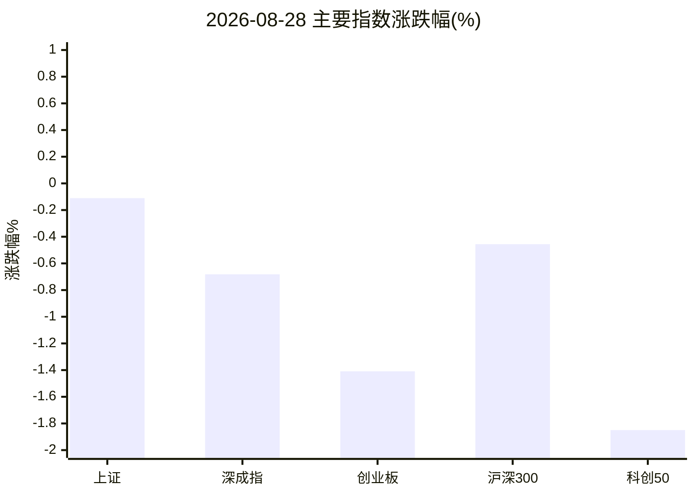
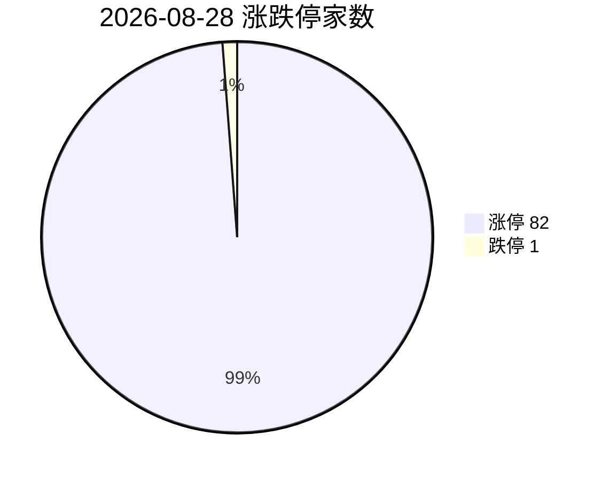
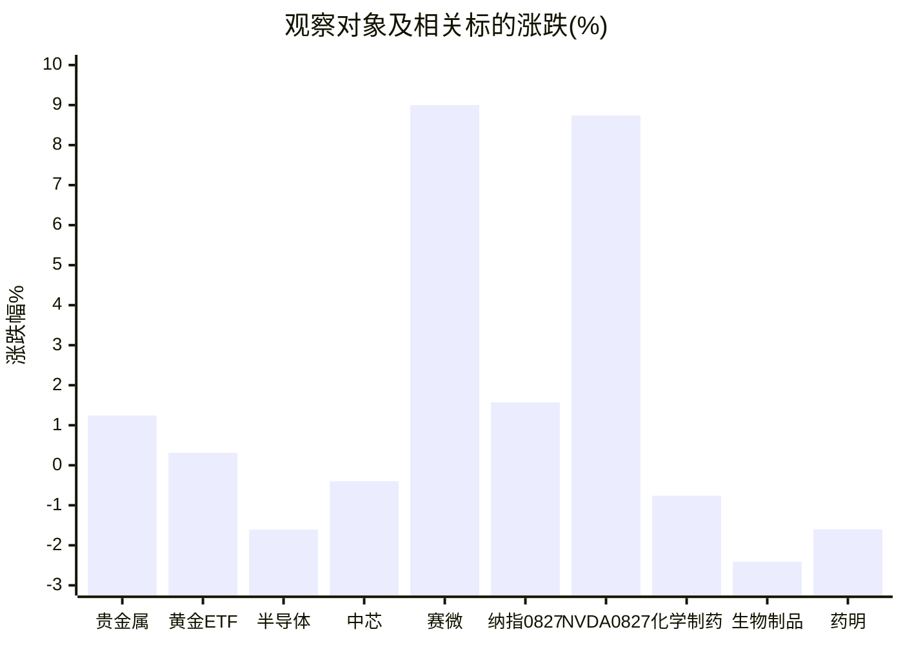
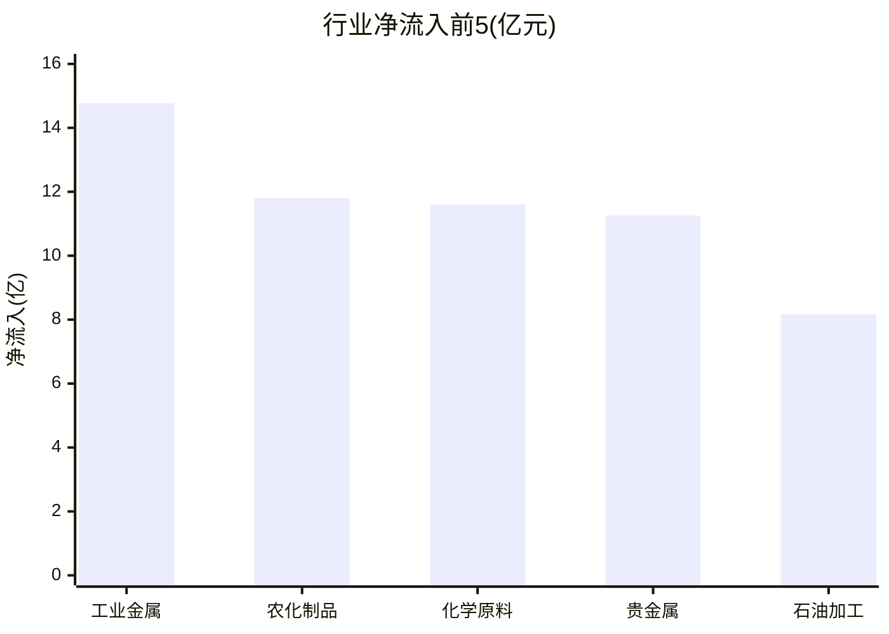

# A股盘后简报 · 2026-08-28（交易日）

> 研究摘要，不构成投资建议。数据时点以北京时间为主；纳指/美股为上一美股交易日（2026-08-27）收盘。

## 今日结论

1. **指数分化偏弱**：上证微跌，深成指与创业板、科创50明显走弱；涨停 82 / 跌停 1，情绪结构仍偏活跃但主线不在科技。
2. **资金切向周期/农业**：同花顺行业净流入前排为工业金属、农化、化学原料、**贵金属**；**半导体净流出约 164.7 亿**，化学制药/生物制品/医疗服务同步流出。
3. **黄金内外分化**：国际金价在约 4600 美元附近回落整理，A 股贵金属与黄金 ETF 仍偏强；关注联储主席 Warsh 杰克逊霍尔演讲后波动。
4. **半导体冷热切换**：隔夜纳指大涨、英伟达大涨，但 A 股半导体今日普跌流出，属“外强内弱”的高位兑现日。
5. **医药继续承压**：创新药/CXO/生物制品概念跌幅居前，龙头药明康德技术面转弱。

---

## 1. 今日市场异动（最多 8 条）

| # | 标的 | 幅度 | 为何算异动 |
|---|---|---|---|
| 1 | NVDA 英伟达（美股 08-27） | **+8.74%** 报 227.98 | StockSight：超额收益异动；业绩/指引超预期点燃 AI 交易 |
| 2 | 赛微电子 300456 | **+9.0%** 报 40.40 | 涨幅近板 + 换手约 21% + RSI 超买 + 突破布林上轨（危险级） |
| 3 | 湖南黄金 002155 | **+7.03%** 报 28.92 | 贵金属领涨股；换手约 12% + 超额收益异动 |
| 4 | 山东黄金 600547 | **+1.7%** 报 35.49 | 量比 2.49；RSI 偏热 + KDJ 死叉（短线动能分化） |
| 5 | 药明康德 603259 | **-1.6%** 报 157.40 | MACD 死叉、空头排列；CXO/创新药概念集体走弱 |
| 6 | 同花顺·半导体板块 | **-1.61%**，净流入 **-164.7 亿** | 全市场净流出第一；上涨 33 / 下跌 151 |
| 7 | 概念·创新药 / CXO | 约 **-2.5% / -2.57%** | 概念跌幅榜前排，情绪与资金双杀 |
| 8 | 涨停结构 | 涨停 **82** / 跌停 **1** | 高连板活跃于农业/化工等，非半导体主线 |

补充：中芯国际 688981 收 **-0.4%**（125.88），异动不显著；黄金 ETF 华安 518880 **+0.31%** 报 9.475。

---

## 2. 四个观察对象的行情要点

### 黄金

| 项目 | 数据 | 说明 |
|---|---|---|
| 沪金 AU0 | 最近日线 **08-27** 收 995.30 | akshare 主力日线尚未覆盖 08-28，**当日期货结算数据不可用** |
| 上金所 Au99.99 | 约 **993.5 元/克**（更新 15:29） | 相对 08-27 日线收盘 992.29，约 **+0.12%**（估算） |
| 国际金价 | 约 **4586.5 美元/盎司**，约 **-0.3%** | Trading Economics，08-28；周线偏弱，静待 Warsh 讲话 |
| A 股贵金属 | **+1.24%**，净流入约 **+17.3 亿** | 同花顺；领涨湖南黄金 +7.03% |
| 黄金 ETF 518880 | **+0.31%** | 成交额约 44.6 亿 |

**关键新闻**：证券时报指金价在 4600 关口拉锯；债务/美元信用交易仍支撑中长期，但通胀韧性与潜在加息预期制约上行。新浪期货快讯称现货金约 4610、纽约期金约 4660（盘中口径，与 TE 收盘口径并存，以 TE 约 4586 为当日偏空整理参考）。

### 半导体

| 项目 | 数据 |
|---|---|
| 同花顺半导体 | **-1.61%**，净流入 **-164.7 亿**，33↑/151↓ |
| 电子器件（新浪） | 约 **-1.03%** |
| 中芯国际 | **-0.4%** |
| 赛微电子等题材 | 个股脉冲上涨，板块整体走弱 |
| 隔夜美股芯片 | NVDA **+8.74%**；富途板块页 AVGO/INTC 等同日偏强（美东 08-27） |

**关键新闻**：08-27 A 股半导体曾大涨（媒体称板块约 +5%），受英伟达业绩催化；今日转为高位兑现。工信部“十五五”信息通信/算力叙述仍在，但短线主导是盈亏比与资金面。

### 纳斯达克（纳指）

| 项目 | 数据 |
|---|---|
| 纳斯达克综合指数 | **26541.35**（**+1.57%**） |
| 时点 | **美东 2026-08-27 收盘**（北京 08-28 15:30 时尚处该收盘后、当日美股未开盘） |
| 驱动 | 英伟达财报/指引超预期，软件与网络安全同步爆发 |
| 前瞻 | 市场关注 **08-28** Warsh 杰克逊霍尔演讲；利率路径仍是波动源 |

akshare-stock「纳指行情」入口因 formatter `_fmt_amount` NameError 失败，上表由 `index_us_stock_sina('.IXIC')` 直连补全。

### 医药

| 项目 | 数据 |
|---|---|
| 化学制药 | **-0.76%**，净流入 **-40.2 亿** |
| 生物制品 | **-2.41%**，净流入 **-25.0 亿** |
| 医疗服务 | **-2.63%**，净流入 **-32.0 亿** |
| 医疗器械 | **-0.36%** |
| 概念 | 创新药约 **-2.50%**，CXO 约 **-2.57%**，CRO 约 **-2.48%** |
| 药明康德 | **-1.6%**，MACD 死叉 |
| 恒瑞医药 | **-0.61%**，无明显异动 |

**关键新闻**：当日火搜多为基金半年报观点（中长期看好创新产业链），**缺少权威“今日政策突发”硬催化**；盘面以资金流出与题材退潮为主。

---

## 3. 数据可视化

### 主要指数涨跌幅（%）

### 涨停 vs 跌停

### 四个观察对象及相关标的涨跌（%）

### 行业资金净流入前 5（同花顺，亿元）

注：同花顺「贵金属」净流入在板块摘要接口约 +17.29 亿，与资金流排行口径 +11.26 亿略有差异，正文排行以 skill「市场/行业资金流向」输出为准；板块强弱以 THS summary 的涨跌幅与上涨/下跌家数为准。

---

## 4. 投资建议（研究视角）

| 对象 | 建议 | 理由 | 主要风险 |
|---|---|---|---|
| **黄金** | **观望** | 国际金价在 4600 附近回落整理且静待 Warsh 讲话；A 股贵金属已有溢价，不宜追高。 | 讲话偏鹰加速回调；股期背离导致金股高开低走 |
| **半导体** | **观望** | 隔夜外盘强、A 股当日大幅净流出，属兑现日；题材股换手过高。 | 追高被套；若纳指回吐，A 股映射失效 |
| **纳指** | **观望** | 单日大涨后风险收益比变差，且临近联储沟通窗口。 | 利率预期上修；AI 交易拥挤后的利润兑现 |
| **医药** | **谨慎减仓** | 创新药/CXO/生物制品资金与情绪双弱，龙头技术面转弱，未见当日硬催化。 | 继续阴跌或事件冲击；反弹若现也可能是超跌脉冲 |

> 以上为仓位节奏研究提示，**不是买卖指令**。请结合自身风险承受能力与合规要求独立决策。

---

## 5. 次日观察点

1. Warsh 杰克逊霍尔讲话后金价、美债收益率、纳指期货反应。
2. A 股半导体是否继续流出，或出现对 NVDA 映射的低吸回流。
3. 贵金属能否在金价震荡中维持相对强势，还是跟随外盘回吐。
4. 医药创新药/CXO 跌幅是否收敛，药明等龙头有无止跌量能。
5. 北向净买显示为 0 的口径需交叉核验，勿单独作为结论。

---

## 6. 风险提示

- 本材料仅供研究学习，**不构成投资建议或收益承诺**。
- 行情、资金与新闻可能延迟、口径不一或被修订；缺数据处已标注，**禁止当作完整事实**。
- 涨停/高换手个股波动剧烈，存在快速回撤风险。

---

## 7. 数据时点与来源 / Skill 调用记录

| Skill | 状态 | 说明 |
|---|---|---|
| **akshare-stock** | 部分成功 | 涨停统计、市场/行业资金、行业/概念涨跌成功；「A股大盘」「纳指行情」因 `formatter._fmt_amount` NameError 失败，已用新浪指数/纳指直连补全；「半导体/医药板块」路由回总榜，已用 THS `stock_board_industry_summary_ths` 补板块；「黄金期货」返回无效行，沪金用 `futures_main_sina('AU0')`（最新至 08-27） |
| **stocksight** | 成功 | 主线雷达（akshare，30 条）；详细/标准报告：688981、603259、600547、300456、002155、600276、NVDA（strategy=neutral） |
| **firecrawl-cli** | 成功（无 API Key，免费档） | search+scrape：gold / nasdaq-semi / pharma / semi-cn / nasdaq-cn / pharma2；scrape：tradingeconomics 金价、证券时报金价稿、新浪期货快讯 |

**生成时间**：2026-08-28 约 15:30–15:40（北京）/ 07:30–07:40 UTC  
**报告目录**：`reports/2026-08-28/`（含 `主线雷达.md`、`sources/`）
