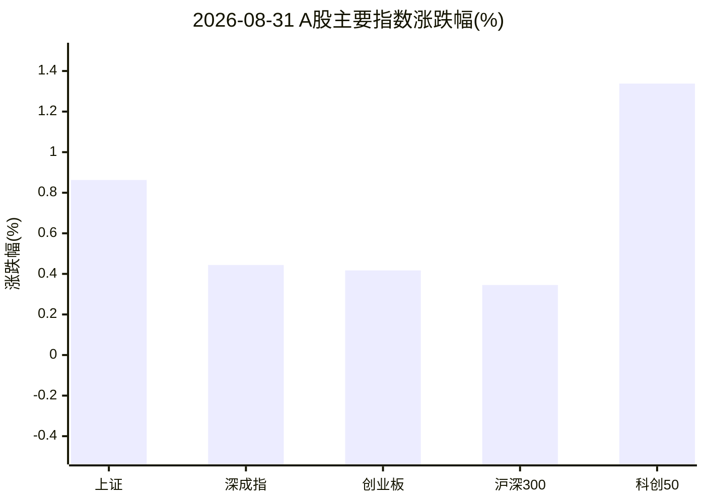
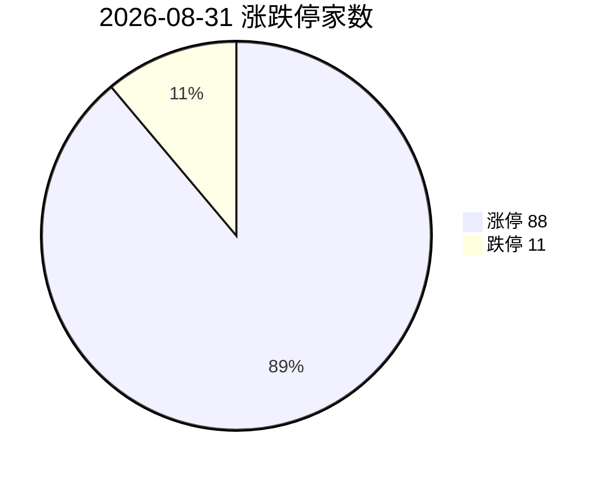
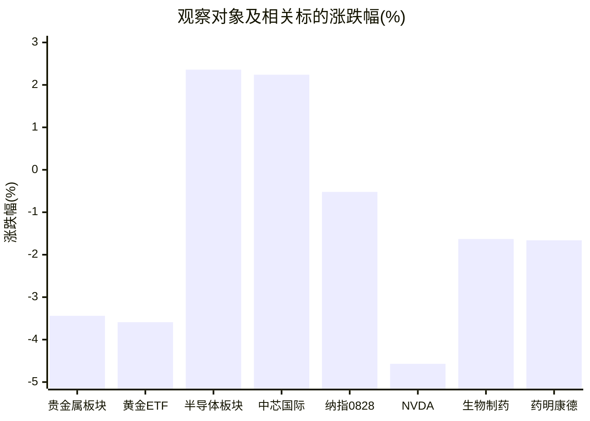
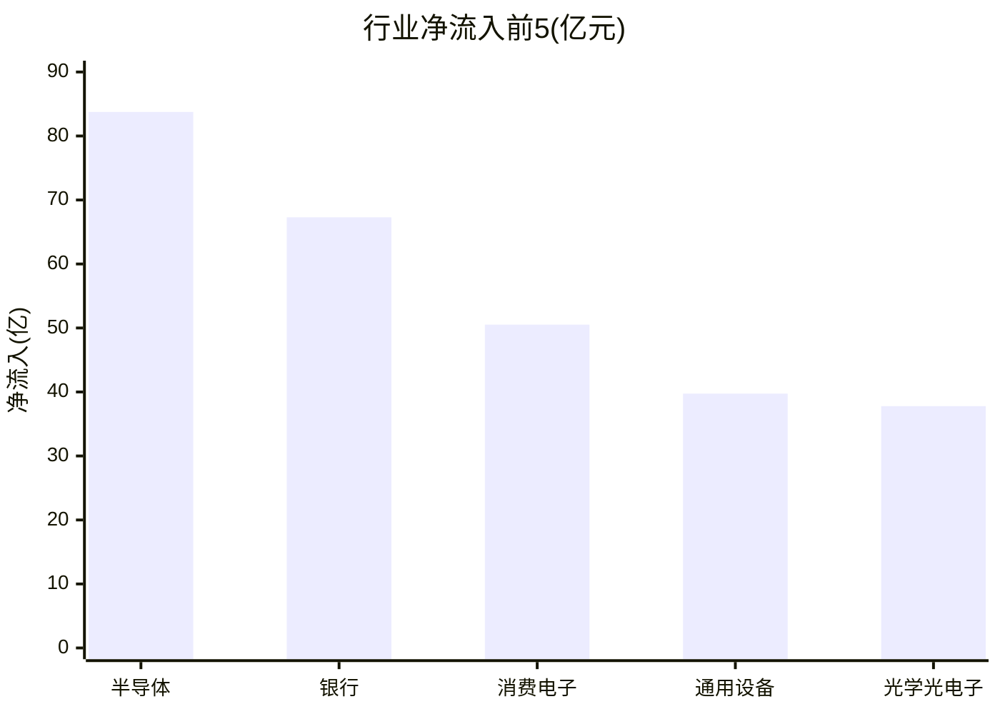

# A股盘后观察简报 · 2026-08-31（周一）

> 研究摘要，不构成投资建议。数据时点以文末为准。

## 今日结论

1. **指数低开高走收红**：上证 +0.86%、深成指 +0.44%、创业板 +0.42%、科创50 +1.34%；涨停 88 / 跌停 11，情绪偏活跃。
2. **半导体资金与涨幅双强**：同花顺行业净流入约 +83.76 亿、涨幅 +2.36%（148/37 涨跌家数），与隔夜美股芯片回调形成「外弱内强」对照。
3. **黄金高位回撤**：国际金价延续 Jackson Hole 后鹰派定价下挫；国内 Au99.99 约 960–962 元/克，贵金属板块 -3.44%，黄金 ETF 约 -3.6%。
4. **医药/创新药继续走弱**：生物制药 -1.63%、创新药概念 -2.36%，化学制药净流出约 27.6 亿；键凯科技等出现跌停级异动。
5. **纳指沿用上周五收盘**：2026-08-28 收 26402.42（-0.52%）；北京时间 15:30 美股尚未开盘。

---

## 1. 今日市场异动（最多 8 条）

| # | 标的 | 幅度 | 为何算异动 |
|---|---|---|---|
| 1 | 力芯微(688601) | +18.21% | 半导体板块领涨股；StockSight 判定超额收益异动（危险级），量比约 12.1 |
| 2 | 键凯科技(688356) | -16.36% | 创新药/医药侧杀跌样本；量比约 20.5，StockSight 危险级超额收益异动 |
| 3 | 中文在线(300364) | +20.02% | 传媒娱乐领涨；主线雷达首位行业领涨股，换手约 21.6% |
| 4 | 睿创微纳(688002) | +14.41% | 科创50概念领涨股；放量上涨，量比约 3.0 |
| 5 | 寒武纪(688256) | +6.26% | 半导体/算力权重中军走强，呼应板块净流入 |
| 6 | 湖南黄金(002155) | -5.84% | 贵金属普跌样本；换手约 7.9%、量比约 7.9，StockSight 关注级异动 |
| 7 | 黄金ETF华安(518880) | -3.59% | 黄金 beta 工具同步回撤，反映金价而非个股故事 |
| 8 | NVDA | -4.57% | 上周五美股芯片回吐；对 A 股半导体隔夜风险定价仍重要 |

补充市场结构：涨停 88 / 跌停 11；海鸥住工(002084) 6 连板、万向德农(600371) 5 连板，情绪主线偏题材扩散（传媒/地产链等），与资金主线（半导体/消费电子）不完全重合。

---

## 2. 四个观察对象的行情要点

### 黄金

| 项目 | 数据 |
|---|---|
| 国内现货 Au99.99 | 约 **960.3–962 元/克**（上金所延时/AkShare 分时尾盘）；较 08-28 收盘 995.05 约 **-3.3%～-3.5%** |
| 沪金主力 AU0 | 最新日线仅至 **08-28 收 999.28**（当日日线暂缺） |
| A股贵金属板块 | **THS -3.44%**，净流入 **-3.09 亿**，上涨 1 / 下跌 13 |
| 黄金概念 | **-2.78%**（概念跌幅榜第1） |
| 代表性标的 | 518880 **-3.59%**；湖南黄金 **-5.84%**；山东黄金 **+6.65%**（个股分化，RSI 超买，不宜代表板块） |
| 国际金价 | Trading Economics：约 **4439 USD/oz**，08-31 约 **-0.3%**，延续 08-28 急跌 |
| 关键新闻 | Jackson Hole 后美联储主席 **Kevin Warsh** 偏鹰，市场上调 9 月加息概率（约 57%）；油价/地缘亦压制金价。品牌金饰跟跌下调报价（新浪财经转述） |

**结论**：短线进入「加息预期升温 → 金价回撤 → 黄金股/ETF 跟跌」阶段；个股分化大，山东黄金逆势不可外推。

### 半导体

| 项目 | 数据 |
|---|---|
| THS 半导体 | **+2.36%**，净流入 **+83.76 亿**，上涨 148 / 下跌 37 |
| 资金排名 | 全市场行业净流入第 1 |
| 龙头样本 | 中芯国际 **+2.24%**（StockSight：偏强/MACD 金叉）；寒武纪 **+6.26%**；力芯微 **+18.21%** |
| 隔夜美股 | NVDA **-4.57%**；纳指上周五芯片回吐 |
| 关键新闻 | 早盘受全球科技扰动低开，随后低开高走；中证半导中报营收/净利连增（21 世纪经济报道/同花顺）；模拟芯片、博通集成等午后走强（金融界） |

**结论**：内资定价独立偏强，但外盘芯片仍是扰动源；领涨个股过热，更适合看板块回撤后的中军而非追高连板。

### 纳斯达克（纳指）

| 项目 | 数据 |
|---|---|
| 最近收盘 | **2026-08-28**：开 26515.99 / 收 **26402.42**，**约 -0.52%** |
| 时点说明 | 北京时间 08-31 15:30 对应美股周末休市后、周一尚未开盘 → **使用上周五收盘** |
| 关联 | 芯片股回吐周四涨幅；下周关注非农/Broadcom 等（Fidelity/Reuters 周展望） |
| 数据可用性 | akshare `index_us_stock_sina('.IXIC')` 可用；skill 入口「纳指行情」因 formatter `_fmt_amount` NameError **失败**，已用直连补全 |

**结论**：短线偏震荡偏弱，等待本周美国数据与科技财报定价；对 A 股映射看隔夜科技波动率。

### 医药

| 项目 | 数据 |
|---|---|
| 生物制药（新浪行业） | **-1.63%** |
| 创新药概念 | **-2.36%** |
| 化学制药 / 生物制品 / 中药（THS） | **-1.47% / -2.01% / -1.74%**；化学制药净流出约 **-27.56 亿** |
| 龙头样本 | 药明康德 **-1.66%**（无明显异动，MACD 偏空）；恒瑞 **-2.64%**；键凯科技 **-16.36%**（跌停级） |
| 关键新闻 | 创新药午后走弱，键凯科技等触及跌停（财闻/金融界）；港股通创新药中报盈利改善与 A 股价格走弱并存（东财财富号） |

**结论**：业绩兑现未阻止资金流出，短线仍是「卖预期/调仓」格局，需等跌势收敛。

---

## 3. 投资建议（研究视角，非代客理财）

| 对象 | 建议 | 理由（1–2句） | 主要风险 |
|---|---|---|---|
| 黄金 | **谨慎减仓** | 加息预期升温驱动金价连续回撤，A股贵金属与黄金 ETF 同步走弱；8 月累计涨幅仍大，短线以防守为主。 | 鹰派叙事反复、油价/地缘突然推升避险导致 V 反；个股分化（如山东黄金）误导仓位。 |
| 半导体 | **逢低关注** | 行业净流入与涨跌家数领先，龙头中军偏强；但隔夜 NVDA 大跌说明外盘扰动未结束，更适合回撤观察而非追高妖股。 | 美股科技继续杀估值、领涨股高换手回撤、题材一日游。 |
| 纳指 | **观望** | 上周五收跌且本周宏观/财报密集，美股当日尚未开盘，信息不足以下方向性仓位。 | Warsh/联储路径突变、大型科技财报不及预期。 |
| 医药 | **观望** | 板块与创新药概念继续调整且资金净流出，龙头仅温和下跌、部分标的出现跌停级异动，等待企稳信号。 | 继续杀估值、政策/集采扰动、业绩兑现后「利好出尽」。 |

---

## 4. 数据可视化（Mermaid）

### 主要指数涨跌幅（%）

### 涨停 vs 跌停

### 四个观察对象及相关标的涨跌对比（%）

> 纳指为 08-28 收盘；国际金为 TE 08-31 盘中约值；其余为 A 股当日收盘附近。

### 行业资金净流入前 5（同花顺，亿元）

---

## A股异动与主线雷达摘要

- **主线雷达**（stocksight / akshare）：传媒娱乐、鸿蒙、TOPCon 居前（自动分 5.5/10，均未达完整 10 项主线 6 分门槛）→ 仅「跟踪观察」。
- **资金主线**：半导体、消费电子、通用设备、光学光电子、IT 服务。
- **弱势方向**：贵金属、创新药/生物制药、化学制药净流出。
- **北向**：沪深港通接口显示北向净买 +0.00 亿（待核实）；南向港股通（沪+深）合计约 +31.98 亿。

### StockSight 个股摘要（strategy=neutral）

| 代码 | 名称 | 涨跌 | 结论要点 |
|---|---|---|---|
| 688981 | 中芯国际 | +2.2% | 偏强，MACD 金叉，无显著危险异动 |
| 688601 | 力芯微 | +18.2% | 超额收益危险级，RSI 偏高，不宜追 |
| 603259 | 药明康德 | -1.7% | 结构平稳，MACD 偏空 |
| 688356 | 键凯科技 | -16.4% | 危险级下跌异动 |
| 600547 | 山东黄金 | +6.7% | RSI 超买，与板块背离 |
| 002155 | 湖南黄金 | -5.8% | 换手/跌幅关注级 |
| 300456 | 赛微电子 | -0.3% | 高换手+布林上轨，偏过热观察 |
| NVDA | 英伟达 | -4.57% | 标准模式未触发额外技术异动标签 |

---

## 次日观察点

1. 美股周一开盘：纳指/NVDA/SOX 是否继续回吐，映射 A 股半导体高开低走风险。
2. 金价能否在 4400–4500 美元一带止跌；国内黄金股是否继续分化。
3. 半导体净流入能否连续第 2 日为正，力芯微等是否高开回落。
4. 创新药跌停股溢价与修复节奏；化学制药流出是否收敛。
5. 北向真实净额（今日接口显示 0，需交叉核验）。

---

## 风险提示

本材料仅供研究学习，不构成任何投资建议或收益承诺。市场有风险，决策需独立判断并自行承担后果。

---

## 5. 数据时点与来源 / Skill 调用情况

**生成时间**：2026-08-31 约 15:30–15:40（北京时间） / 触发 cron `07:30 UTC`  
**报告目录**：`reports/2026-08-31/`

| Skill | 状态 | 说明 |
|---|---|---|
| **akshare-stock** | 部分成功 | 涨停统计、市场/行业资金、行业/概念涨跌成功；「A股大盘」「纳指行情」因 `formatter._fmt_amount` NameError 失败，已用 `stock_zh_index_spot_sina` / `index_us_stock_sina` 直连补全；「半导体/医药板块」路由回总榜，已用 THS `stock_board_industry_summary_ths` 补全；「黄金期货」返回无效主力列表，已用 `futures_main_sina('AU0')` + `spot_quotations_sge('Au99.99')` 补全 |
| **stocksight** | 成功 | `mainline_radar.py --board all --limit 30`（akshare）；详细/标准报告：688981、688601、603259、688356、600547、002155、300456、NVDA |
| **firecrawl-cli** | 成功（无密钥档） | `firecrawl --status` 显示未认证；`search --scrape` 仍写出 `sources/gold.json`、`nasdaq-semi.json`、`pharma.json`、`semi-cn.json`；另 scrape `tradingeconomics.com/commodity/gold` |

原始检索与个股报告路径：

- `reports/2026-08-31/主线雷达.md`
- `reports/2026-08-31/sources/`
- `reports/2026-08-31/stocksight/`
