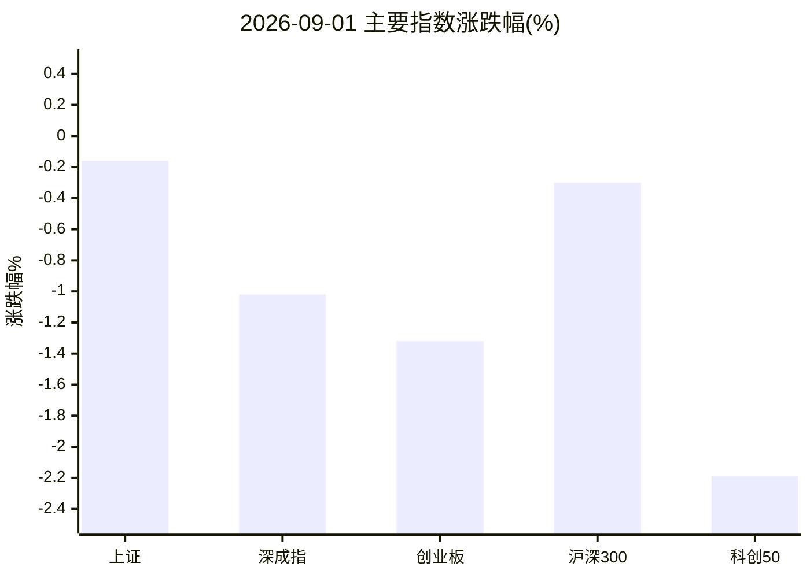
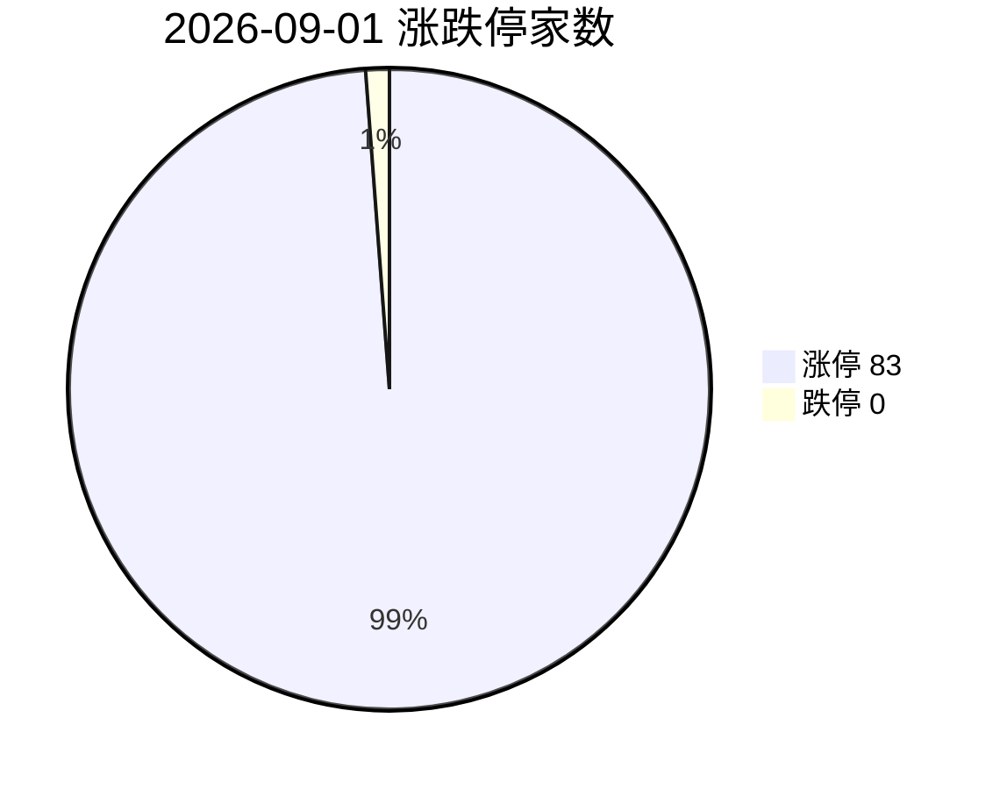
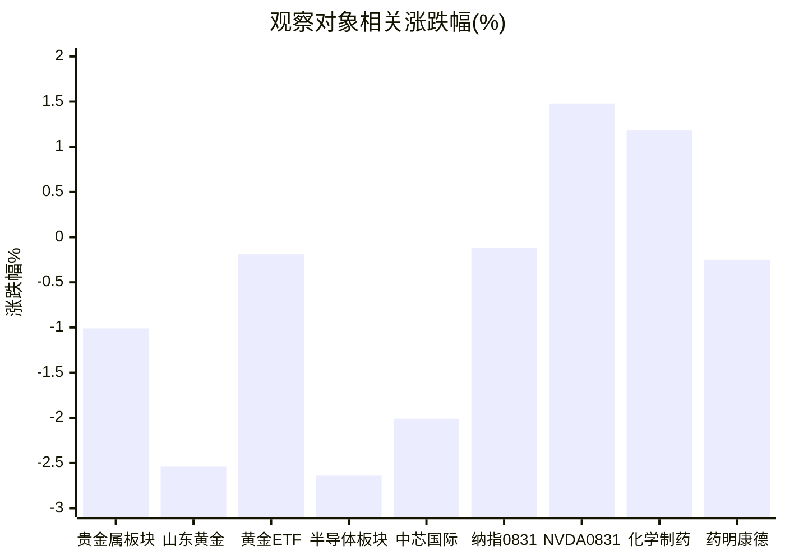
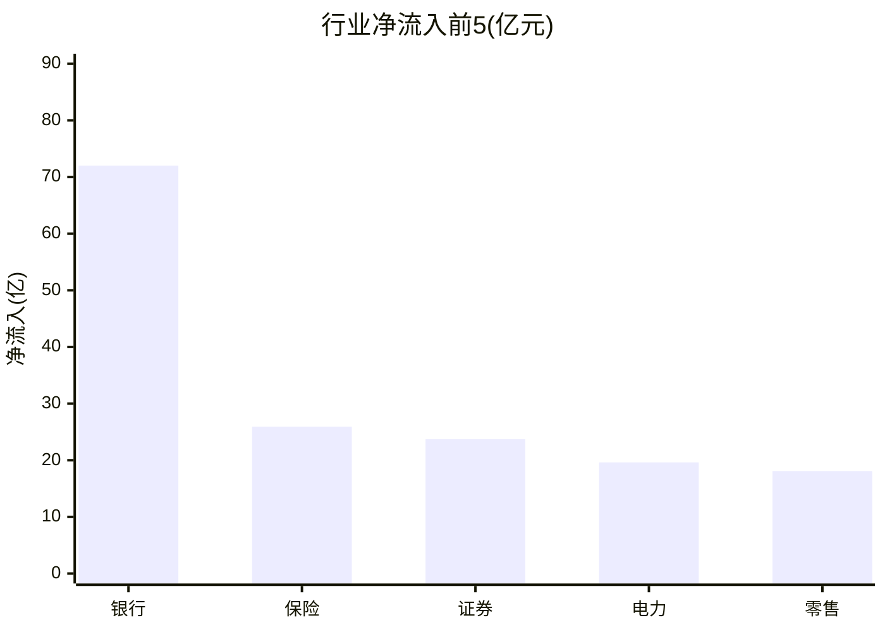

# 2026-09-01 A股盘后简报

> 研究摘要，不构成投资建议。触发时点：2026-09-01 07:30 UTC（北京时间 15:30，交易日收盘后）。

## 今日结论

1. **指数分化、风格切向金融/农业**：上证微跌 -0.16%，深成指 -1.02%、创业板 -1.32%、科创50 -2.19%；涨停 83 / 跌停 0，情绪结构偏强但成长承压。
2. **半导体大幅回流逆转**：同花顺半导体 -2.64%、净流出约 **174.48 亿元**（上涨 21 / 下跌 165），与隔夜 NVDA +1.48% 形成“外强内弱”。
3. **黄金高位回撤后今日企稳**：上金所 Au99.99 现报约 959.99 元/克；沪金 AU0 日线最新为 08-31 收 961.92（较 08-28 -3.74%）；国际金约 4433 美元/盎司附近，受 Fed 加息预期压制。
4. **医药相对抗跌**：化学制药 +1.18%（净流入约 12.56 亿）、中药 +1.64%、医药商业 +2.0%；主线雷达偏农业/种业，非医药。
5. **纳指上一美股交易日（08-31）微跌**：收 26370.89（-0.12%）；今日美股尚未开盘（北京 15:30）。

---

## 1. 今日市场异动（最多 8 条）

| # | 标的 | 幅度/数据 | 为何算异动 |
|---|---|---|---|
| 1 | 同花顺·半导体板块 | -2.64%，净流出 **174.48 亿**，21↑/165↓ | 全市场净流出第一，广度极差，成长杀跌核心 |
| 2 | 科创50 | -2.19%（1647.53） | 宽基中最弱，与半导体/硬科技资金撤离共振 |
| 3 | 海鸥住工 (002084) | +10.03%，**7 连板**，换手约 13.8% | 最高连板高度，情绪龙头级异动 |
| 4 | 捷荣技术 (002855) | +10.00%，**6 连板**，换手约 10.0% | 高连板梯队延续，短线情绪标杆 |
| 5 | 芒果超媒 (300413) | +20.02%，换手约 13.5% | 创业板 20cm 涨停+高换手，传媒/内容侧脉冲 |
| 6 | 生物育种/生态农业（雷达） | 概念 +7.86% / +4.52%；神农种业约 +20% | 主线雷达前列（自动分 5.5/10，未满 6 分入候选） |
| 7 | 山东黄金 (600547) | -2.54%；KDJ 死叉（StockSight） | 贵金属股跟随金价回撤，技术短线转弱 |
| 8 | 赛微电子 (300456) | -1.44%，量比约 **7.55** | 放量但下跌，半导体个股量价背离样本 |

补充：银行同花顺净流入约 +83.8 亿、+2.15%（邮储银行领涨），保险 +3.16%——资金明显向金融防守切换。北向沪/深股通净买接口显示 **0.00 亿（待核实）**；南向港股通（沪+深）合计净买约 **+78.9 亿**。

---

## 2. 四个观察对象的行情要点

### 黄金

| 项目 | 数据 | 时点/说明 |
|---|---|---|
| 上金所 Au99.99 | 现价约 **959.99** 元/克 | 2026-09-01 15:29（分时报价） |
| Au99.99 日线 | 08-31 收 **962.00**（较 08-28 收 995.05 约 **-3.32%**） | akshare `spot_hist_sge` |
| 沪金 AU0 | 08-31 收 **961.92**（较 08-28 **-3.74%**）；09-01 日线**尚未更新** | `futures_main_sina` |
| 黄金 ETF 华安 518880 | **9.118（-0.19%）**，量比约 3.87 | 腾讯行情 / StockSight |
| 山东黄金 600547 | **36.89（-2.54%）** | StockSight：KDJ 死叉警告 |
| 湖南黄金 002155 | **26.45（-2.86%）** | 腾讯行情 |
| 同花顺贵金属 | **-1.01%**，净流出约 **-10.35 亿** | 5↑/9↓ |
| 国际金（参考） | 约 **4433–4480** 美元/盎司，日变动约 **-0.17%~+0.03%** | Trading Economics / Yahoo GC=F（盘中参考） |

**资金/情绪**：国内黄金股与贵金属板块继续回调；ETF 跌幅明显小于个股，显示现货急跌后 ETF 已部分钝化。  
**关键新闻（firecrawl）**：Fed 主席 Warsh 偏鹰言论推升 9 月加息概率（报道称约 60%–65%+）；上周五国际金单日大跌逾 3%；霍尔木兹/中东紧张推高油价、强化通胀担忧——对金价偏空（利率路径）与偏多（避险）并存，短期利率主导。

### 半导体

| 项目 | 数据 |
|---|---|
| 同花顺半导体 | **-2.64%**，成交额约 2219.91 亿，净流入 **-174.48 亿**，21↑/165↓，领涨英集芯 +5.18% |
| 电子器件（新浪行业） | **-2.83%** |
| 电子化学品 | **-3.83%**，净流出约 -54.23 亿 |
| 科创50 | **-2.19%** |
| 中芯国际 688981 | **126.11（-2.01%）**；StockSight：MACD/KDJ 仍偏多但当日回调 |
| 寒武纪 688256 | **1109.00（-0.29%）** |
| 力芯微 688601 | **63.89（-1.19%）**，量比约 5.19 |
| NVDA（美股） | **220.78（+1.48%）**，时点 Yahoo 2026-08-31 20:00 |

**资金/情绪**：半导体为当日全市场净流出之首；ETF 侧亦有科创半导体等净流出报道（firecrawl，指向 08-31 资金）。与隔夜美股芯片分化、日韩半导体承压的外围叙事一致，但 A 股跌幅显著大于纳指/ NVDA。  
**关键新闻**：NVIDIA 财报季后叙事仍在（Q2 FY2027 营收等）；A 股侧更多是资金从成长回流金融。

### 纳斯达克（纳指）

| 项目 | 数据 | 时点 |
|---|---|---|
| .IXIC 收盘 | **26370.89（-0.12%）** | **美东 2026-08-31**（上一交易日） |
| 前收 | 26402.42（08-28） | akshare `index_us_stock_sina` |
| 道指（中文收评） | 约 **-0.70%**，报约 53186 | firecrawl 中文收盘综述 |
| 标普500（中文收评） | 约 **-0.33%** | 同上 |
| 8 月累涨（中文收评） | 纳指约 **+3.93%** | 月度收官叙事 |

**说明**：北京时间 15:30 复盘时，美股当日（09-01）**尚未开盘**；以下结论均基于 **08-31 收盘**。  
**情绪**：三大指数集体收跌但纳指仅微跌；存储/部分芯片报道偏强，与 A 股半导体大跌不同步。  
**关键新闻**：公用事业等板块受个别爆雷拖累（中文收评标题）；PYPL 等个股暴雷对情绪有扰动（第三方综述，需交叉验证）。

### 医药

| 项目 | 数据 |
|---|---|
| 化学制药 | **+1.18%**，净流入约 **+12.56 亿**，116↑/40↓ |
| 中药 | **+1.64%**，净流入约 +3.7 亿 |
| 生物制品 | **+0.61%**，净流入约 -1.62 亿 |
| 医药商业 | **+2.0%**，净流入约 +4.56 亿 |
| 医疗器械 | **+1.03%**，净流入约 -2.28 亿 |
| 药明康德 603259 | **154.40（-0.25%）**；MACD 空头排列，StockSight 判“结构平稳/低位修复观察” |
| 恒瑞医药 600276 | **46.23（+0.35%）** |
| 凯莱英 002821 | **160.88（-0.45%）** |

**资金/情绪**：医药细分多数飘红且化学制药进入行业净流入前十，明显强于半导体/贵金属；但主线雷达未把医药列为跟踪主线（农业/种业更热）。  
**关键新闻**：firecrawl 当日医药检索多落到板块个股列表页，**缺乏强权威日催化**；结论以盘面资金为主，资讯面标为弱。

---

## 3. 数据可视化

### 主要指数涨跌幅（%）



### 涨停 vs 跌停家数



> 注：跌停为 0，饼图用占位 1 仅满足渲染；正文以 **跌停 0 家** 为准。

### 四观察对象及相关标的涨跌（%）



### 行业资金净流入前 5（同花顺，亿元）



> 上表用 akshare「市场资金流向」同花顺口径；THS 摘要接口银行净流入约 83.81 亿（口径略有差异，趋势一致）。

---

## 4. 投资建议（研究立场，非代客理财）

| 对象 | 建议 | 理由 | 主要风险 |
|---|---|---|---|
| **黄金** | **观望** | 国际金与沪金刚经历急跌，Fed 加息预期升温压制实际利率敏感资产；国内 ETF 已接近平盘但个股/板块仍弱，不宜抢反弹。 | Warsh/点阵图进一步鹰派；中东与油价推升实际利率预期；金股流动性折价扩大。 |
| **半导体** | **谨慎减仓** | 单日净流出超 170 亿、下跌家数碾压上涨家数，科创50 同步走弱；与 NVDA 隔夜反弹背离，显示内资主动去杠杆。 | 若美股芯片再度大跌将二次杀估值；若仅一日回流可能假跌真换仓——减仓节奏需控仓而非清仓式恐慌。 |
| **纳指** | **观望** | 08-31 仅微跌且 8 月累涨仍强，但今日 A 股映射偏空、美股当日未开盘，缺乏新定价锚。 | 利率预期、大型科技个股业绩/监管突发；跨市场时滞导致错误映射。 |
| **医药** | **逢低关注** | 化学制药等细分资金净流入、涨跌家数占优，相对半导体/黄金更抗跌；龙头波动收敛。 | 缺少强政策/订单硬催化；若大盘继续切向金融，医药弹性可能不足；CXO 海外订单与政策风险仍在。 |

**统一风险提示**：以上为基于公开行情与资讯的研究摘要，不构成任何买卖建议或收益承诺；市场有风险，决策需结合自身风险承受能力与合规要求。

---

## 5. A股异动补充（主线雷达）

- 雷达数据源：akshare；生成时间 2026-09-01 07:31。
- 跟踪观察（自动分 5.5/10，**未达 6 分正式候选**）：生态农业、生物燃料、内贸规划、水域改革、水产品、农林牧渔、乡村振兴。
- 共同缺口：上涨/下跌家数、主力净流入、换手率多待确认；偏主题脉冲，持续性存疑。

完整榜单见同目录 `主线雷达.md`。

---

## 6. 次日观察点

1. 半导体净流出是否收敛，科创50 能否止跌；对照美股 09-01 开盘后 NVDA/SOX。
2. 金价能否站稳 4400 美元/上金所 960 元附近；关注 Fed 官员继续发言。
3. 金融（银行/保险）流入能否延续，是否形成风格切换而非一日游。
4. 农业/种业高标（神农种业等）分歧日表现，验证雷达主线成色。
5. 北向资金口径核实（今日接口显示 0，需交叉验证）。

---

## 7. Skill 调用与数据时点

| Skill | 状态 | 说明 |
|---|---|---|
| **akshare-stock** | 部分成功 | 涨停统计、资金流向、行业/概念板块成功；`A股大盘`/`纳指行情` 因 formatter `_fmt_amount` NameError 崩溃，已用 `stock_zh_index_spot_sina` / `index_us_stock_sina` 直连补全；`半导体/医药板块` 路由回总榜，已用 THS `stock_board_industry_summary_ths` 补板块级数据；`黄金期货` 主力列表无效，已用 AU0 + 上金所现货补全。 |
| **stocksight** | 成功 | `mainline_radar.py` 成功（akshare）；详细/标准报告：688981、603259、600547、518880、NVDA、异动批次 300456/688601/002155。策略：`neutral`。 |
| **firecrawl-cli** | 成功（无 API Key，走免密额度） | `FIRECRAWL_API_KEY` 未配置，`--status` 显示未登录；`search --scrape` 与 `scrape` 仍可用。已写入 `sources/gold.json`、`gold-news.json`、`nasdaq-semi.json`、`nasdaq.json`、`pharma.json`、`a-semi-news.json`、`te-gold.md` 等。Yahoo IXIC 页面 scrape 质量差；纳指收盘以 akshare + 中文收评交叉。 |

**数据时戳**：A 股与国内接口约北京时间 2026-09-01 15:30–15:35；纳指/NVDA 为美东 2026-08-31 收盘；国际金为 09-01 盘中参考。

**目录**：

```text
reports/2026-09-01/
  复盘.md
  主线雷达.md
  stocksight/
  sources/
```
