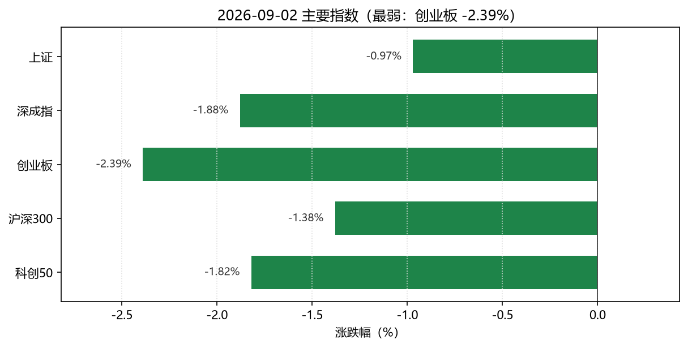
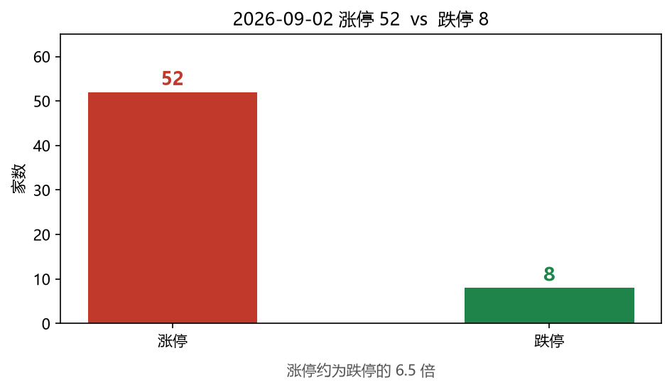
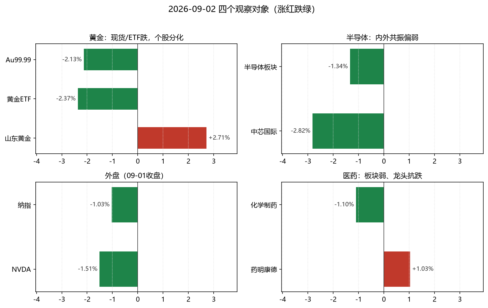
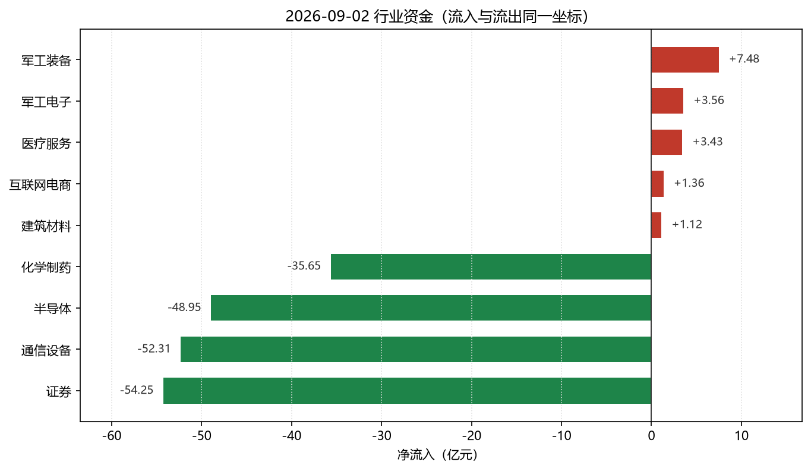

# 2026-09-02 A 股盘后简报

> 研究摘要，不构成投资建议。触发时点：cron `2026-09-02T07:30:01Z`（北京时间约 15:30）。

## 今日结论

1. **A 股全面调整**：上证 -0.97%、深成指 -1.88%、创业板 -2.39%、科创50 -1.82%；涨停 52 / 跌停 8，情绪偏弱但未全面冰点。
2. **半导体继续失血**：同花顺半导体板块 -1.34%、净流出约 48.95 亿元；中芯国际 -2.82%，隔夜美股存储/芯片走弱形成外压。
3. **黄金现货续跌、黄金股分化**：国际金约 4320–4328 美元/盎司（Trading Economics），上金所 Au99.99 约 937.5 元/克（较昨收约 -2.1%）；黄金 ETF -2.37%，但山东黄金放量 +2.71%。
4. **医药板块整体偏弱、个股分化**：化学制药 -1.10%（净流出约 35.65 亿），创新药概念 -1.14%；药明康德逆势 +1.03%，同时出现冀衡医药、神奇制药跌停。
5. **纳指（上一美股交易日 09-01）收跌约 -1.03%**：点位 26099.77；NVDA -1.51%。北京 15:30 美股尚未开盘。

---

## 1. 今日市场异动（最多 8 条）

| # | 标的 | 幅度 | 为何算异动 |
|---|---|---|---|
| 1 | 创业板指 | -2.39%（3312.24） | 主要宽基中跌幅最深，成长风格显著承压 |
| 2 | 同花顺·半导体 | -1.34%，净流出约 48.95 亿 | 成交额约 1819 亿且资金大幅净流出，外盘半导体重挫后的内盘跟跌 |
| 3 | 中芯国际 688981 | -2.82%（122.55） | StockSight：相对同批观察样本超额收益异动（跑输约 3.1pct） |
| 4 | 山东黄金 600547 | +2.71%（37.89），量比 3.65 | 金价/ETF 下跌背景下股放量逆势，StockSight 量比偏离 |
| 5 | 黄金 ETF 518880 | -2.37%（8.902） | 与现货金回撤同向，反映避险交易回撤而非股票个体因素 |
| 6 | 竞业达 003005 | +10.0% 四连板 | StockSight：涨停+ RSI 极度超买（>80），短线回撤风险升高 |
| 7 | 神奇制药 600613 / 冀衡医药 002742 | 双双跌停 | 化学制药板块净流出背景下的个股极端弱势 |
| 8 | 纳指 .IXIC（09-01 收盘） | -1.03%（26099.77） | 美债利率与通胀预期升温拖累科技股；NVDA -1.51% |

主线雷达（StockSight，`--provider auto`/akshare）：榜首多为开发区、股期、TOPCon、军工等，**自动雷达分均未达跟踪阈值**；半导体/医药未进入雷达前列。

---

## 2. 四个观察对象的行情要点

### 黄金

| 指标 | 数值 | 时点/说明 |
|---|---|---|
| 国际金（TE CFD） | 约 **4320–4328 美元/盎司**，近端约平/微跌 | 2026-09-02，连续第 4 个交易日偏弱 |
| 上金所 Au99.99 | **937.50** 元/克（15:29 报价） | 相对 09-01 日线收盘 957.92 约 **-2.13%** |
| 沪金 AU0 日线 | 最新完整日线为 **09-01 收 959.94** | 当日日线尚未完整入库时标注滞后 |
| 黄金 ETF 518880 | **8.902（-2.37%）** | 腾讯行情 |
| 山东黄金 600547 | **37.89（+2.71%），量比 3.65** | 股金背离 |
| THS 贵金属板块 | **-0.40%，净流入约 +0.36 亿** | 领涨：招金黄金约 +5.03%（板块字段） |

**资金/情绪**：联储主席 Warsh 鹰派表述 + 美债收益率上行，市场定价 9 月加息概率约六至七成；中东扰动推高油价反而强化“加息抗通胀”叙事，短期压制无息资产。  
**关键新闻**：Trading Economics / 同花顺黄金资讯——金价向 4300 美元附近回落；上金所延时行情显示 Au99.99 盘中最低约 926.8。

### 半导体

| 指标 | 数值 |
|---|---|
| THS 半导体 | **-1.34%**，上涨 27 / 下跌 158，净流入 **-48.95 亿**，成交额约 1819 亿 |
| THS 元件 | **-1.11%**，净流入约 -6.36 亿 |
| 中芯国际 688981 | **122.55（-2.82%）**，量比 1.43 |
| 寒武纪 688256 | **1108.00（-0.09%）** |
| 科创50 | **-1.82%** |

**资金/情绪**：连续弱势，资金流出幅度居各行业前列（与证券、通信设备同列流出榜前列）。  
**关键新闻**：财联社早报——美股存储/芯片走低，费城半导体指数约 **-2.47%**（希捷、美光、应用材料等跌幅靠前）；东财资金流评论亦指向半导体净流出。

### 纳斯达克（纳指）

| 指标 | 数值 | 时点 |
|---|---|---|
| .IXIC 收盘 | **26099.77（-1.03%）** | **2026-09-01** 美股收盘（北京 15:30 时仍为上一交易日） |
| 前收 | 26370.89（08-31） | akshare `index_us_stock_sina` |
| NVDA | **217.44（-1.51%）** | 09-01 收盘（新浪美股） |

**资金/情绪**：全球债息上行、油价与地缘推升通胀担忧，科技成长承压；博通等财报窗口临近或加大波动。  
**关键新闻**：中文收评/社区稿指向纳指/纳斯达克 100 回撤；部分外媒页面数据与 akshare 点位不完全一致，**以 akshare 收盘点位为准**。

### 医药

| 指标 | 数值 |
|---|---|
| THS 化学制药 | **-1.10%**，净流入 **-35.65 亿** |
| THS 生物制品 | **-1.26%**，净流入约 -12.97 亿 |
| THS 中药 / 医药商业 | **-1.51% / -1.68%** |
| 新浪概念·创新药 | **-1.14%** |
| CRO / CXO 概念 | **+0.21% / -0.04%**（相对抗跌） |
| 药明康德 603259 | **155.99（+1.03%）**，量比 1.70；StockSight 判定结构平稳 |
| 跌停样本 | 冀衡医药、神奇制药等 |

**资金/情绪**：板块资金偏流出，但 CXO/龙头个别抗跌；主题炒作（涨停梯队）与医药主线脱节。  
**关键新闻**：检索多为板块列表页或 09-01 午后医药脉冲旧闻；**缺少可独立确认的当日硬催化**，以盘面资金与涨跌为准。

---

## 3. 数据可视化

> 涨红跌绿；柱上标了具体数值。资金图把流入和流出画在**同一坐标**上，避免「军工 +7 亿」看起来比「半导体 -49 亿」还大。

### 读图要点

1. 宽基全线收跌，**创业板 -2.39% 最弱**。
2. 涨停 52 / 跌停 8，情绪偏弱但未冰点。
3. 黄金现货与 ETF 下跌，**山东黄金逆势 +2.71%**。
4. 资金上，军工小流入，**半导体/化学制药大额净流出**。

### 主要指数涨跌幅

### 涨停 vs 跌停家数

### 四个观察对象及相关标的

> 纳指、NVDA 为 **09-01 美股收盘**；Au99.99 相对昨收约 **-2.13%**。

### 行业资金：流入与流出同一把尺子

> 来源：同花顺即时行业资金。只画净流入前 5 会严重误导，因此把大额流出一并画上。

补充：沪深股通北向净买额接口显示为 **0**，**待核实**，不作为结论依据。

---

## 4. 投资建议（研究视角，非投顾）

| 对象 | 建议（三选一） | 理由 | 主要风险 |
|---|---|---|---|
| **黄金** | **观望** | 国际金连续回撤、国内现货与 ETF 同步走弱，加息定价升温；黄金股与金价背离不可简单外推。 | 美债利率再冲高、实际利率交易；地缘消息反复导致波动放大 |
| **半导体** | **谨慎减仓** | 内外共振偏弱：A 股板块大额净流出 + 隔夜费半/存储重挫，龙头中芯亦明显回调。 | 外盘继续杀估值；若仅反弹修复则容易诱多 |
| **纳斯达克** | **观望** | 上一交易日已收跌，北京收盘时美股未开；等待利率数据与科技财报窗口。 | 加息预期、油价/地缘冲击风险偏好 |
| **医药** | **观望** | 板块资金仍流出、多数子版块下跌，但 CXO/部分龙头抗跌，方向未统一。 | 主题退潮与跌停扩散；政策/集采预期扰动 |

**统一风险提示**：以上仅为基于公开行情与资讯的研究摘要，不构成任何买入/卖出/持仓建议；市场有风险，决策需独立审慎。

---

## 5. 次日观察点

1. 美股 09-02 夜盘：纳指能否止跌，费半/NVDA 是否继续拖累 A 股半导体。
2. 金价能否在 4300 美元附近企稳；关注 ADP/非农对加息概率的修正。
3. A 股半导体净流出是否收敛，中芯等龙头量价是否止跌。
4. 医药跌停扩散是否收敛，药明康德等 CXO 能否维持相对强势。
5. 涨停高度（竞业达/国芳 4 板）晋级率，判断情绪能否与主线脱钩修复。

---

## 6. 数据时点与来源

| 来源 | 调用结果 | 说明 |
|---|---|---|
| **akshare-stock** | 成功（部分入口需绕过 formatter） | 大盘、涨跌停、沪深港通+行业资金、行业/概念板块、THS 摘要、SGE/AU0、纳指 `.IXIC` 均取到数。CLI `formatter._fmt_amount` NameError 导致「A股大盘/纳指」文本渲染失败，已用 adapter/直连接口补全；「半导体/医药板块」路由回总榜，改用 THS/概念过滤；「黄金期货」未返回 AU0，改 `futures_main_sina('AU0')` + SGE。 |
| **stocksight** | 成功 | `mainline_radar.py --board all --limit 30` → `主线雷达.md`；标准异动摘要 + 详细报告：688981 / 603259 / 600547 / 003005（策略 **neutral**）。 |
| **firecrawl-cli** | 部分成功 | `FIRECRAWL_API_KEY` 未配置，免密钥搜索可用：`gold.json`、`semi.json`、`nasdaq.json`、`pharma2.json`、TE 金价 scrape、财联社早报 scrape。`pharma`/`pharma3`/`nasdaq-close` 部分查询返回无结果。 |
| **生成时间** | 2026-09-02 约 15:30–15:40（北京时间） | 报告目录：`reports/2026-09-02/` |

附件：`主线雷达.md`、`stocksight/`、`sources/`。
