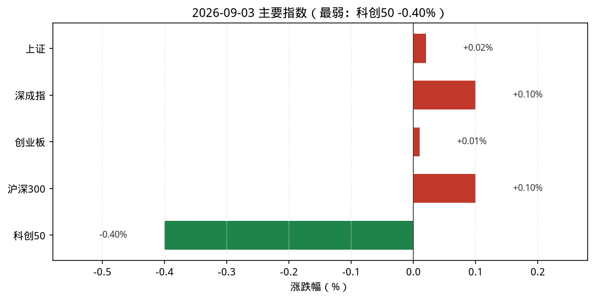
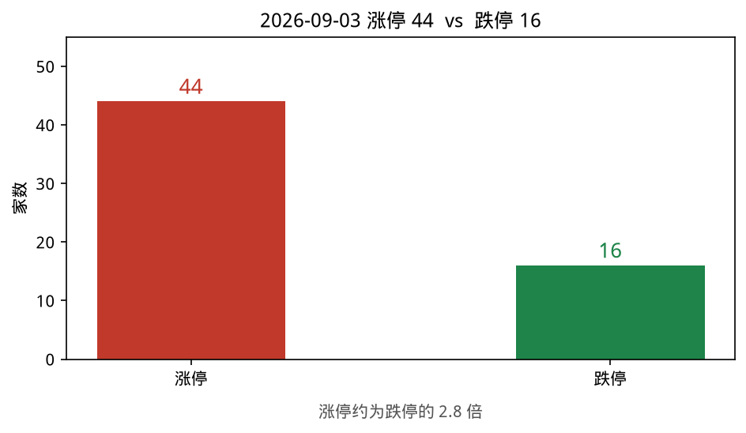
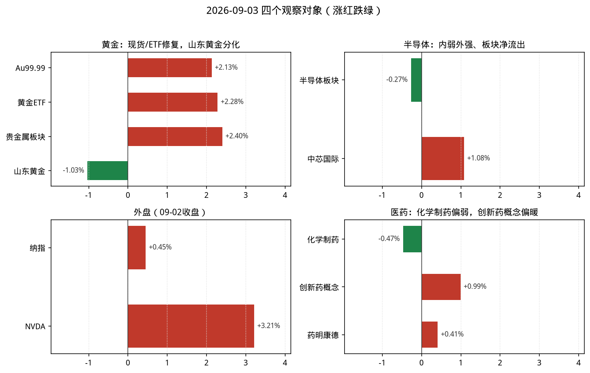
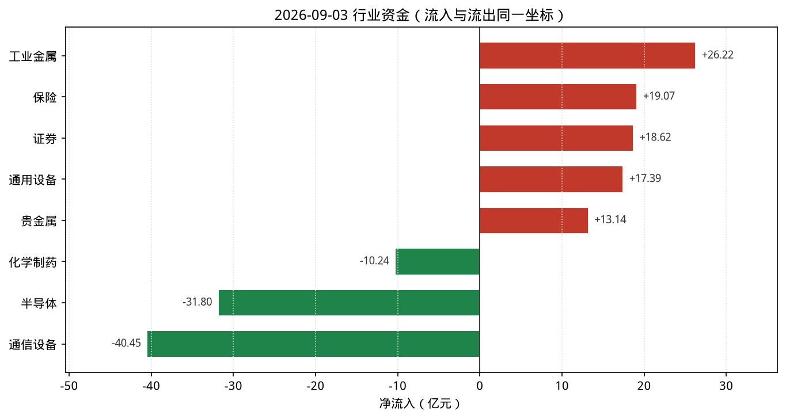

# 2026-09-03 A股盘后观察简报

> 研究摘要，不构成投资建议。触发时点：cron `2026-09-03T07:30:01Z`（北京时间约 15:30，A 股已收盘）。

## 今日结论

1. **宽基近似平盘**：上证 +0.02%、深成指 +0.10%、创业板 +0.01%；科创50 **-0.40%** 偏弱。
2. **情绪分化**：涨停 **44** / 跌停 **16**，高连板仍在（国芳集团 5 板），但跌停家数偏多。
3. **黄金修复**：贵金属行业 **+2.40%**、净流入约 **14.7 亿**；沪金现货 Au99.99 相对昨收约 **+2.1%**；国际金价（Trading Economics）约 **4429 美元/盎司（+0.94%）**。
4. **半导体仍弱**：THS 半导体 **-0.27%**、净流出约 **31.8 亿**；外盘 NVDA（09-02）约 **+3.2%**，内外节奏不完全同步。
5. **医药分化**：化学制药偏弱净流出；创新药概念约 **+0.99%**，资讯面有政策/中报叙事，盘面尚未全面共振。

---

## 1. 今日市场异动（最多 8 条）

| # | 标的 | 幅度/数据 | 为何算异动 |
|---|---|---|---|
| 1 | 国芳集团(601086) | +10.00%，连板 **5** | 涨停池最高连板，情绪标尺 |
| 2 | 集泰股份(002909) / 龙版传媒(605577) | 各约 +10%，连板 **4** | 高连板梯队仍活跃 |
| 3 | 金现代(300830) | **+19.98%** | 创业板涨停极值，风电概念领涨之一 |
| 4 | 湖南黄金(002155) | **+5.07%**，量比 6.87、换手 6.9% | StockSight：超额收益+换手偏高；KDJ 死叉警告 |
| 5 | 黄金ETF华安(518880) | **+2.28%**，换手 5.5% | 金价修复映射；StockSight 换手偏高关注 |
| 6 | 中金黄金(600489) | **+4.01%** | 黄金股内部分化中的强势标的 |
| 7 | 贵金属（THS） | **+2.40%**，净流入约 **14.65 亿** | 资金+涨幅双强，对比昨日走弱形成反向修复 |
| 8 | 半导体（THS） | **-0.27%**，净流出约 **31.8 亿** | 全市场净流出前列；外强（NVDA）内弱 |

补充：涨停 44 / 跌停 16；主线雷达自动分均 **<6**，**暂无**达跟踪阈值方向。

---

## 2. 四个观察对象的行情要点

### 黄金

| 项目 | 数据 | 说明 |
|---|---|---|
| 沪金现货 Au99.99 | 盘中末约 **957.51** 元/克（相对 09-02 收盘 937.50 约 **+2.13%**） | 上金所分时；09-03 日线收盘待确认 |
| AU0 主力期货 | 最新日线 **09-02** 收 938.22 | **09-03 日线暂不可用**（接口滞后） |
| 贵金属行业 | +2.40%，净流入约 14.65 亿 | THS；领涨湖南白银 +7.81% |
| 黄金概念 | +1.49% | 概念板块涨幅前三 |
| 黄金ETF(518880) | 9.105，**+2.28%** | 腾讯行情 |
| 山东黄金(600547) | 37.50，**-1.03%** | 股金分化：板块强、龙头股偏弱 |
| 国际金价 | 约 **4429** USD/盎司，约 **+0.94%** | Trading Economics；亚洲现货报道约 +0.48%（Yahoo 中文） |

**资金/情绪**：贵金属净流入靠前；概念与 ETF 跟随现货修复。  
**关键新闻**：美元走弱、金价自低位反弹（TE：Gold Extends Gain as Dollar, Treasury Yields Retreat）；亚洲现货盘中上涨约 0.48%。

### 半导体

| 项目 | 数据 | 说明 |
|---|---|---|
| THS 半导体 | **-0.27%**，净流入 **-31.8 亿**，上涨 75 / 下跌 109 | 领涨英集芯 +10.74% |
| 中芯国际(688981) | 123.87，**+1.08%** | StockSight：偏强但无显著量价异动 |
| 寒武纪(688256) | 1099.99，**-0.72%** | — |
| 赛微电子(300456) | 38.83，**-1.92%** | — |
| NVDA | **224.41，+3.21%**（美东 09-02 收盘） | Yahoo；StockSight 标准报告无异动信号 |

**资金/情绪**：半导体仍处净流出前列（通信设备/IT 服务亦大幅流出）；科创50 -0.40% 同向承压。  
**关键新闻**：Reuters：美东 09-02 纳指约 **+0.45%** 收高；芯片叙事多为评论性稿件，硬催化不足。09-01 外盘半导体普跌（美光等）的冲击仍在消化。

### 纳斯达克（纳指）

| 项目 | 数据 | 说明 |
|---|---|---|
| .IXIC 收盘 | **26217.83**（**2026-09-02**） | 较 09-01 的 26099.77 约 **+0.45%** |
| 前一交易日 | 09-01 **-1.03%**（26099.77） | 中新经纬复盘：科技股普跌、半导体存储承压 |
| 09-03 美股 | **尚未开盘**（北京 15:30） | 本简报使用 **最近完整收盘 = 09-02** |

**资金/情绪**：09-02 反弹修复 09-01 跌幅的一部分；Reuters 称三大指数收高（道 +0.56% / 标普 +0.46% / 纳指 +0.45%）。  
**关键新闻**：华夏纳斯达克100 ETF(513300) 09-02 午间有溢价风险提示公告（上交所披露）。

### 医药

| 项目 | 数据 | 说明 |
|---|---|---|
| 化学制药 | **-0.47%**，净流入 **-10.24 亿** | THS |
| 生物制品 | **+0.47%**，净流入 **+1.30 亿** | THS |
| 中药 / 医疗器械 / 医疗服务 | 约 -0.6% ~ -0.7%，均净流出 | THS |
| 创新药概念 | 约 **+0.99%** | 主线雷达第 12 |
| 药明康德(603259) | 156.63，**+0.41%** | StockSight：结构平稳，无显著异动 |
| 恒瑞医药(600276) | 45.96，**+0.86%** | — |
| 凯莱英(002821) | 168.22，**+2.20%** | CXO 相对强 |

**资金/情绪**：细分分化，化学制药走弱；创新药概念与港股通创新药 ETF 资讯偏暖，但 A 股医药资金整体不热。  
**关键新闻**：医保局按病种付费 3.0 相关报道；中泰等券商“结构性盈利修复、九月主线验证”观点稿；石药集团临床进展（个股催化，非板块普涨证据）。

---

## 3. 数据可视化

> 按 `scripts/make_recap_charts.py` 出图；数字与正文表格一致。源数据：`charts/data.json`。

**读图要点**

1. 宽基几乎贴零轴，只有科创50 明显偏绿（约 -0.40%）。
2. 涨停 44、跌停 16，红多于绿但跌停并不少，情绪仍分化。
3. 黄金组红、山东黄金绿：现货/ETF 修复 vs 龙头股分化。
4. 外盘（09-02）NVDA/纳指偏红，A 股半导体板块仍略绿——内外不同步。
5. 资金图同一横轴：工业金属等流入 vs 通信设备/半导体等流出，量级一眼可比。

> 资金流入侧用同花顺即时排行；半导体/化学制药流出用 THS 行业摘要（与流入侧接口不同，细差来自刷新时点，方向一致）。
---

## 4. 投资建议（研究口径，非代客理财）

| 对象 | 建议 | 理由（1–2 句） | 主要风险 |
|---|---|---|---|
| **黄金** | **逢低关注** | 现货/ETF/贵金属资金同步修复，国际金价随美元回落反弹；但昨日大跌后反弹斜率陡，宜等回撤或缩量确认。 | 美元与实际利率再度走强；股金背离（如山东黄金走弱）扩大；期货日线滞后导致误判。 |
| **半导体** | **观望** | A 股板块仍净流出、涨跌家数偏弱；外盘 NVDA 反弹未充分映射至国产链。 | 出口管制/订单预期波动；科创成长风格继续抽血；追高个股流动性风险。 |
| **纳斯达克** | **观望** | 09-02 仅温和反弹，且本简报时点美股 09-03 未开盘；09-01 科技股回撤记忆仍在。 | 美债收益率与地缘（伊朗等地缘叙事）；纳指 ETF 溢价；隔夜跳空。 |
| **医药** | **观望** | 化学制药资金偏弱，创新药概念与资讯偏暖但未形成一致净流入；龙头异动不显著。 | 政策预期反复；CXO 订单与海外监管；概念炒作退潮。 |

**统一风险提示**：以上为基于公开行情与资讯的研究摘要，不构成任何买入/卖出或资产配置建议；市场有风险，决策须独立判断并自行承担损益。

---

## 5. 次日观察点

1. 贵金属净流入能否延续，山东黄金是否跟上板块。
2. 半导体净流出是否收窄，以及美东 09-03 开盘后费半/NVDA 方向。
3. 创新药概念能否带动化学制药/CXO 资金回流。
4. 涨停/跌停比与连板高度（国芳 5 板后的分歧）。

---

## 6. 风险提示

数据仅供研究学习，**不构成投资建议**。接口可能延迟、北向净买显示 0 需待核实，部分美股与期货为上一交易日数据。

---

## 7. 数据时点与来源

| Skill | 状态 | 说明 |
|---|---|---|
| **akshare-stock** | 部分成功 | `今日涨停统计`/`市场资金流向`/`行业资金流向`/`行业·概念板块` 成功；`A股大盘`/`纳指行情` 因 formatter `_fmt_amount` NameError 失败，已用新浪指数/`index_us_stock_sina` 直连补齐；`半导体/医药板块` 路由回总榜，已用 THS 行业摘要补齐；`黄金期货` 入口无效行，已用 Au99.99 + AU0 直连 |
| **stocksight** | 成功 | 主线雷达（akshare，30 条）；详细/标准报告：600547、688981、603259、002155、518880、NVDA（strategy=neutral） |
| **firecrawl-cli** | 成功（免密） | `FIRECRAWL_API_KEY` 未配置，免密 search/scrape 可用；已写入 `sources/gold.json`、`nasdaq-semi.json`、`pharma.json`、`nasdaq-close.json`、`te-gold.md` |

- **报告生成时间**：2026-09-03 约 07:30–07:35 UTC（北京 15:30–15:35）
- **A 股行情时点**：2026-09-03 收盘附近
- **纳指/NVDA 时点**：美东 **2026-09-02** 收盘（北京 15:30 时尚为上一完整美股日）
- **原始材料目录**：`reports/2026-09-03/`（含 `主线雷达.md`、`stocksight/`、`sources/`）
