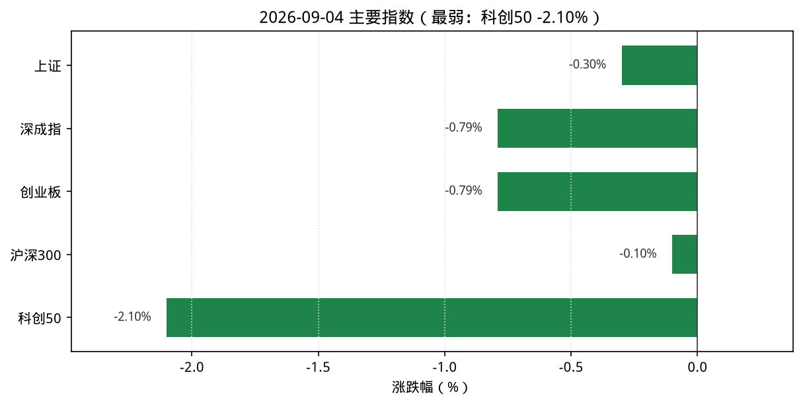
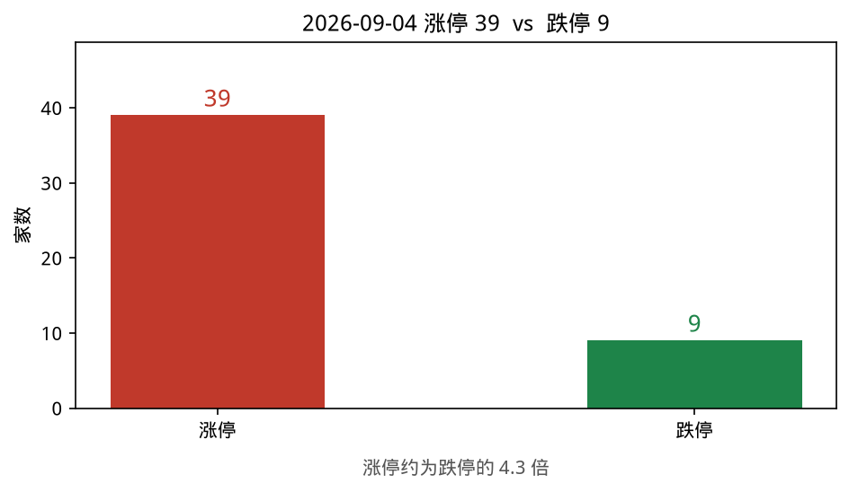
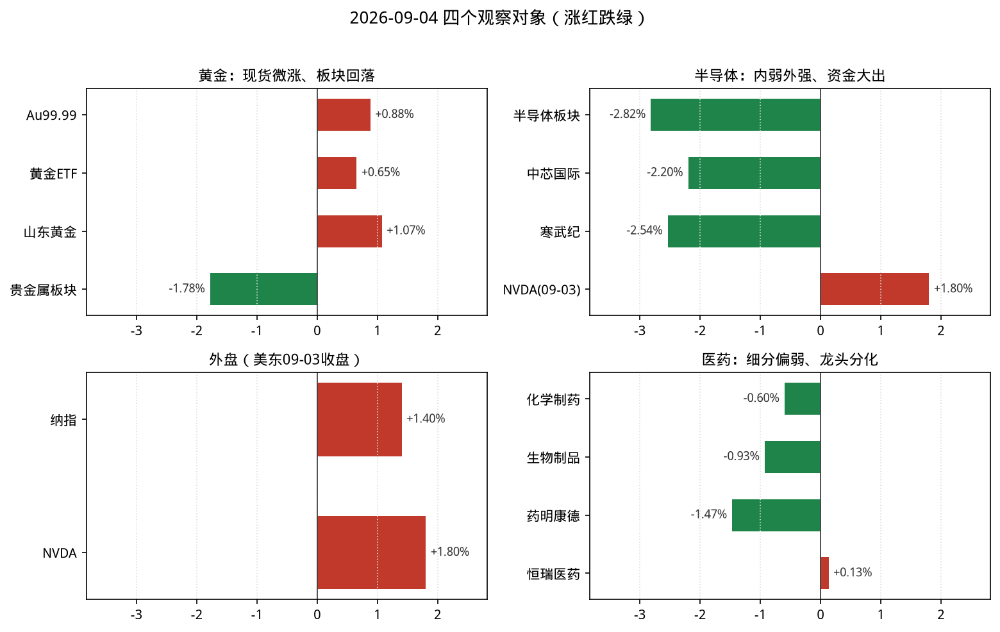
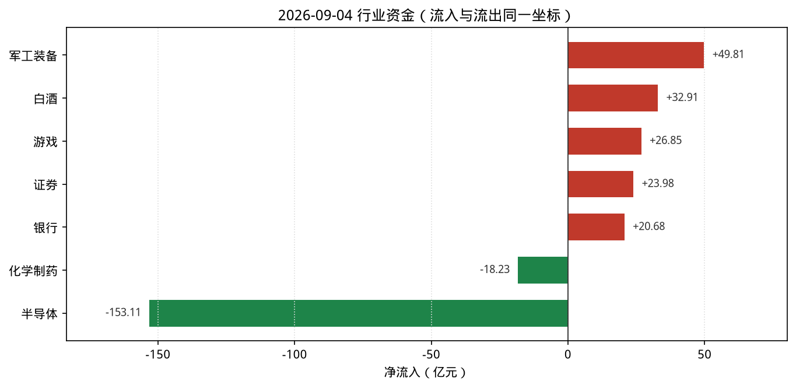

# 2026-09-04 A股盘后观察简报

> 研究摘要，不构成投资建议。触发时点：cron `2026-09-04T07:30:07Z`（北京时间约 15:30，A 股已收盘）。

## 今日结论

1. **宽基普跌、科创显著偏弱**：上证 **-0.30%**、深成指 **-0.79%**、创业板 **-0.79%**、沪深300 **-0.10%**；科创50 **-2.10%** 拖累成长风格。
2. **情绪尚可**：涨停 **39** / 跌停 **9**（约 4.3 倍），高连板仍在（龙版传媒 5 板），但与科创/半导体抛压并存。
3. **半导体资金大出**：THS 半导体 **-2.82%**、净流出约 **-153.1 亿**，上涨仅 13 / 下跌 172；对比美东 09-03 NVDA **+1.8%**，内外背离。
4. **黄金现货微涨、A 股贵金属回落**：Au99.99 相对昨收约 **+0.88%**；贵金属行业 **-1.78%**、净流出约 **13.2 亿**（股金分化）。
5. **主线雷达**：船舶/农牧渔等强，自动分均 **<6**，**暂无**达正式跟踪阈值方向；军工/白酒/游戏净流入靠前。

---

## 1. 今日市场异动（最多 8 条）

| # | 标的 | 幅度/数据 | 为何算异动 |
|---|---|---|---|
| 1 | 科创50 | **-2.10%** | 宽基中最弱，成长风格全面承压 |
| 2 | 半导体（THS） | **-2.82%**，净流出约 **-153.1 亿** | 全市场净流出第一；涨跌家数 13/172 |
| 3 | 龙版传媒(605577) | **+9.97%**，连板 **5** | 涨停池最高连板，情绪标尺 |
| 4 | 海峡创新(300300) | **+16.01%**，换手约 **23.4%** | 创业板极值+高换手，游戏/概念领涨之一 |
| 5 | 灿瑞科技(688061) | **+11.02%** | 半导体板块稀缺领涨（板块整体大跌中的逆势） |
| 6 | 中芯国际(688981) | **-2.20%**，StockSight：KDJ 死叉警告 | 龙头走弱；有 MACD 底背离但短线动能转弱 |
| 7 | 贵金属（THS） | **-1.78%**，净流出约 **13.2 亿** | 现货/ETF 微涨 vs 板块回落，股金背离 |
| 8 | 纳指 / NVDA（美东 09-03） | 纳指 **+1.40%**；NVDA **+1.80%** | 外盘偏强，与 A 股半导体抛压形成对照 |

补充：涨停 39 / 跌停 9；主线雷达前六为船舶制造、水产品、鸡肉、生物育种、猪肉、农林牧渔（自动分 5.5），完整 10 项均未达 6 分。

---

## 2. 四个观察对象的行情要点

### 黄金

| 项目 | 数据 | 说明 |
|---|---|---|
| 沪金现货 Au99.99 | 盘末约 **965.95** 元/克（相对 09-03 收盘 957.50 约 **+0.88%**） | 上金所分时；09-04 日线收盘待确认 |
| AU0 主力期货 | 新浪连续约 **965.9**；日线最新完整为 **09-03** 收 958.38 | 09-04 日线尚未完整入库 |
| 贵金属行业 | **-1.78%**，净流入 **-13.15 亿**，上涨 2 / 下跌 12 | THS；领涨山东黄金 +1.07% |
| 黄金ETF(518880) | 9.164，**+0.65%** | 腾讯行情 |
| 山东黄金(600547) | 37.90，**+1.07%**；量比约 2.96 | StockSight：KDJ 超买警告，判「转弱—关注回撤」 |
| 湖南黄金(002155) | 26.78，**-2.76%** | 股内部分化 |
| 国际金价 | Trading Economics 约 **4472–4474** USD/盎司，日变约 **0% 附近**（报道有 +0.01% / -0.04% 差异） | Firecrawl 抓取 TE；GoldPrice.org 另有日内波动口径，以 TE 为准 |

**资金/情绪**：现货与 ETF 小幅跟涨，但 A 股贵金属板块与多数个股回落，资金净流出。  
**关键新闻**：金店零售价日报（金投网等）；国际金价高位震荡、月线仍偏强（TE：近月约 +5%）。

### 半导体

| 项目 | 数据 | 说明 |
|---|---|---|
| THS 半导体 | **-2.82%**，净流入 **-153.11 亿**，上涨 13 / 下跌 172 | 领涨灿瑞科技 +11.02% |
| 中芯国际(688981) | 121.14，**-2.20%** | StockSight：KDJ 死叉；MACD 底背离信号并存 |
| 寒武纪(688256) | 1072.00，**-2.54%** | — |
| 北方华创(002371) | 638.17，**-2.69%** | — |
| 元件 / 消费电子 | -2.73% / -2.06%，均大幅净流出 | 电子链条共振偏弱 |
| NVDA | **228.45，+1.80%**（美东 **09-03** 收盘） | Yahoo/日线；StockSight：结构平稳，无显著异动 |

**资金/情绪**：半导体为当日最大净流出方向；科创50 -2.10% 同向。MarketWatch（09-03）：纳指大涨时软件偏强、半导体承压——外盘芯片亦非全面强势。  
**关键新闻**：美东 09-03 纳指收高约 366 点（+1.40%）；芯片叙事多为盘面评论，未见硬催化扭转 A 股抛压。

### 纳斯达克（纳指）

| 项目 | 数据 | 说明 |
|---|---|---|
| .IXIC 收盘 | **26584.06**（**2026-09-03**） | 较 09-02 的 26217.83 约 **+1.40%**（+366.23 点） |
| 同步指数（报道） | 道指约 +1.1%；标普约 +1.06% | 期货/财经通稿（09-03） |
| 09-04 美股 | **尚未开盘**（北京 15:30） | 本简报使用 **最近完整收盘 = 09-03** |

**资金/情绪**：09-03 科技股整体反弹；软件强于半导体（MarketWatch）。  
**关键新闻**：Yahoo 财经验证纳指 26584.06、+1.40%；部分中文社区稿仍引用 09-02 数据，已交叉校验新浪日线。

### 医药

| 项目 | 数据 | 说明 |
|---|---|---|
| 化学制药 | **-0.60%**，净流入 **-18.23 亿** | THS；上涨 54 / 下跌 100 |
| 生物制品 | **-0.93%**，净流入 **-8.64 亿** | THS |
| 中药 / 医疗器械 / 医疗服务 | -0.07% / -0.04% / -0.66% | 器械近乎平盘小幅净流入 |
| 药明康德(603259) | 153.83，**-1.47%** | StockSight：结构平稳；MACD 空头排列 |
| 恒瑞医药(600276) | 46.02，**+0.13%** | 抗跌 |
| 凯莱英(002821) | 163.02，**-3.09%** | CXO 偏弱 |

**资金/情绪**：化学制药、生物制品双双净流出；资讯面仍有「创新药触底反弹」观点稿，但当日 A 股盘面未共振。  
**关键新闻**：证券时报等创新药产业链评论偏中长期；盘中未见统一政策硬催化。

---

## 3. 数据可视化

> 按 `scripts/make_recap_charts.py` 出图；数字与正文表格一致。源数据：`charts/data.json`。

**读图要点**

1. 宽基全绿，科创50 最弱（约 -2.10%），成长风格当日承压最明显。
2. 涨停 39 vs 跌停 9，红柱远高于绿柱，情绪与指数/科创不完全同向。
3. 黄金组：现货/ETF/山东黄金偏红，贵金属板块偏绿——股金背离。
4. 半导体组内绿、NVDA（09-03）红：内外不同步；外盘组整体偏红。
5. 资金图同一横轴：军工/白酒等流入 vs 半导体 **-153 亿** 级别流出，量级一眼可比。

> 资金图统一使用同花顺行业摘要（THS）同一时点；与即时「行业资金流向」前五细差来自刷新口径，方向一致。

---

## 4. 投资建议（研究口径，非代客理财）

| 对象 | 建议 | 理由（1–2 句） | 主要风险 |
|---|---|---|---|
| **黄金** | **观望** | 现货仅微涨、国际金价贴近零轴，A 股贵金属反而净流出；昨日修复后今日股金背离，不宜追涨。 | 美元/实际利率再度走强；板块继续落后现货；山东黄金 KDJ 超买回撤。 |
| **半导体** | **谨慎减仓** | 板块跌幅与 **-153 亿** 级净流出显示抛压集中；龙头中芯/寒武纪同步走弱，外盘反弹未映射。 | 出口管制与订单预期；科创继续抽血；逆势涨停个股一日游。 |
| **纳斯达克** | **观望** | 09-03 收高但本简报时点 09-04 美股未开盘；软件强芯片弱的结构仍需隔夜确认。 | 美债收益率与就业/服务业数据；隔夜跳空；纳指 ETF 溢价。 |
| **医药** | **观望** | 化学制药/生物制品资金偏弱，CXO 分化；资讯偏暖但盘面未形成净流入共振。 | 政策预期反复；海外订单与监管；概念炒作退潮。 |

---

## 5. 次日观察点

1. 半导体净流出是否收敛、科创50 能否止跌；灿瑞等逆势股是否有跟风扩散。
2. 黄金：关注 Au99.99 日线收盘与贵金属资金是否修复股金背离。
3. 美东 09-04 开盘后纳指/NVDA/SOX 对 A 股电子链的隔夜映射。
4. 船舶/农牧渔主线能否连续强于大盘并补齐雷达待确认项。

---

## 6. 风险提示

本报告仅供研究与盘后观察，**不构成**任何投资建议或收益承诺。行情数据可能存在延迟、口径差异或接口失败回退；外盘在北京 15:30 使用最近完整收盘，须注意时点。市场有风险，决策需独立判断。

---

## 7. 数据时点与来源

| 来源 | 状态 | 说明 |
|---|---|---|
| **akshare-stock** | 部分成功 | 涨停统计、市场/行业资金、行业与概念涨跌成功；`A股大盘`/`纳指行情` 入口因 formatter `_fmt_amount` NameError 失败 → **直连** `stock_zh_index_spot_sina` / `index_us_stock_sina` 补全；`半导体板块`/`医药板块` 路由落到行业排行未给细分 → **直连** `stock_board_industry_summary_ths()`；`黄金期货` 主力列表无效 → 新浪 AU0 + 上金所 Au99.99 分时/日线；`黄金股票推荐` 未命中黄金标的（路由到通用荐股） |
| **stocksight** | 成功 | `mainline_radar.py --provider auto`（板块源 akshare）；详报：中芯国际、山东黄金、药明康德、NVDA（yahoo），策略 `neutral` |
| **firecrawl-cli** | 成功（免密） | `FIRECRAWL_API_KEY` **未配置**，使用 keyless；原始结果见 `sources/gold.json`、`gold-en.json`、`nasdaq-semi.json`、`nasdaq.json`、`pharma.json` |
| 采集完成 | 北京时间约 **2026-09-04 15:30–15:35** | UTC 约 07:30–07:35 |

目录：`reports/2026-09-04/`（含 `复盘.md`、`主线雷达.md`、`charts/`、`sources/`、`stocksight/`）。
