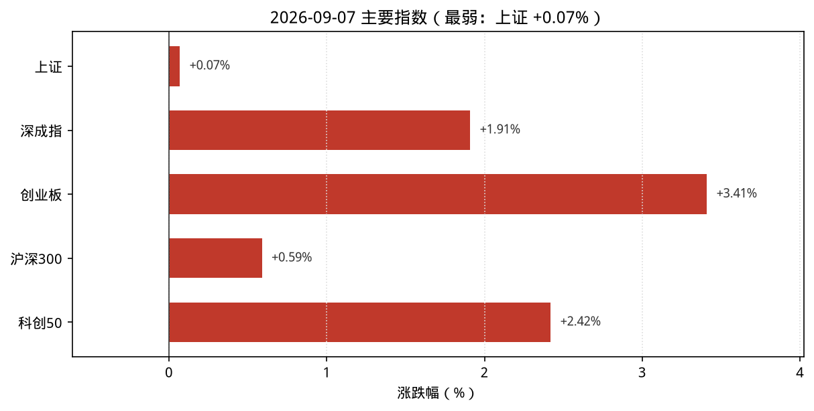
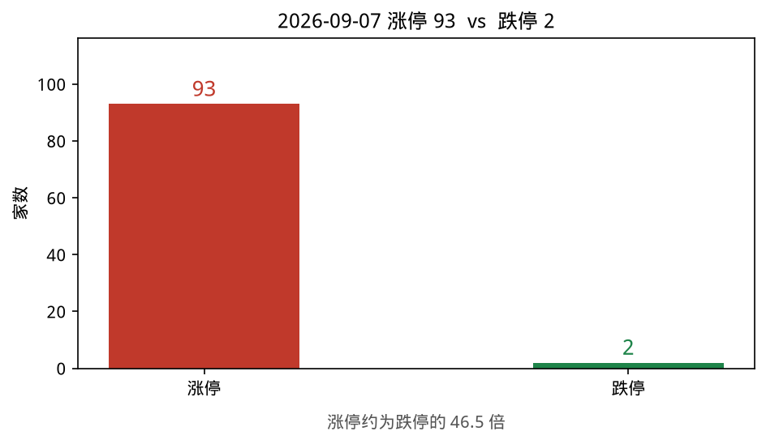
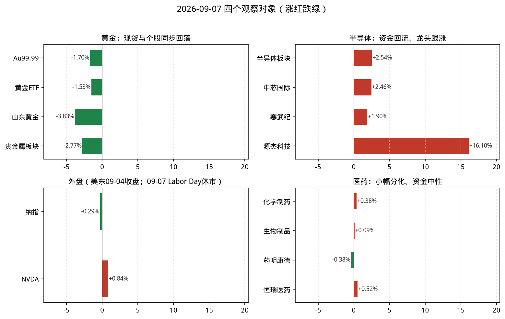
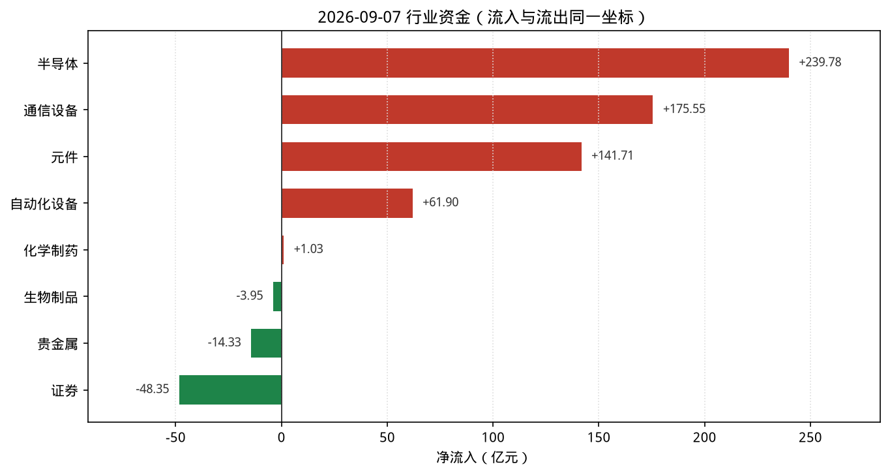

# 2026-09-07 A股盘后观察简报

> 研究摘要，不构成投资建议。触发时点：cron `2026-09-07T07:30:00Z`（北京时间约 15:30，A 股已收盘）。美东当日为 **Labor Day 休市**，纳指/NVDA 使用 **2026-09-04** 最近完整收盘。

## 今日结论

1. **成长风格显著修复**：深成指 **+1.91%**、创业板 **+3.41%**、科创50 **+2.42%**；上证仅 **+0.07%**，结构偏科技/成长。
2. **情绪极强**：涨停 **93** / 跌停 **2**；最高连板龙版传媒 **6** 板。
3. **半导体资金大回流**：THS 半导体 **+2.54%**、净流入约 **+239.8 亿**（上涨 155 / 下跌 30），与 09-04 大流出形成反转。
4. **黄金同步走弱**：Au99.99 盘末约 **949.51**（相对 09-04 收盘 965.95 约 **-1.70%**）；贵金属行业 **-2.77%**、净流出约 **14.3 亿**；国际金价（TE）约 **-0.77%**。
5. **主线雷达**：光伏链（钙钛矿/HIT/TOPCon）、水产品、华为概念等靠前，自动分最高 **5.5**，**暂无**达正式跟踪阈值（完整 10 项 ≥6）。

---

## 1. 今日市场异动（最多 8 条）

| # | 标的 | 幅度/数据 | 为何算异动 |
|---|---|---|---|
| 1 | 创业板 / 科创50 | **+3.41%** / **+2.42%** | 宽基中最强，成长风格全日主导 |
| 2 | 半导体（THS） | **+2.54%**，净流入约 **+239.8 亿** | 全市场净流入第一；涨跌家数 155/30 |
| 3 | 元件（THS） | **+6.83%**，净流入约 **+141.7 亿**，上涨 63 / 下跌 0 | 全板上涨；领涨则成电子约 +30% |
| 4 | 龙版传媒(605577) | **+10.03%**，连板 **6** | 涨停池最高连板，情绪标尺 |
| 5 | 源杰科技(688498) | **+16.10%** | 半导体板块领涨股，光芯片高弹性 |
| 6 | 黄金 / 贵金属 | Au99.99 约 **-1.70%**；板块 **-2.77%** | 现货、ETF、个股同向下跌，风险偏好回升时避险资产承压 |
| 7 | 黄金ETF(518880) | **-1.53%**，量比约 **4.28** | 放量下跌，ETF 与现货同向 |
| 8 | 纳指 / NVDA（美东 09-04） | 纳指 **-0.29%**；NVDA **+0.84%** | 09-07 美股 Labor Day 休市；外盘最新完整日温和分化 |

补充：市场资金（skill）行业净流入前五为半导体、通信设备、元件、自动化设备、消费电子；南向港股通（沪+深）成交净买合计约 **+14.8 亿**，北向当日字段显示为 0（口径/披露延迟，勿过度解读）。主线雷达前排偏光伏/养殖/华为，完整 10 项均未达 6 分。

---

## 2. 四个观察对象的行情要点

### 黄金

| 项目 | 数据 | 说明 |
|---|---|---|
| 沪金现货 Au99.99 | 盘末 **949.51** 元/克（相对 09-04 收盘 965.95 约 **-1.70%**） | 上金所分时；更新时间约 15:43 |
| AU0 主力连续 | 新浪报价最新约 **950.78**（开 952 / 高 961.88 / 低 944.10）；日线最新完整入库仍为 **09-04** 收 965.96 | 09-07 日线待完整入库 |
| 贵金属行业 | **-2.77%**，净流入 **-14.33 亿**，上涨 0 / 下跌 14 | THS；领跌侧整体普跌 |
| 黄金概念 | **-2.02%** | 概念板块跌幅前列 |
| 黄金ETF(518880) | 9.024，**-1.53%**；量比约 4.28 | StockSight：结构平稳、无显著技术异动 |
| 山东黄金(600547) | 36.45，**-3.83%** | StockSight：KDJ 死叉警告，判「转弱—关注回撤」 |
| 湖南黄金(002155) | 25.97，**-3.02%** | 与板块同向 |
| 国际金价 | Trading Economics 约 **4398.53** USD/盎司，日变约 **-0.77%**（2026-09-07） | Firecrawl 抓取 TE；Barchart 期货亦报回落 |

**资金/情绪**：现货、期货、ETF、A 股贵金属同步走弱，资金净流出；与科技成长回流形成风险偏好切换。  
**关键新闻**：WikiFX/TE 等称金价自上周高位回落；升息预期与美元相关叙事仍在（资讯面，非交易信号）。

### 半导体

| 项目 | 数据 | 说明 |
|---|---|---|
| THS 半导体 | **+2.54%**，净流入 **+239.78 亿**，上涨 155 / 下跌 30 | 领涨源杰科技 +16.10% |
| 中芯国际(688981) | 124.12，**+2.46%**；量比约 1.57 | StockSight：KDJ 死叉警告仍在，判「转弱—关注回撤」（价格反弹但短线动能信号未完全修复） |
| 寒武纪(688256) | 1092.38，**+1.90%** | StockSight：偏强—动能偏多 |
| 北方华创(002371) | 660.65，**+3.52%** | 设备链跟涨 |
| 元件 / 通信设备 / 电子化学品 | +6.83% / +3.77% / +4.10%，均大幅净流入 | 电子链条共振偏强 |
| NVDA | **230.36，+0.84%**（美东 **09-04** 收盘） | Yahoo/StockSight；RSI 偏热关注；09-07 美股休市 |

**资金/情绪**：半导体为当日最大净流入方向；科创50 +2.42% 同向。相对 09-04 的大流出，属典型修复日。  
**关键新闻**：外盘侧 NVDA 09-04 小涨；未见扭转格局的硬监管催化，更多是 A 股内部资金回流与成长风格修复。

### 纳斯达克（纳指）

| 项目 | 数据 | 说明 |
|---|---|---|
| .IXIC 收盘 | **26506.99**（**2026-09-04**） | 较 09-03 的 26584.06 约 **-0.29%**（约 -77 点） |
| FRED / Nasdaq 官方页面 | 确认最近观测日为 **2026-09-04** | Firecrawl：FRED 26,506.990 |
| 09-07 美股 | **Labor Day 休市**（北京整日无常规美股交易日收盘） | 本简报使用 **最近完整收盘 = 09-04**，不是 09-07 盘中 |

**资金/情绪**：最近完整日纳指微跌、NVDA 小涨，科技内部仍分化。  
**关键新闻**：交易日历确认 09-07 休市；隔夜映射需等到 09-08（美东）常规开盘后再评估。

### 医药

| 项目 | 数据 | 说明 |
|---|---|---|
| 化学制药 | **+0.38%**，净流入 **+1.03 亿** | THS；上涨 89 / 下跌 66 |
| 生物制品 | **+0.09%**，净流入 **-3.95 亿** | 涨幅近乎平盘但资金小幅流出 |
| 中药 / 医疗器械 / 医疗服务 | +0.39% / +0.23% / +0.78% | 医疗服务相对更强 |
| 药明康德(603259) | 153.25，**-0.38%** | StockSight：KDJ 死叉警告 |
| 恒瑞医药(600276) | 46.26，**+0.52%** | 结构平稳 |
| 凯莱英(002821) | 166.60，**+2.20%** | CXO 分化偏强 |

**资金/情绪**：医药细分整体中性偏弱于科技主线；化学制药微流入、生物制品微流出。  
**关键新闻**：证券时报等中长期「创新药配置」评论仍在；东财侧有仿制药/集采相关公司报道。当日 A 股盘面未形成独立主升。

---

## 3. 数据可视化

> 按 `scripts/make_recap_charts.py` 出图；数字与正文表格一致。源数据：`charts/data.json`。

**读图要点**

1. 宽基全红但分化大：创业板/科创显著强于上证，成长风格当日主导。
2. 涨停 93 vs 跌停 2，红柱极端占优，情绪与科技回流一致。
3. 黄金组全绿：现货、ETF、山东黄金、贵金属板块同步回落。
4. 半导体组全红且源杰科技弹性极大；外盘组为 09-04（Labor Day 前）微跌/NVDA 小涨。
5. 资金图同一横轴：半导体约 **+240 亿** 级流入 vs 证券约 **-48 亿**、贵金属约 **-14 亿**，量级一眼可比。

> 资金图统一使用同花顺行业摘要（THS）同一时点；skill「行业资金流向」前五与 THS 摘要存在细差（如半导体约 231.9 亿 vs 239.8 亿），方向一致，以 THS 入图。

---

## 4. 投资建议（研究口径，非代客理财）

| 对象 | 建议 | 理由（1–2 句） | 主要风险 |
|---|---|---|---|
| **黄金** | **谨慎减仓** | 国内外现货同步回落，A 股贵金属全线下跌且净流出；风险偏好回升时避险仓位性价比下降。 | 地缘/实际利率突发转向再拉升金价；板块超跌反抽；山东黄金继续技术性回撤。 |
| **半导体** | **逢低关注** | 净流入与涨跌家数显示资金回流，龙头跟涨；但中芯仍有 KDJ 死叉警告，不宜在修复日追高打满。 | 隔夜美股（09-08）若转弱；出口管制与订单预期；高弹性个股一日游。 |
| **纳斯达克** | **观望** | 09-07 Labor Day 休市，最新仅为 09-04 微跌收盘；缺少当日价格发现。 | 美债收益率与就业数据；节后跳空；科技股估值波动。 |
| **医药** | **观望** | 细分仅小幅翻红，资金中性，未进入主线雷达前列；资讯偏中长期，盘面缺乏独立催化。 | 集采/政策预期反复；CXO 订单波动；科技回流挤压医药注意力。 |

---

## 5. 次日观察点

1. 半导体净流入能否连续、科创50 是否延续强于上证；源杰等高弹性标的是否扩散到设备/材料。
2. 黄金：Au99.99 能否止跌，贵金属资金是否止出；关注美元与美债节后定价。
3. 美东 **09-08** 常规开盘后纳指/NVDA/SOX 对 A 股电子链的隔夜映射（今日无美股交易）。
4. 光伏链（钙钛矿/HIT/TOPCon）与华为概念能否把雷达待确认项补齐到 ≥6 分。

---

## 6. 风险提示

本报告仅供研究与盘后观察，**不构成**任何投资建议或收益承诺。行情数据可能存在延迟、口径差异或接口失败回退；外盘在北京 15:30 且适逢美国假日时，必须使用最近完整收盘并标明时点。市场有风险，决策需独立判断。

---

## 7. 数据时点与来源

| 来源 | 状态 | 说明 |
|---|---|---|
| **akshare-stock** | 部分成功 | 涨停统计、市场/行业资金、行业与概念涨跌成功；`A股大盘`/`纳指行情` 入口因 formatter `_fmt_amount` NameError 失败 → **直连** `stock_zh_index_spot_sina` / `index_us_stock_sina` 补全；`半导体板块`/`医药板块` 路由落到行业排行未给细分 → **直连** `stock_board_industry_summary_ths()`；`黄金期货` 主力列表无效 → 新浪 AU0 + 上金所 Au99.99 分时/日线 |
| **stocksight** | 成功 | `mainline_radar.py --provider auto`（板块源 akshare）；详报：中芯国际、寒武纪、山东黄金、黄金ETF、药明康德、恒瑞医药、NVDA（yahoo），策略 `neutral` |
| **firecrawl-cli** | 成功（免密） | `FIRECRAWL_API_KEY` **未配置**，CLI status 显示 Not authenticated；search 仍可用，原始结果见 `sources/gold.json`、`gold-en.json`、`nasdaq-semi.json`、`nasdaq.json`、`pharma.json` |
| 采集完成 | 北京时间约 **2026-09-07 15:30–15:50** | UTC 约 07:30–07:50 |

目录：`reports/2026-09-07/`（含 `复盘.md`、`主线雷达.md`、`charts/`、`sources/`、`stocksight/`）。
