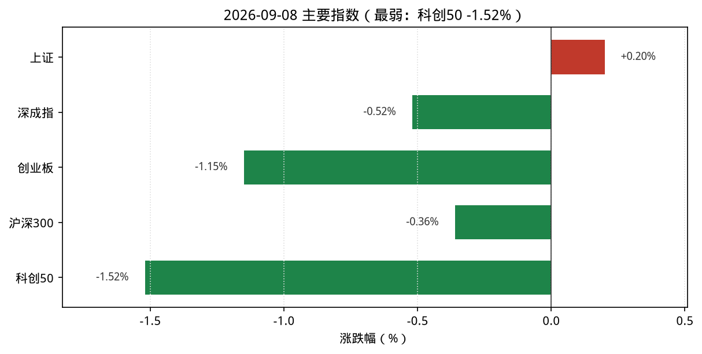
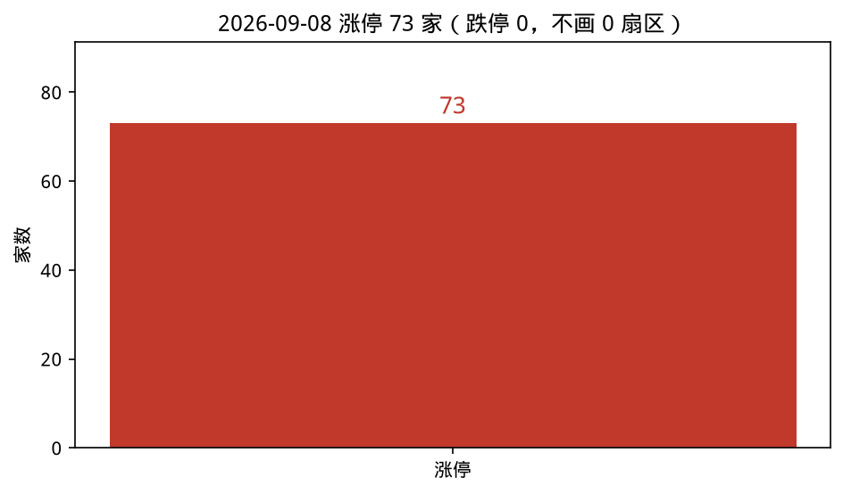
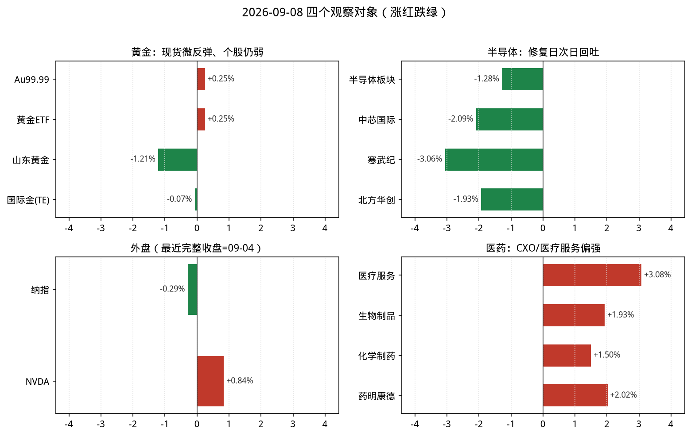
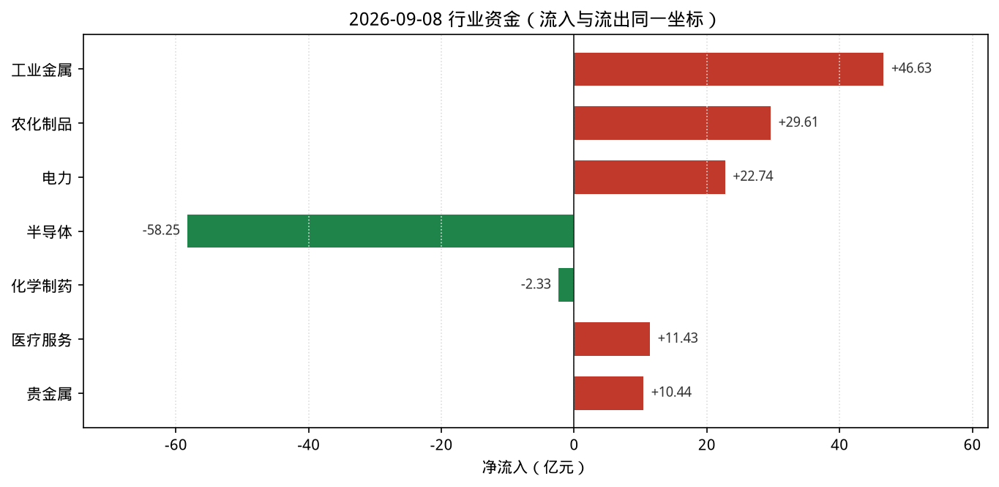

# 2026-09-08 A股盘后观察简报

> 研究摘要，不构成投资建议。触发时点：cron `2026-09-08T07:30:01Z`（北京时间约 15:30，A 股已收盘）。美东 **09-07 Labor Day 休市**，**09-08 常规盘尚未开盘**（约北京 21:30 开盘），故纳指/NVDA 使用 **2026-09-04** 最近完整收盘，并标明时点。

## 今日结论

1. **风格切换**：上证微涨 **+0.20%**，深成指 **-0.52%**、创业板 **-1.15%**、科创50 **-1.52%**；相对 09-07 成长修复日，今日成长回吐、价值/周期与医药相对占优。
2. **情绪仍偏暖但高度下降**：涨停 **73** / 跌停 **0**；最高连板 **4**（爱仕达、亚盛集团、百大集团），低于昨日 6 板。
3. **半导体资金大幅流出**：THS 半导体 **-1.28%**、净流入约 **-58.3 亿**（上涨 35 / 下跌 151），与 09-07 大回流形成反转。
4. **医药/CXO 走强**：医疗服务 **+3.08%**、生物制品 **+1.93%**、化学制药 **+1.50%**；主线雷达前排出现 CXO/CRO（自动分 5.5，未达正式跟踪阈值）。
5. **黄金内外分化**：沪金 Au99.99 盘末 **952.0**（相对 09-07 收盘约 **+0.25%**）；国际金价（TE）约 **4402** 美元/盎司、日变约 **-0.07%**；A 股贵金属 **-0.20%**。

---

## 1. 今日市场异动（最多 8 条）

| # | 标的 | 幅度/数据 | 为何算异动 |
|---|---|---|---|
| 1 | 科创50 / 创业板 | **-1.52%** / **-1.15%** | 成长风格明显回吐，与昨日修复形成反差 |
| 2 | 半导体（THS） | **-1.28%**，净流入约 **-58.3 亿** | 全市场净流出第一档；涨跌家数 35/151 |
| 3 | 农化制品 / 农药化肥 | 净流入约 **+29.6 亿**（+4.71%）；行业涨幅榜农药化肥 **+4.10%** | 资金与涨幅共振，雷达榜前列 |
| 4 | 医疗服务 / CXO概念 | **+3.08%** / **+3.37%** | 医药链当日最强分支；领涨侧奥浦迈、泰格医药 |
| 5 | 工业金属 | **+2.12%**，净流入约 **+46.6 亿** | 当日最大净流入行业 |
| 6 | 连板高度：爱仕达等 | 最高 **4** 板；涨停 **73** / 跌停 **0** | 情绪偏暖但高度与家数均低于 09-07 |
| 7 | 寒武纪(688256) / 中芯国际(688981) | **-3.06%** / **-2.09%** | 半导体龙头回撤；StockSight 均提示 KDJ 死叉偏弱 |
| 8 | 纳指 / NVDA（美东 09-04） | 纳指 **-0.29%**；NVDA **+0.84%** | 北京 15:30 仍无 09-08 美股收盘；外盘映射滞后 |

补充：市场资金（skill）走沪深港通——南向港股通（沪+深）成交净买合计约 **+61.0 亿**；北向当日字段显示为 0（口径/披露延迟，勿过度解读）。行业净流入前五（同花顺即时）：工业金属、农化制品、医疗服务、银行、电力。主线雷达前排偏农化/石油/CXO，完整 10 项均未达 6 分。

---

## 2. 四个观察对象的行情要点

### 黄金

| 项目 | 数据 | 说明 |
|---|---|---|
| 沪金现货 Au99.99 | 盘末 **952.0** 元/克（相对 09-07 收盘 949.60 约 **+0.25%**） | 上金所分时；更新约 15:32 |
| AU0 主力连续 | 新浪报价最新约 **953.12**（开 951 / 高 961.14 / 低 950.98）；相对 09-07 收盘 950.78 约 **+0.25%** | 日线 09-07 已入库；09-08 盘中连续报价 |
| 贵金属行业 | **-0.20%**，净流入约 **+10.44 亿**，上涨 5 / 下跌 8 | THS 摘要；领涨紫金矿业 +3.01% |
| 黄金ETF(518880) | 9.047，**+0.25%**；量比约 0.71、换手约 3.53% | StockSight：结构平稳、无显著异动 |
| 山东黄金(600547) | 36.01，**-1.21%** | StockSight：MACD/KDJ 死叉，判「转弱—关注回撤」 |
| 湖南黄金(002155) | 25.86，**-0.42%** | 个股弱于现货微反弹 |
| 国际金价 | Trading Economics 约 **4401.9** USD/盎司，日变约 **-0.07%**（2026-09-08） | Firecrawl 抓取 TE；叙事偏升息预期压制 |

**资金/情绪**：国内现货/ETF 微弹，但黄金股仍偏弱、国际金价贴近 4400 附近承压。  
**关键新闻**：TE 称金价受美联储升息押注与油价推升通胀担忧压制；中国央行连续增持黄金叙事仍在（资讯面，非交易信号）。  
**投资建议**：**观望**（现货弱修复、个股技术面仍偏弱，不宜追反弹）。

### 半导体

| 项目 | 数据 | 说明 |
|---|---|---|
| THS 半导体 | **-1.28%**，净流入约 **-58.25 亿**，上涨 35 / 下跌 151 | 领涨利扬芯片 +9.02%（局部，非板块共振） |
| 中芯国际(688981) | 121.52，**-2.09%**；量比约 1.01～1.39 | StockSight：KDJ 死叉，判「转弱—关注回撤」 |
| 寒武纪(688256) | 1058.99，**-3.06%** | StockSight：KDJ 死叉；MACD 仍偏多但价格回撤 |
| 北方华创(002371) | 647.87，**-1.93%** | 设备链跟跌 |
| 消费电子 / 电子化学品 | -1.08% / -1.46%，均净流出 | 电子链条共振偏弱 |
| NVDA | **230.36，+0.84%**（美东 **09-04** 收盘） | Yahoo/StockSight；RSI 偏热关注；09-08 美股未开盘 |

**资金/情绪**：相对 09-07 的 +239 亿级回流，今日大幅净流出，属修复后的回吐日。  
**关键新闻**：外盘侧仍停在 09-04；未见扭转格局的硬监管催化，更多是 A 股内部获利了结与风格切换。  
**投资建议**：**谨慎减仓**（高位回吐+资金流出；若持仓偏重可降波动暴露，新开仓观望）。

### 纳斯达克（纳指）

| 项目 | 数据 | 说明 |
|---|---|---|
| .IXIC 收盘 | **26506.99**（**2026-09-04**） | 较 09-03 的 26584.06 约 **-0.29%** |
| FRED NASDAQCOM | 最近观测日 **2026-09-04：26,506.990** | Firecrawl 抓取确认 |
| 09-07 / 09-08 美股 | 09-07 **Labor Day 休市**；北京 15:30 时 09-08 常规盘**尚未开盘** | 本简报使用最近完整收盘 = **09-04** |

**资金/情绪**：最近完整日纳指微跌、NVDA 小涨；隔夜映射需等美东 09-08 收盘后再评估。  
**关键新闻**：交易日历与 FRED 观测日一致；升息预期相关宏观叙事在黄金资讯中同步出现。  
**投资建议**：**观望**（时点滞后，避免用过期收盘做当日映射交易）。

### 医药

| 项目 | 数据 | 说明 |
|---|---|---|
| 医疗服务 | **+3.08%**，净流入约 **+11.43 亿**，上涨 50 / 下跌 6 | THS；领涨奥浦迈 +20% |
| 生物制品 | **+1.93%**，净流入约 **+7.44 亿**，上涨 46 / 下跌 9 | 近岸蛋白 +15.33% |
| 化学制药 | **+1.50%**，净流入约 **-2.33 亿**，上涨 128 / 下跌 27 | 涨价但资金略流出（价量略背离） |
| CXO / CRO 概念 | **+3.37%** / **+3.17%** | 雷达跟踪观察；领涨泰格医药约 +8.2% |
| 药明康德(603259) | 156.35，**+2.02%** | StockSight：价格偏强但 KDJ 信号反复，判「转弱—关注回撤」 |
| 恒瑞医药(600276) | 45.71，**-1.19%** | 创新药龙头未跟涨 |
| 爱尔眼科(300015) | 8.35，**+0.85%** | 医疗服务中军温和 |

**资金/情绪**：医药链（尤其 CXO/医疗服务）为当日少数与成长回吐逆向的强势方向。  
**关键新闻**：搜狐等称 CXO 景气修复、相关 ETF 盘中跟涨（资讯面）。  
**投资建议**：**逢低关注**（板块偏强但个股分化；优先观察同步性与资金是否持续，不追高一字/极端涨停）。

---

## 3. 数据可视化

读图要点：

1. 宽基呈「上证微红、创业/科创明显回绿」，成长回吐一目了然。
2. 涨停 73、跌停 0，情绪偏暖但高度仅 4 板。
3. 观察对象上：半导体与多数芯片龙头回吐；医药四项全红；外盘仍停在 09-04。
4. 资金轴上工业金属/农化为流入主力，半导体为大额流出，化学制药接近零轴略负。

资金图口径：同花顺行业摘要 `stock_board_industry_summary_ths()`（亿元）。与即时排行 `stock_fund_flow_industry` 存在细差（如半导体即时约 -41.2 亿 vs 摘要 -58.3 亿），图中统一用摘要以便与涨跌家数同表。

---

## 4. 投资建议

| 观察对象 | 建议 | 理由（一句话） |
|---|---|---|
| 黄金 | **观望** | 现货仅弱修复，个股技术面仍偏弱，国际金受升息预期压制 |
| 半导体 | **谨慎减仓** | 修复日后资金大幅流出、龙头回撤，波动风险上升 |
| 纳斯达克 | **观望** | 北京 15:30 仍无当日美股收盘，映射失效 |
| 医药 | **逢低关注** | CXO/医疗服务偏强且上涨家数占优，但需确认持续性 |

**次日观察点**

1. 半导体流出是否延续，科创50 能否止跌。
2. CXO/医疗服务能否连续强于大盘，药明等中军是否带量。
3. 美东 09-08 开盘后纳指/NVDA 对 A 股科技的隔夜映射。
4. 黄金：关注国际金能否守住约 4400，以及 A 股贵金属是否跟上现货。

**风险提示**：以上内容仅供研究交流，不构成任何投资建议；行情与资讯可能延迟、口径不一致或随后修正；请独立判断并控制仓位与风险。

---

## 5. 数据来源与时间戳

| 来源 | 用途 | 时点 |
|---|---|---|
| akshare-stock | 涨停统计、市场/行业资金、行业/概念涨跌；大盘入口因 `_fmt_amount` NameError 失败，已直连新浪指数补全；半导体/医药入口落到行业排行，已用 THS 摘要直连；黄金期货入口未返回 AU0，已用新浪连续+日线补全；纳指入口同上 NameError，已用新浪 `.IXIC` 补全 | 2026-09-08 约 15:30–15:35（北京） |
| stocksight | 主线雷达（`--provider auto`，板块源 akshare）；个股详细报告 688981/688256/603259/518880/600547/NVDA（neutral） | 雷达约 07:33 UTC；个股约 07:33–07:34 UTC |
| firecrawl-cli | 黄金/纳指半导体/医药资讯检索与 TE、FRED、上金所页面抓取 | **未配置 `FIRECRAWL_API_KEY`，使用免密额度**（CLI 显示 Not authenticated，但仍返回结果） |
| 直连补充 | 腾讯行情 `qt.gtimg.cn`；同花顺行业摘要；上金所 Au99.99 分时 | 同上 |

原始检索与中间结果见：`reports/2026-09-08/sources/`、`主线雷达.md`、`stocksight/`、`charts/`。
