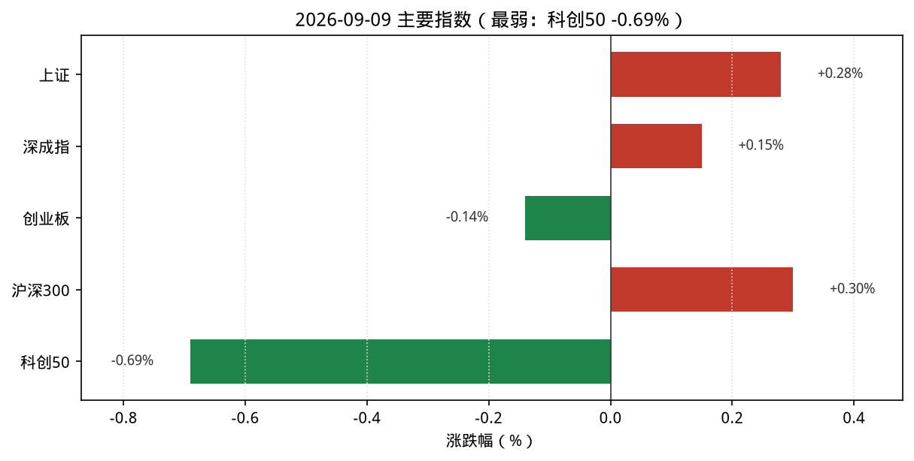
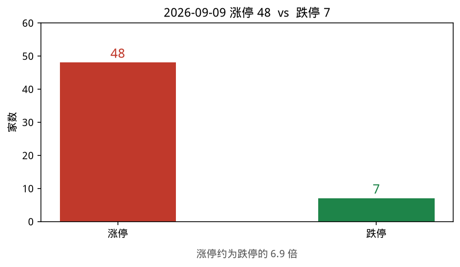
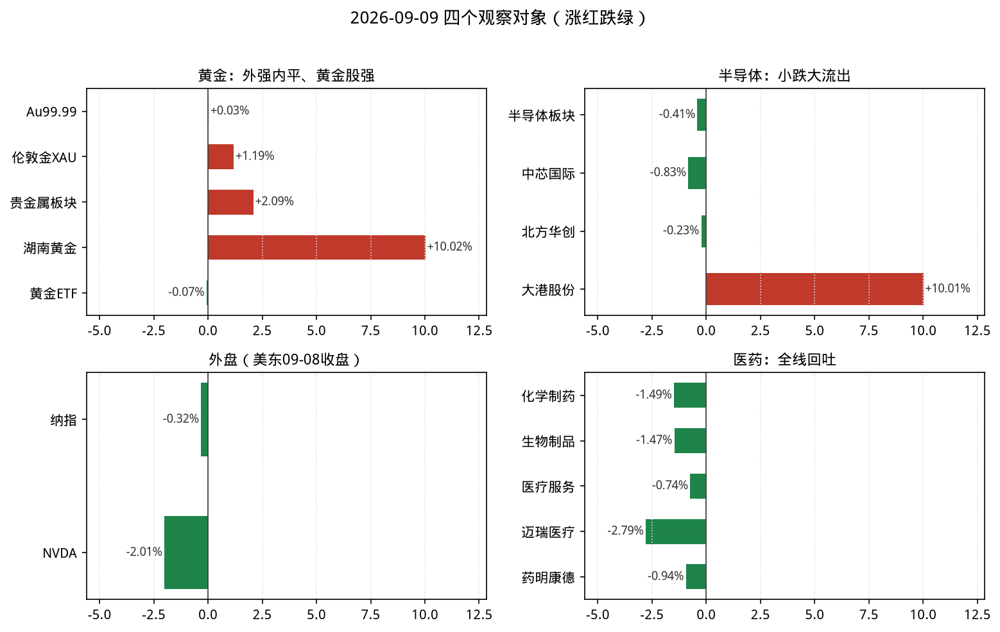
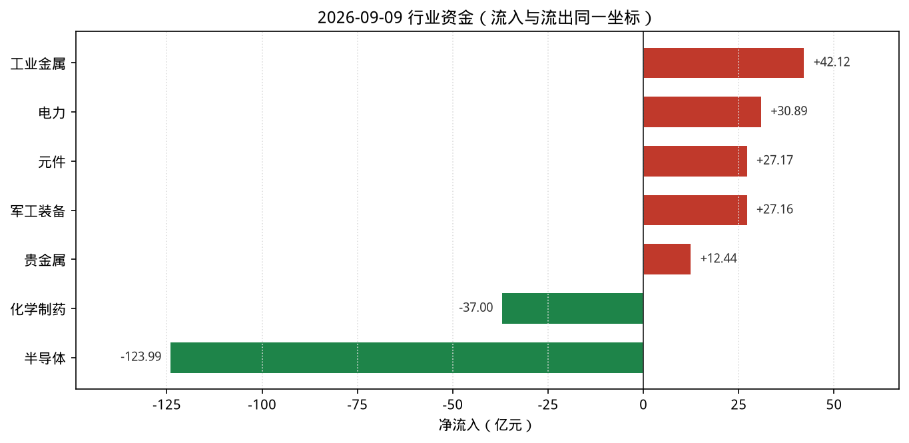

# 2026-09-09 A股盘后观察简报

> 研究摘要，不构成投资建议。触发时点：cron `2026-09-09T07:30:02Z`（北京时间约 15:30，A 股已收盘）。美东 **09-09 常规盘尚未开盘**（约北京 21:30），故纳指/NVDA 使用 **2026-09-08** 最近完整收盘，并标明时点。

## 今日结论

1. **宽基分化偏稳**：上证 **+0.28%**、沪深300 **+0.30%**、深成指 **+0.15%**；创业板 **-0.14%**、科创50 **-0.69%**，成长仍弱于价值/周期。
2. **情绪降温**：涨停 **48** / 跌停 **7**（昨日 73/0）；最高连板 **5**（百大集团），但跌停家数回升。
3. **半导体继续大流出**：THS 半导体 **-0.41%**、净流入约 **-124.0 亿**（上涨 56 / 下跌 128），流出量级高于 09-08。
4. **医药全日回吐**：化学制药 **-1.49%**、生物制品 **-1.47%**、医疗服务 **-0.74%**，与 09-08 的 CXO/医疗服务强势形成反转。
5. **黄金内外分化**：国际金（伦敦金/TE）约 **+1.2%**；A 股贵金属 **+2.09%**（湖南黄金涨停），但沪金现货 Au99.99 近乎持平。

---

## 1. 今日市场异动（最多 8 条）

| # | 标的 | 幅度/数据 | 为何算异动 |
|---|---|---|---|
| 1 | 半导体（THS） | **-0.41%**，净流入约 **-124.0 亿** | 全市场最大净流出；涨跌家数 56/128 |
| 2 | 贵金属 / 湖南黄金 | 板块 **+2.09%**；002155 **+10.02%** | 黄金股强于现货；雷达黄金概念入榜 |
| 3 | 化学制药 / 医药链 | **-1.49%**，净流入约 **-37.0 亿** | 相对昨日医药强势日全面回吐 |
| 4 | 工业金属 | **+1.72%**，净流入约 **+42.1 亿** | 当日最大净流入行业 |
| 5 | 煤炭开采加工 | **+3.35%**，净流入约 **+18.1 亿** | 行业涨幅居前，云煤能源等涨停 |
| 6 | 大港股份(002077) | **+10.01%**，换手约 **14.3%**、量比约 **5.3** | 半导体领涨股涨停放量；StockSight 判超额收益异动/过热 |
| 7 | 连板高度：百大集团 | 最高 **5** 板；涨停 **48** / 跌停 **7** | 情绪降温（跌停回升、涨停家数下降） |
| 8 | 纳指 / NVDA（美东 09-08） | 纳指 **-0.32%**；NVDA **-2.01%** | 北京 15:30 仍无 09-09 美股收盘；芯片映射偏弱 |

补充：市场资金（skill）走沪深港通——南向港股通（沪+深）成交净买合计约 **+38.4 亿**；北向当日字段显示为 0（口径/披露延迟，勿过度解读）。行业净流入前五（同花顺即时排行）：元件、工业金属、电力、军工装备、通信设备；摘要与即时存在细差，图中统一用 THS 摘要。主线雷达前排偏水产/陶瓷/船舶/煤炭/黄金概念，完整 10 项均未达 6 分跟踪阈值。

---

## 2. 四个观察对象的行情要点

### 黄金

| 项目 | 数据 | 说明 |
|---|---|---|
| 沪金现货 Au99.99 | 盘末约 **951.78** 元/克（相对 09-08 收盘 951.52 约 **+0.03%**） | akshare 上金所分时；更新约 15:29 |
| 上金所延时行情 | Au99.99 最新 **946.29**（开 950 / 高 952.8 / 低 941） | Firecrawl 抓取官网延时页；与实时分时不完全一致，报告主口径用实时分时 |
| AU0 主力连续 | 新浪报价最新 **952.22**（开 953.98 / 高 955 / 低 942.12）；相对昨结算 955.9 约 **-0.38%** | 相对昨收 952.22 持平 |
| 贵金属行业 | **+2.09%**，净流入约 **+12.44 亿**，上涨 12 / 下跌 2 | THS；领涨湖南黄金 +10.02% |
| 黄金ETF(518880) | 9.041，**-0.07%**；换手约 3.82%、量比约 0.78 | 腾讯行情；近乎平盘 |
| 山东黄金(600547) | 36.25，**+0.67%** | StockSight：MACD/KDJ 死叉，判「转弱—关注回撤」 |
| 湖南黄金(002155) | 28.45，**+10.02%** | 涨停；换手约 9.5%、量比约 2.0 |
| 国际金价 | 伦敦金（新浪 hf_XAU）约 **4407.2** USD/盎司，相对昨收约 **+1.19%**；TE 描述同日约 **4407**、**+1.18%**（2026-09-09） | 纽约金期货（新浪 hf_GC）约 **4451.4** |

**资金/情绪**：外盘金价明显反弹，A 股黄金股/贵金属跟涨，但国内现货与 ETF 近乎不动，股强于金。  
**关键新闻**：Firecrawl 检索到上金所延时行情与 Investing/Futunn 等期货页；英文侧多为 09-01～09-06 旧稿，时效不足处已改用新浪/TE 当日点位。  
**投资建议**：**逢低关注**（外盘金价与贵金属资金共振偏强，但涨停个股不宜追高；现货未同步确认）。

### 半导体

| 项目 | 数据 | 说明 |
|---|---|---|
| THS 半导体 | **-0.41%**，净流入约 **-123.99 亿**，上涨 56 / 下跌 128 | 领涨大港股份 +10.01%（局部涨停，非板块共振） |
| 中芯国际(688981) | 120.51，**-0.83%** | StockSight：KDJ 死叉，判「转弱—关注回撤」；换手字段不可用 |
| 北方华创(002371) | 646.40，**-0.23%** | 设备链跟跌偏弱 |
| 中际旭创(300308) | 908.90，**+0.72%** | 光模块相对抗跌 |
| 元件（相关） | **+2.20%**，净流入约 **+27.17 亿** | 与半导体价量背离：元件流入、半导体积弱 |
| NVDA | **225.73，-2.01%**（美东 **09-08** 收盘） | Yahoo/StockSight；北京 15:30 时 09-09 美股未开盘 |

**资金/情绪**：价格仅小跌，但资金流出创近几日新高量级，属「价稳量逃」；局部涨停难抵板块净流出。  
**关键新闻**：Firecrawl 检索到半导体外盘偏弱叙事（Yahoo 等称芯片股承压）；纳指侧见下节。东财概念 push2 云端不可用，概念涨跌 skill 失败已注明。  
**投资建议**：**谨慎减仓**（连续资金流出+龙头技术偏弱；持仓偏重可降波动暴露，新开仓观望）。

### 纳斯达克（纳指）

| 项目 | 数据 | 说明 |
|---|---|---|
| .IXIC 收盘 | **26421.41**（**2026-09-08**） | 较 09-04 的 26506.99 约 **-0.32%**（09-05～09-07 含周末/Labor Day，新浪序列下一交易日为 09-08） |
| NVDA | **225.73，-2.01%**（**2026-09-08**） | 相对 09-04 收盘 230.36 |
| 09-09 美股 | 北京 15:30 时常规盘**尚未开盘** | 本简报使用最近完整收盘 = **09-08** |

**资金/情绪**：最近完整日纳指微跌、NVDA 明显回调，对 A 股半导体情绪偏压制。  
**关键新闻**：Firecrawl 抓取 Yahoo 纳指页失败（页面异常）；指数点位以 akshare/新浪直连为准。SOX 等页面有报价但时点未交叉验证，不作主数据。  
**投资建议**：**观望**（时点滞后；等美东 09-09 收盘后再评估映射）。

### 医药

| 项目 | 数据 | 说明 |
|---|---|---|
| 化学制药 | **-1.49%**，净流入约 **-37.00 亿**，上涨 27 / 下跌 130 | THS；领涨侧含 ST 标的，质量一般 |
| 生物制品 | **-1.47%**，净流入约 **-8.68 亿**，上涨 8 / 下跌 47 | 昨日强势分支回吐 |
| 医疗服务 | **-0.74%**，净流入约 **-10.53 亿**，上涨 14 / 下跌 41 | 相对其他医药细分略抗跌 |
| 医疗器械 | **-1.41%**，净流入约 **-13.42 亿** | 迈瑞医疗等拖累 |
| 药明康德(603259) | 154.88，**-0.94%** | 腾讯行情 |
| 迈瑞医疗(300760) | 165.20，**-2.79%** | StockSight：KDJ 死叉，判「转弱—关注回撤」 |
| 恒瑞医药(600276) | 44.71，**-2.19%** | 创新药龙头跟跌 |

**资金/情绪**：医药链全面转弱，资金与涨跌家数共振偏空，属 09-08 强势后的兑现日。  
**关键新闻**：Firecrawl 检索到证券时报等「创新药配置」类旧叙事与东财板块页；当日盘面更直接反映为回吐，政策面未见扭转性新催化。  
**投资建议**：**观望**（强势日后回吐，等资金与上涨家数重新占优再谈低吸）。

---

## 3. 数据可视化

读图要点：

1. 宽基「上证/沪深300微红、科创明显回绿」，成长仍弱。
2. 涨停 48、跌停 7，情绪较昨日降温。
3. 观察对象上：黄金股/外盘金偏强、半导体小跌、医药全线回绿；外盘用 09-08。
4. 资金轴上工业金属/电力/元件流入，半导体约 -124 亿为最大流出，化学制药亦明显流出。

资金图口径：同花顺行业摘要 `stock_board_industry_summary_ths()`（亿元）。与即时排行 `stock_fund_flow_industry` 存在细差（如元件即时约 +32.8 亿 vs 摘要 +27.2 亿），图中统一用摘要以便与涨跌家数同表。

---

## 4. 投资建议

| 观察对象 | 建议 | 理由（一句话） | 主要风险 |
|---|---|---|---|
| 黄金 | **逢低关注** | 外盘金价与贵金属资金偏强，但现货未确认、涨停不宜追 | 美债利率/美元反弹压制金价；股金背离快速收敛 |
| 半导体 | **谨慎减仓** | 连续大额净流出、龙头技术偏弱，价稳不改资金离场 | 外盘芯片继续杀估值；局部涨停诱多 |
| 纳斯达克 | **观望** | 北京 15:30 仍无当日美股收盘，映射失效 | 隔夜波动可能放大次日 A 股开盘缺口 |
| 医药 | **观望** | 昨日强势分支全面回吐，资金与家数共振偏弱 | 继续杀跌或主题快速轮空 |

---

## 5. 数据来源与时间戳

| Skill / 来源 | 状态 | 说明 |
|---|---|---|
| akshare-stock | **部分成功** | `今日涨停统计`/`市场资金流向`/`行业资金流向`/`行业板块涨跌`/`黄金期货入口` 已调用；`A股大盘`/`纳指行情` 因 formatter `_fmt_amount` NameError 失败，已用新浪指数/美股序列直连补全；`半导体板块`/`医药板块` 路由落到通用行业排行，已用 THS 摘要直连补全；`概念板块涨跌` 东财概念接口 JSON 解析失败 |
| stocksight | **成功** | 主线雷达 `--provider auto`（数据源 akshare）；详细报告：002077/600547/300760/688981/NVDA（strategy=neutral） |
| firecrawl-cli | **成功（免密）** | `FIRECRAWL_API_KEY` 未配置，走免密；已检索 gold/nasdaq-semi/pharma/gold-en，并 scrape 上金所延时页等；原始 JSON 在 `sources/` |
| 直连补数 | 已使用 | 新浪指数、THS 行业摘要、上金所 Au99.99 分时、AU0、腾讯个股、新浪纳指/伦敦金/纽约金 |
| 图表 | **已生成** | `python3 scripts/make_recap_charts.py reports/2026-09-09/charts/data.json` → 四张 PNG |

- 数据采集与成稿：约 **2026-09-09 15:30–15:40（北京时间）**
- 报告目录：`reports/2026-09-09/`（含 `复盘.md`、`主线雷达.md`、`charts/`、`sources/`）

**风险提示**：以上内容仅供研究与信息汇总，不构成任何投资建议或买卖依据。市场有风险，决策需独立判断。
