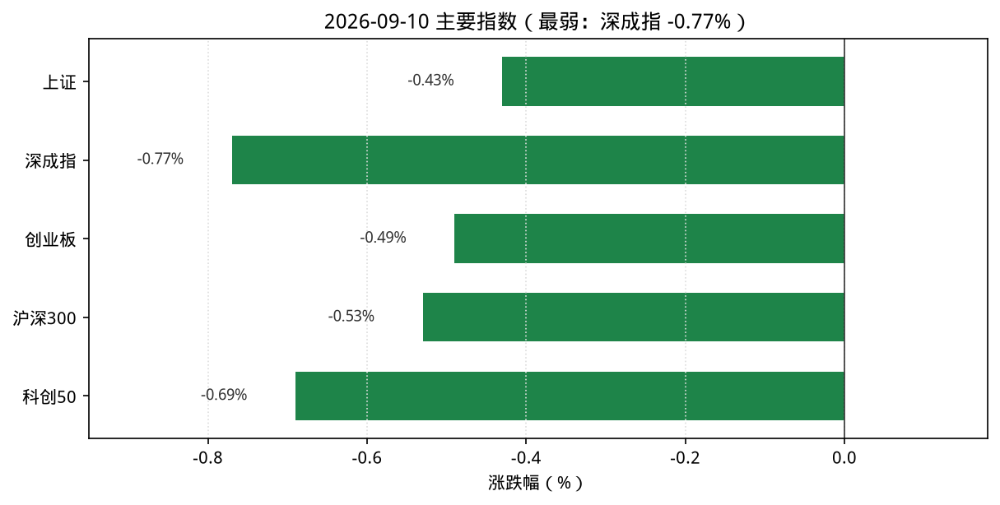
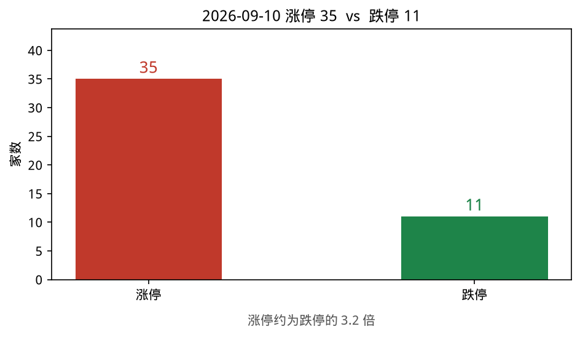
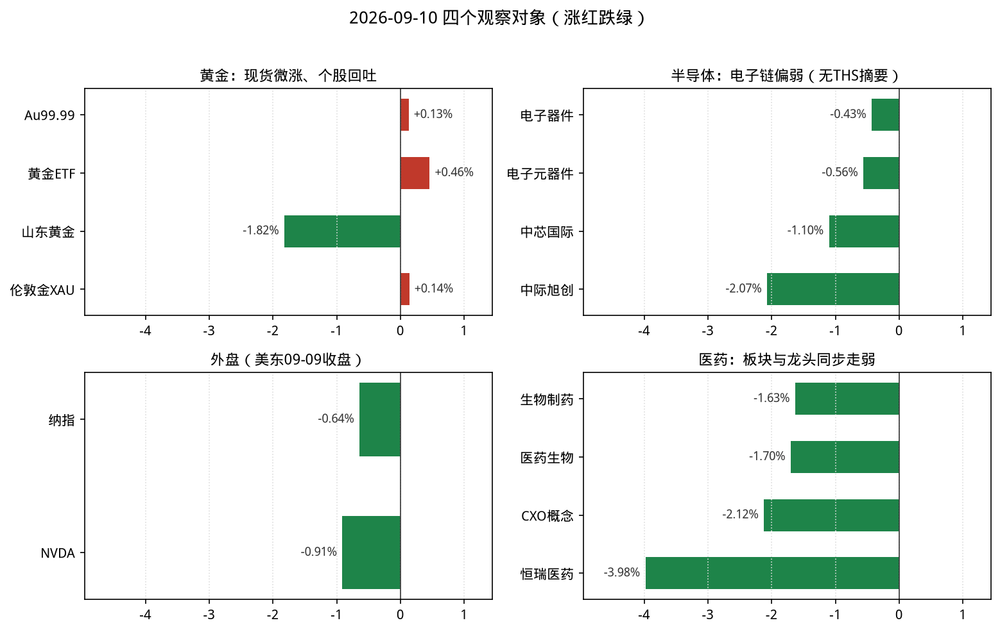

# 2026-09-10 A股盘后观察简报

> 研究摘要，不构成投资建议。触发时点：cron `2026-09-10T07:30:00Z`（北京时间约 15:30，A 股已收盘）。美东 **09-10 常规盘尚未开盘**（约北京 21:30），故纳指/NVDA 使用 **2026-09-09** 最近完整收盘，并标明时点。

## 今日结论

1. **宽基普跌**：上证 **-0.43%**、沪深300 **-0.53%**、深成指 **-0.77%**、创业板 **-0.49%**、科创50 **-0.69%**，成长与权重同步走弱。
2. **情绪继续降温**：涨停 **35** / 跌停 **11**（昨日 48/7）；最高连板 **4**（桂林旅游），跌停家数再升。
3. **医药链走弱**：新浪生物制药 **-1.63%**、启明星医药生物 **-1.70%**、CXO 概念 **-2.12%**；恒瑞医药 **-3.98%**，StockSight 提示 KDJ/MACD 转弱。
4. **半导体映射偏弱**：THS 半导体板块摘要/资金流当日不可用；新浪电子器件 **-0.43%**、启明星电子元器件 **-0.56%**；中芯 **-1.10%**、北方华创 **-1.20%**、中际旭创 **-2.07%**。
5. **黄金内外分化减弱**：Au99.99 约 **+0.13%**、黄金 ETF **+0.46%**，但山东黄金 **-1.82%**、黄金概念 **-0.90%**；伦敦金（新浪）约 **+0.14%**。

---

## 1. 今日市场异动（最多 8 条）

| # | 标的 | 幅度/数据 | 为何算异动 |
|---|---|---|---|
| 1 | 宽基指数 | 上证 **-0.43%**、深成指 **-0.77%**、科创50 **-0.69%** | 全日普跌，成长端更弱 |
| 2 | 涨跌停情绪 | 涨停 **35** / 跌停 **11**；最高连板 **4** | 较 09-09（48/7）再降温 |
| 3 | 生物制药 / 医药生物 | **-1.63%** / **-1.70%** | 医药链全面回吐，CXO **-2.12%** |
| 4 | 恒瑞医药(600276) | **-3.98%**，量比约 **1.93** | 龙头放量下跌；StockSight：KDJ/MACD 警告 |
| 5 | 中际旭创(300308) | **-2.07%** | 光模块领跌，外盘芯片映射偏弱 |
| 6 | 船舶制造 | **+2.61%**（雷达第 1） | 弱市中少数行业逆势；完整 10 项未达跟踪阈值 |
| 7 | 电力 / 金融 | 电力 **+1.38%**、金融 **+0.93%** | 防御/金融相对抗跌；华银电力等涨停 |
| 8 | 纳指 / NVDA（美东 09-09） | 纳指约 **-0.64%**；NVDA **-0.91%** | 北京 15:30 仍无 09-10 美股收盘；芯片情绪压制 |

补充：市场资金（skill）走沪深港通——南向港股通（沪）成交净买约 **+39.93 亿**、港股通（深）约 **-0.86 亿**；北向当日字段显示为 0（口径/披露延迟，勿过度解读）。**同花顺行业资金即时排行与 THS 行业摘要当日均失败**（接口返回空/SSL），故无行业净流入排序，资金图省略。主线雷达数据源 akshare，前排偏船舶/电力/风能/玻璃；完整 10 项均未达 6 分跟踪阈值。

---

## 2. 四个观察对象的行情要点

### 黄金

| 项目 | 数据 | 说明 |
|---|---|---|
| 沪金现货 Au99.99 | 盘末约 **952.99** 元/克（相对 09-09 收盘 951.77 约 **+0.13%**） | akshare 上金所分时；更新约 15:29 |
| AU0 主力连续 | 新浪报价最新约 **957.18**（开约 952.12 / 高 959.60 / 低 947.58） | 相对昨收附近偏强；skill「黄金期货」入口落到通用主力列表且字段残缺，已改直连 |
| 黄金概念 | **-0.90%**，领涨赤峰黄金约 **+0.96%** | 新浪概念；THS 贵金属摘要不可用 |
| 黄金ETF(518880) | 9.083，**+0.46%**；换手约 **3.75%**、量比约 **0.89** | 腾讯行情（StockSight 量比/换手偶发串字段，以腾讯为准） |
| 山东黄金(600547) | 35.59，**-1.82%** | StockSight：MACD/KDJ 死叉，「转弱—关注回撤」 |
| 湖南黄金(002155) | 28.54，**+0.32%** | 昨涨停后今日高开平走 |
| 国际金价 | 伦敦金（新浪 hf_XAU）约 **4408.07**，相对昨收 4401.73 约 **+0.14%**（报价时点约 15:32） | 纽约金（hf_GC）约 **4449.8**，相对昨收 4460.7 约 **-0.24%** |

**资金/情绪**：现货与 ETF 小幅跟涨，但黄金股/概念回吐，股弱于金。  
**关键新闻**：Firecrawl（免密）检索到金投网 09-10 现货页、上金所官网、新浪/东财期货页；点位以新浪/上金所分时为主口径。  
**投资建议**：**观望**（内外金价波动收敛，A 股黄金股转弱，不宜追涨；等股金再度共振）。

### 半导体

| 项目 | 数据 | 说明 |
|---|---|---|
| THS 半导体 | **数据不可用** | `stock_board_industry_summary_ths` / 行业资金流当日失败（空响应/SSL） |
| 电子器件（新浪行业） | **-0.43%** | 最接近的半导体相关行业代理口径 |
| 电子元器件（启明星） | **-0.56%** | 交叉验证偏弱 |
| 中芯国际(688981) | 119.18，**-1.10%**；换手约 **0.96%**、量比约 **0.71** | StockSight 误报换手 95.7%（推导异常），以腾讯为准；MACD/KDJ 转弱 |
| 北方华创(002371) | 638.64，**-1.20%** | 设备链跟跌 |
| 中际旭创(300308) | 890.10，**-2.07%** | 光模块领跌 |
| NVDA | **223.67，-0.91%**（美东 **09-09** 收盘） | Yahoo/StockSight；北京 15:30 时 09-10 美股未开盘 |

**资金/情绪**：价格偏弱、龙头技术信号转弱；行业资金量级因接口失败无法量化。  
**关键新闻**：Firecrawl 英文侧偏「芯片股承压」叙事（Yahoo 等）；部分稿件时点偏旧，结论以当日 A 股与美东 09-09 收盘为准。  
**投资建议**：**谨慎减仓**（内外共振偏弱、龙头技术转弱；仓位偏重可降波动暴露，新开仓观望）。

### 纳斯达克（纳指）

| 项目 | 数据 | 说明 |
|---|---|---|
| .IXIC 收盘 | **26253.34**（**2026-09-09**） | 较 09-08 的 26421.41 约 **-0.64%** |
| NVDA | **223.67，-0.91%**（**2026-09-09**） | 相对 09-08 收盘 225.73 |
| 09-10 美股 | 北京 15:30 时常规盘**尚未开盘** | 本简报使用最近完整收盘 = **09-09** |

**资金/情绪**：最近完整日纳指与 NVDA 同步回调，对 A 股成长/半导体情绪偏压制。  
**关键新闻**：Firecrawl 中文检索到 09-09 前后美股/芯片相关稿；部分标题指向更早交易日，指数点位以 akshare/新浪日线为准。  
**投资建议**：**观望**（时点滞后；等美东 09-10 收盘后再评估映射）。

### 医药

| 项目 | 数据 | 说明 |
|---|---|---|
| 生物制药（新浪行业） | **-1.63%**，领涨津药药业涨停 | 成交额约 344 亿 |
| 医药生物（启明星） | **-1.70%** | 与生物制药同向 |
| 医药制造业（证监会行业） | **-1.73%** | 口径交叉验证 |
| CXO 概念 | **-2.12%** | 相对 09-08 强势日继续回吐 |
| 创新药概念 | **-1.57%** | 同步走弱 |
| 医疗器械（新浪） | **-2.22%** | 跌幅居前行业之一 |
| 恒瑞医药(600276) | 42.93，**-3.98%** | StockSight：「过热—背离警告」/KDJ·MACD |
| 药明康德(603259) | 154.50，**-0.25%** | 相对抗跌但仍收绿 |

**资金/情绪**：医药各口径普跌，龙头恒瑞放量走弱；局部涨停（津药药业）难抵板块回撤。  
**关键新闻**：Firecrawl 检索到创新药政策/规划类稿与板块页；当日价格面偏弱，政策叙事与盘面暂未共振。  
**投资建议**：**谨慎减仓**（板块与龙头同步转弱；反弹需等跌幅收敛与资金回流信号）。

---

## 3. 数据可视化

读图要点：

1. 主要指数全日收绿，深成指与科创50跌幅更深。
2. 涨停 35、跌停 11，情绪继续降温。
3. 观察对象中医药组最弱；黄金现货/ETF 微涨但个股回吐；外盘为美东 09-09 收盘。
4. **省略资金图**：同花顺行业资金即时排行与 THS 行业摘要当日均不可用，禁止用 0 凑数。

省略：`charts/04_flow.png`（行业资金数据不可用）。

---

## 4. 投资建议

| 观察对象 | 建议 | 理由与主要风险 |
|---|---|---|
| 黄金 | **观望** | 现货/ETF 仅微涨，黄金股回吐；风险是外盘金价突然波动带动股性放大 |
| 半导体 | **谨慎减仓** | 电子链与龙头偏弱，外盘芯片映射不佳；风险是超跌反弹与主题脉冲 |
| 纳斯达克 | **观望** | 使用 09-09 收盘，09-10 美股未开盘；风险是隔夜大幅波动改变 A 股映射 |
| 医药 | **谨慎减仓** | 板块普跌+恒瑞放量转弱；风险是政策催化与局部涨停诱多 |

**次日观察点**：① 美东 09-10 纳指/NVDA 收盘；② 半导体/医药是否止跌缩量；③ 行业资金接口恢复后的净流入排序；④ 黄金股是否与现货再度共振。

---

## 5. 风险提示

本报告仅供研究参考，不构成任何投资建议或操作依据。市场有风险，决策需独立判断并自行承担损益。

---

## 6. 数据来源与时间戳

| 来源 | 状态 | 说明 |
|---|---|---|
| akshare-stock | **部分成功** | 涨停统计、行业/概念涨跌、沪深港通成功；大盘入口因 `_fmt_amount` NameError 失败，已直连新浪指数；半导体/医药入口落到通用行业排行；黄金期货入口字段残缺，已直连；行业资金流失败 |
| stocksight | **成功** | 主线雷达 `--provider auto`（akshare）；详细报告：688981、600276、600547、518880、300308、NVDA（yahoo）；策略 `neutral` |
| firecrawl-cli | **成功（免密）** | `FIRECRAWL_API_KEY` 未配置；keyless 检索写入 `sources/gold.json`、`nasdaq-semi.json`、`pharma.json`、`nasdaq-cn.json` |
| 直连补数 | 已使用 | 新浪指数/期货/伦敦金、腾讯个股、上金所 Au99.99 分时、新浪/启明星行业板块 |
| 采集时点 | 2026-09-10 约 15:30–15:45（北京） | Automation cron `2026-09-10T07:30:00Z` |
