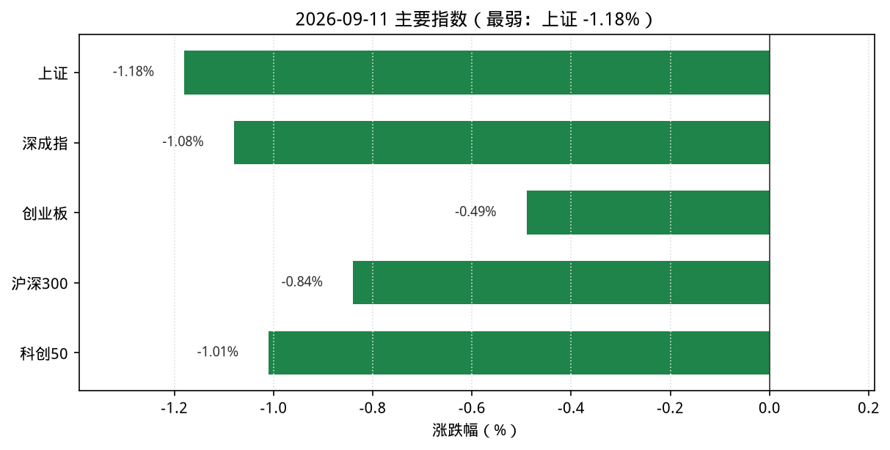
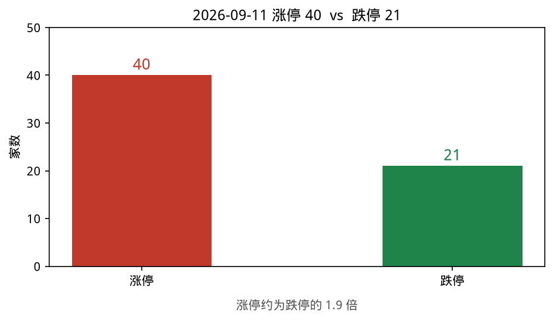
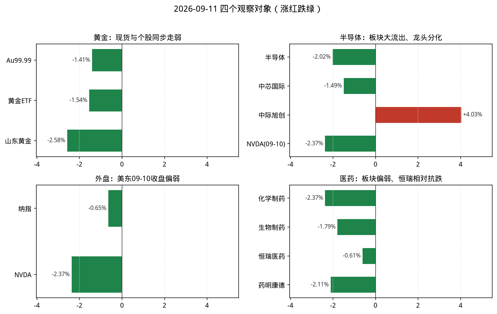
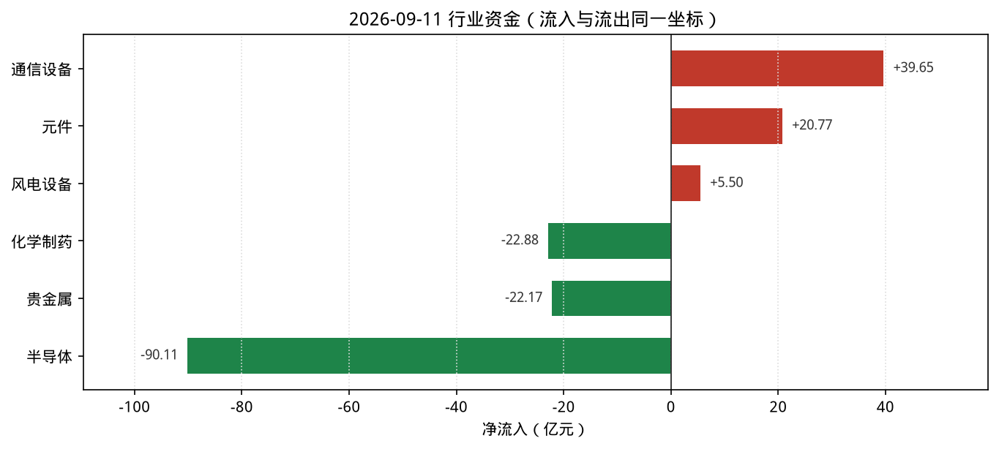

# 2026-09-11 A股盘后观察简报

> 研究摘要，不构成投资建议。触发时点：cron `2026-09-11T07:40:12Z`（北京时间约 15:40，A 股已收盘）。美东 **09-11 常规盘尚未开盘**（约北京 21:30），故纳指/NVDA 使用 **2026-09-10** 最近完整收盘，并标明时点。

## 今日结论

1. **宽基普跌**：上证 **-1.18%**、沪深300 **-0.84%**、深成指 **-1.08%**、创业板 **-0.49%**、科创50 **-1.01%**，权重与成长同步走弱。
2. **情绪继续降温**：涨停 **40** / 跌停 **21**（昨日 35/11）；最高连板 **4**（瑞尔特），跌停家数明显抬升。
3. **半导体大幅流出**：同花顺半导体 **-2.02%**、净流出约 **-90.11 亿**；中芯 **-1.49%**（MACD 转弱），但中际旭创 **+4.03%** 逆势分化。
4. **医药链偏弱**：化学制药 **-2.37%**、生物制药（新浪）**-1.79%**、CXO 概念 **-3.06%**；恒瑞 **-0.61%** 相对抗跌但仍有 KDJ/MACD 警告。
5. **黄金内外回吐**：Au99.99 约 **-1.41%**、黄金 ETF **-1.54%**、山东黄金 **-2.58%**；贵金属行业净流出约 **-22 亿**。

---

## 1. 今日市场异动（最多 8 条）

| # | 标的 | 幅度/数据 | 为何算异动 |
|---|---|---|---|
| 1 | 宽基指数 | 上证 **-1.18%**、深成指 **-1.08%**、科创50 **-1.01%** | 全日普跌，权重端更弱 |
| 2 | 涨跌停情绪 | 涨停 **40** / 跌停 **21**；最高连板 **4** | 跌停家数较 09-10（11）大幅上升 |
| 3 | 半导体（THS） | **-2.02%**，净流出约 **-90.11 亿** | 流出额居行业第一，上涨仅 16 / 下跌 171 |
| 4 | 中际旭创(300308) | **+4.03%**，换手约 **2.95%** | 弱市中光模块逆势；StockSight：MACD/KDJ 偏多 |
| 5 | 化学制药 / 生物制药 | **-2.37%** / **-1.79%** | 医药链全面回吐；CXO **-3.06%** |
| 6 | 黄金链 | Au99.99 **-1.41%**；贵金属 **-3.39%**；山东黄金 **-2.58%** | 现货、ETF、个股同步走弱 |
| 7 | 元件（相对强） | **+3.11%**，净流入约 **+20.77 亿** | 弱市少数流入行业；领涨则成电子 |
| 8 | 纳指 / NVDA（美东 09-10） | 纳指约 **-0.65%**；NVDA **-2.37%** | 北京 15:30 仍无 09-11 美股收盘；芯片情绪偏压制 |

补充：市场资金（skill）走沪深港通——南向港股通（沪）成交净买约 **+31.38 亿**、港股通（深）约 **+5.95 亿**；北向当日字段显示为 0（口径/披露延迟，勿过度解读）。同花顺行业资金可用：通信设备净流入约 **+39.65 亿**，半导体净流出约 **-90.11 亿**。主线雷达数据源 akshare，前排偏黄河三角/触摸屏/小米/风能等弱市相对抗跌方向；完整 10 项均未达 6 分跟踪阈值。

---

## 2. 四个观察对象的行情要点

### 黄金

| 项目 | 数据 | 说明 |
|---|---|---|
| 沪金现货 Au99.99 | 盘末约 **939.6** 元/克（相对 09-10 收盘 952.99 约 **-1.41%**） | akshare 上金所分时；更新约 15:30 |
| AU0 主力连续 | 新浪报价最新约 **944.94**（开约 942.02 / 高 951.22 / 低 934.44） | 相对昨结约 957.60 约 **-1.32%**；skill「黄金期货」入口落到通用主力列表且字段残缺，已改直连 |
| 贵金属（THS） | **-3.39%**，净流出约 **-22.17 亿** | 领涨赤峰黄金约 **+0.20%**（几乎平盘） |
| 黄金概念（新浪） | **-3.41%** | 概念全面回吐 |
| 黄金ETF(518880) | 8.943，**-1.54%**；换手约 **5.25%**、量比约 **1.36** | 腾讯行情 |
| 山东黄金(600547) | 34.67，**-2.58%** | StockSight：MACD/KDJ 死叉，「转弱—关注回撤」 |
| 湖南黄金(002155) | 27.50，**-3.64%** | 跟跌放大 |
| 国际金价 | 伦敦金（新浪 hf_XAU）约 **4344.48**（报价时点约 15:42）；相对 09-10 复盘口径约 4408 约 **-1.44%** | TradingEconomics/金投亦指向 09-10 前后金价回落；纽约金（hf_GC）约 **4387** |

**资金/情绪**：现货、ETF、黄金股与贵金属资金同步走弱，股金共振偏空。  
**关键新闻**：Firecrawl（免密）检索到金投网、上金所、新浪/英为财情等；点位以上金所分时与新浪报价为主口径。  
**投资建议**：**谨慎减仓**（内外金价与 A 股黄金股同步回吐，仓位偏重可降波动暴露；不宜抄底追涨）。

### 半导体

| 项目 | 数据 | 说明 |
|---|---|---|
| 半导体（THS） | **-2.02%**，净流出约 **-90.11 亿** | 上涨 16 / 下跌 171；领涨燧原科技（次新/特例，勿外推） |
| 电子器件（新浪行业） | **-0.27%** | 相对半导体板块更抗跌的代理口径 |
| 元件（THS） | **+3.11%**，净流入约 **+20.77 亿** | 与半导体分化，属相对强势细分 |
| 中芯国际(688981) | 117.41，**-1.49%**；换手约 **1.76%**、量比约 **1.34** | StockSight：MACD 死叉，「转弱」；换手以腾讯为准 |
| 北方华创(002371) | 634.00，**-0.73%** | 设备链跟跌但跌幅小于板块 |
| 中际旭创(300308) | 926.00，**+4.03%** | StockSight：MACD/KDJ 偏多；弱市逆势需防高位波动 |
| NVDA | **218.36，-2.37%**（美东 **09-10** 收盘） | Yahoo/StockSight；北京 15:30 时 09-11 美股未开盘 |

**资金/情绪**：半导体资金大幅流出、龙头技术转弱；光模块个股逆势不能代表板块。  
**关键新闻**：Firecrawl 英文侧混有旧稿与「芯片股波动」叙事；中文侧闪存市场等确认美东 09-10 纳指约 **-0.65%**。结论以当日 A 股与美东 09-10 收盘为准。  
**投资建议**：**谨慎减仓**（板块级流出与外盘芯片偏弱共振；仅观察逆势个股量能能否延续，不宜追高）。

### 纳斯达克（纳指）

| 项目 | 数据 | 说明 |
|---|---|---|
| .IXIC 收盘 | **26081.72**（**2026-09-10**） | 较 09-09 的 26253.34 约 **-0.65%** |
| NVDA | **218.36，-2.37%**（**2026-09-10**） | 相对 09-09 收盘 223.67；StockSight：MACD/KDJ 转弱 |
| 09-11 美股 | 北京 15:30 时常规盘**尚未开盘** | 本简报使用最近完整收盘 = **09-10** |

**资金/情绪**：最近完整日纳指与 NVDA 同步回调，对 A 股成长/半导体情绪偏压制。  
**关键新闻**：Firecrawl 检索到闪存市场「三大股指集体收跌」、纳指 26081.72 等与日线一致；部分标题指向更早交易日，需过滤。  
**投资建议**：**观望**（时点滞后；等美东 09-11 收盘后再评估映射）。

### 医药

| 项目 | 数据 | 说明 |
|---|---|---|
| 化学制药（THS） | **-2.37%**，净流出约 **-22.88 亿** | 上涨 9 / 下跌 149 |
| 生物制品（THS） | **-2.86%**，净流出约 **-8.74 亿** | 板块偏弱 |
| 生物制药（新浪） | **-1.79%** | 交叉验证偏弱 |
| CXO 概念（新浪） | **-3.06%** | 外包链回吐更明显 |
| 恒瑞医药(600276) | 42.67，**-0.61%**；换手约 **1.26%**、量比约 **1.24** | 相对抗跌；StockSight：KDJ/MACD 警告 |
| 药明康德(603259) | 151.24，**-2.11%** | CXO 龙头跟跌 |

**资金/情绪**：医药链价格与资金同向偏弱，龙头抗跌但技术信号未修复。  
**关键新闻**：Firecrawl 命中搜狐/东财医药板块页与研究 PDF；当日硬催化有限，以行情数据为主。  
**投资建议**：**观望**（板块级走弱未止；等资金流出收敛与龙头技术信号改善后再评估）。

---

## 3. 数据可视化

读图要点：

1. 五大指数全红，上证跌幅最大（约 **-1.18%**），创业板相对抗跌（约 **-0.49%**）。
2. 跌停 **21** 明显高于涨停 **40** 所代表的情绪中性，风险偏好下降。
3. 观察对象中，黄金与医药多为绿柱；半导体内部中际旭创红柱突出，属个股分化而非板块转强。
4. 资金图同一坐标下，半导体约 **-90 亿** 流出远大于通信设备约 **+40 亿** 流入。

---

## 4. 投资建议（综合）

| 对象 | 建议 | 一句话理由 |
|---|---|---|
| 黄金 | **谨慎减仓** | 现货/ETF/个股与贵金属资金同步回吐 |
| 半导体 | **谨慎减仓** | 板块净流出居首、龙头技术转弱；逆势股勿外推 |
| 纳斯达克 | **观望** | 仅有美东 09-10 收盘，09-11 映射尚未落地 |
| 医药 | **观望** | 化学制药/CXO 走弱，等流出收敛 |
| 大盘仓位 | **观望** | 宽基普跌、跌停抬升，主线雷达无达标方向 |

---

## 5. 次日观察点

1. 美东 **09-11** 纳指/NVDA 收盘是否继续拖累，或出现反弹修复映射。
2. 半导体净流出是否收窄；中际旭创能否缩量守住涨幅。
3. 黄金现货能否止跌，黄金股是否继续弱于金价。
4. 医药资金与 CXO 是否止跌，恒瑞技术信号是否修复。
5. 跌停家数能否回落至个位数附近，确认情绪不再恶化。

---

## 6. 风险提示

本报告为盘后研究摘要，基于公开行情与资讯自动汇总，**不构成投资建议**。数据可能存在延迟、口径差异或接口残缺；个股异动不代表可交易信号。股市有风险，决策需独立判断并自行承担。

---

## 7. 数据来源与时间戳

| 来源 | 状态 | 说明 |
|---|---|---|
| **akshare-stock** | 已调用 | 涨停统计、沪深港通+同花顺行业资金、行业/概念涨跌可用；`A股大盘`/`纳指行情` 入口因 formatter `_fmt_amount` NameError 失败，已直连新浪指数/纳指日线/上金所补数；`半导体板块`/`医药板块` 入口误落到全市场行业榜，板块点位改用 THS 摘要+新浪代理；`黄金期货` 入口字段残缺，已直连新浪 AU0/XAU/GC |
| **stocksight** | 已调用 | 主线雷达 `--provider auto`（akshare）；详细报告：688981/600276/600547/300308/NVDA，策略 `neutral` |
| **firecrawl-cli** | 已调用（免密） | 未配置 `FIRECRAWL_API_KEY`，走 keyless；原始结果见 `sources/gold.json`、`nasdaq-semi.json`、`pharma.json`、`nasdaq-cn.json` |
| 采集时点 | 北京时间约 **2026-09-11 15:40–15:45** | A 股已收盘；美股用 **09-10** 收盘 |
